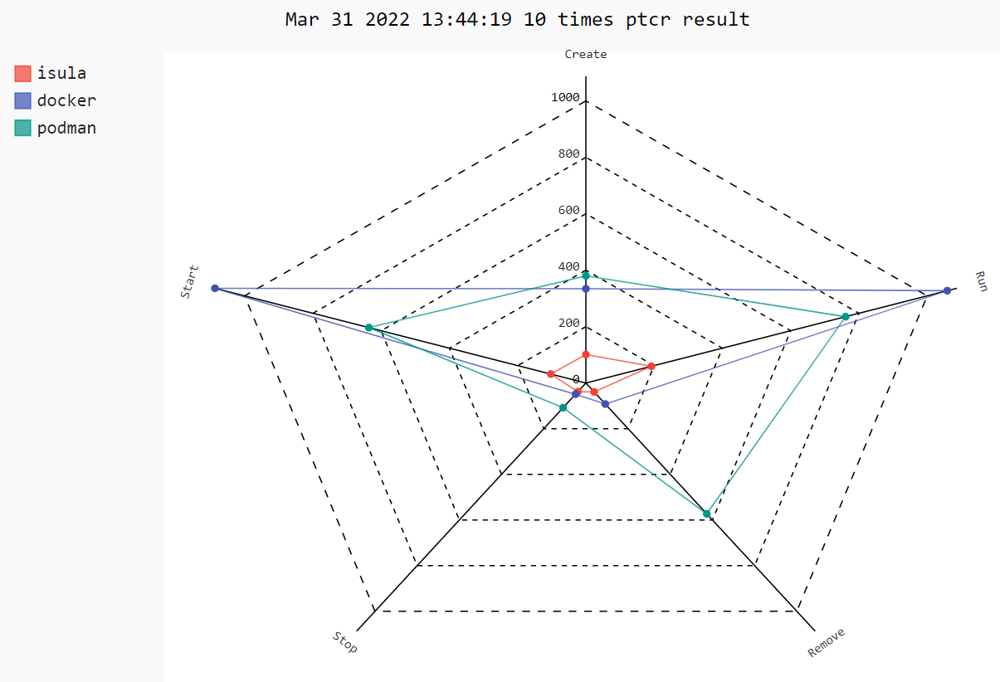
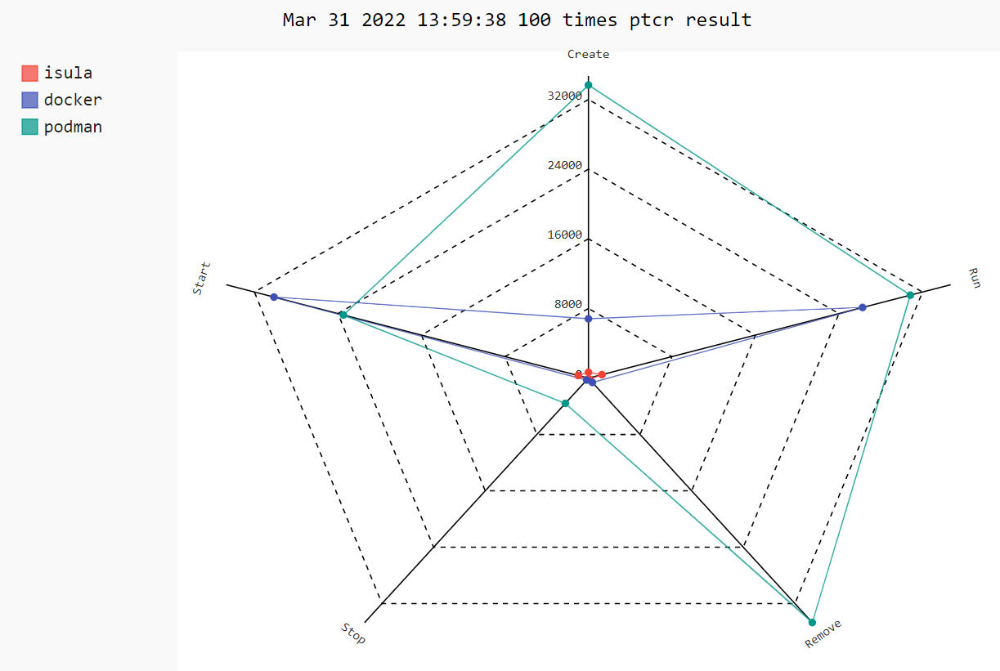
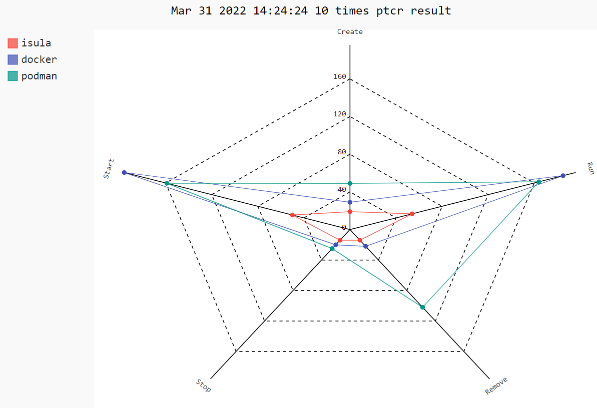

- [English version](README.md)


<a href="https://github.com/openeuler-mirror/iSulad"></a>  

## Introduction

`iSulad`是一个由C/C++编写实现的轻量级容器引擎，具有轻、灵、巧、快的特点，不受硬件规格和架构限制，底噪开销更小，可应用的领域更为广泛。

## Architecture

`iSulad`架构的相关介绍请查看：[architecture](./docs/design/architecture_zh.md)。

## Function

### Runtime

`iSulad`支持多种容器runtime，包括lxc、runc和kata。

#### lxc

lxc是用C语言编写的开源容器操作runtime，资源占用少，适用于对底噪资源限制高的场景，为iSulad默认的runtime。

#### runc

runc是用GO语言编写的符合OCI标准的runtime，使用runc时要求其使用的OCI runtime-spec version不低于iSulad支持的oci spec version 1.0.0。

#### kata-runtime

kata-runtime是一个安全容器runtime，用于启动安全容器时使用。

### Image

`iSulad`支持多种镜像格式，包括OCI标准镜像格式和external rootfs镜像格式。

#### OCI

OCI标准镜像格式是与docker兼容的镜像格式，支持从远程镜像仓库拉取镜像、运行容器。

#### external rootfs

external rootfs镜像格式允许用户自行准备可启动的`root fs`目录，主要用于系统容器场景。

### Operation Interface

`iSulad`提供两种不同的镜像和容器管理操作接口，分别为CLI和CRI。

#### CLI

CLI采用命令行的形式进行镜像和容器管理，是标准的C/S架构模式，将iSulad作为daemon服务端，iSula作为独立的客户端命令，供用户使用。

iSula提供的命令参数覆盖了常用的大部分应用场景，包括容器的操作接口，如运行、停止、删除、pause等操作，也包括镜像的相关操作，如下载、导入、删除等。

#### CRI

CRI（Container Runtime Interface）是由K8S对外提供的容器和镜像的服务接口，供容器引擎接入K8s。

CRI接口基于gRPC实现。iSulad遵循CRI接口规范，实现 CRI gRPC Server，CRI gRPC Server 中包括 Runtime Service 和 image Service，分别用来提供容器运行时接口和镜像操作接口。iSulad的 gRPC Server 需要监听本地的Unix socket，而K8s的组件 kubelet 则作为 gRPC Client 运行。

## Getting Started

- [用法指南：openeuler官方手册](https://docs.openeuler.org/zh/docs/22.03_LTS/docs/Container/container.html)

- [开发指南](./docs/build_docs/README_zh.md)

- [用户手册](./docs/manual/README_zh.md)

- [设计文档](./docs/design/README_zh.md)

### Installing

`iSulad`可以使用`yum`命令进行安装，安装之前需要查看确保配置了openEuler仓库:

```shell
$ cat << EOF > /etc/yum.repos.d/openEuler.repo
[openEuler]
baseurl=https://repo.openeuler.org/openEuler-22.03-LTS/OS/\$basearch
enabled=1
EOF
```

用`yum`安装`iSulad`的命令如下：

```shell
$ yum install -y iSulad
```

若运行安装命令后报如下错误：

```txt
Repository 'openEuler' is missing name in configuration, using id.

You have enabled checking of packages via GPG keys. This is a good thing.
However, you do not have any GPG public keys installed. You need to download
the keys for packages you wish to install and install them.
You can do that by running the command:
    rpm --import public.gpg.key


Alternatively you can specify the url to the key you would like to use
for a repository in the 'gpgkey' option in a repository section and YUM
will install it for you.

For more information contact your distribution or package provider.
```

则需要先运行`rpm --import /etc/pki/rpm-gpg/RPM-GPG-KEY-openEuler`。

### Configure

成功安装`iSulad`之后，需要先配置好容器镜像的注册地址，以"docker.io"为例：

```shell
# cat /etc/isulad/daemon.json
.....
    "registry-mirrors": [
        "docker.io"
    ],
.....
```

### Run

`iSulad`提供了两种服务的启动方式：

1. 使用`systemd`服务来启动`iSulad`

```shell
# 通过systemd命令来重启isulad服务
$ systemctl restart isulad 
```

2. 直接使用命令启动`iSulad`

```shell
# 使用默认套接字名称、默认日志级别和镜像管理功能启动isulad
$ sudo isulad 
```

###  Operations on containers

`iSulad` 提供了两个管理镜像和容器的操作接口：CLI和CRI。

#### **CLI**

`iSulad`使用 `iSula` 作为客户端命令，以下是利用CLI接口管理容器的一些基本命令：

- 列出当前环境下的所有容器：

```shell
$ sudo isula ps -a
```

- 通过`busybox`镜像创建容器：

  - 采用默认的runtime创建容器`test`

  ```sh
  $ sudo isula create -t -n test busybox
  ```

    - 创建**runtime为runc**的容器`testrunc`

  ```sh
  $ sudo isula create -t --runtime runc -n testrunc busybox
  ```


- 启动容器`test`:

```shell
$ sudo isula start test
```

- 停止容器`test`:

```shell
$ sudo isula kill test
```

- 移除容器`test`

```shell
$ sudo isula rm test
```

#### CRI

`iSulad`可以通过CRI接口与kubernetes集成，如何与kubernetes集成请参考[k8s_integration](./docs/manual/k8s_integration_zh.md)。

##  Performance

采用[ptcr](https://gitee.com/openeuler/ptcr)作为容器引擎的性能测试工具，展示在不同架构的计算机中`iSulad`的性能效果。

###  ARM

- 10个容器串行操作的情况下，`iSula`与`docker`、`podman`的性能对比雷达图如下：



- 100个容器并行操作的情况下，`iSula`与`docker`、`podman`的性能对比雷达图如下：



### X86

- 10个容器串行操作的情况下，`iSula`与`docker`、`podman`的性能对比雷达图如下：



- 100个容器并行操作的情况下，`iSula`与`docker`、`podman`的性能对比雷达图如下：


**关于性能测试的更多信息请查看**  [Performance test](https://gitee.com/openeuler/iSulad/wikis/Performance?sort_id=5449355)。

## Kernel Requirements

`iSulad`支持在3.0.x之后的Kernel上运行。

## Compatibility

`iSulad` 能够兼容的标准规范版本如下：

- 兼容 1.0.0 版本的OCI
- 兼容 0.3.0-1.0.0 版本的CNI，iSulad从2.1.4版本后支持 CNI 1.0.0版本
- 兼容 2.1.x 版本以上的lcr

## Kubernetes Support

`iSulad`提供对Kubernetes 1.13 版本以上的支持。以下表格显示了 `iSulad` 与 Kubernetes 之间的兼容性。它给出了指定Kubernetes版本下所需要的最低 `iSulad` 版本。

iSulad 版本 | Kubernetes 版本 | CRI 版本
--- | --- | ---
v2.0.0+ | v1.13-v1.18 | v1alpha2
v2.0.8+ | v1.19-v1.22 | v1alpha2
v2.1.4+ | v1.23-v1.26 | v1, v1alpha2
