| Author | 张晓雨                                               |
| ------ | -----------------------------------------------------|
| Date   | 2023-03-20                                           |
| Email  | [zhangxiaoyu58@huawei.com](zhangxiaoyu58@huawei.com) |

本文主要对 `iSulad` 的 `CRI` 实现部分进行源码级别的学习和研究，为后续想了解 `CRI` 或者 `iSulad` 的同学提供帮助。
本文涉及`CRI`模块`Container`相关的接口。关于`Pod`相关接口的梳理请参考[cri_pod_manager_design.md](./cri_pod_manager_design.md)。

*注：本文以iSulad 2.0.18版本为分析对象。*

本文主要是针对 `CRI` 的 `RuntimeService` 部分，涉及如下接口：
- `CreateContainer`
- `StartContainer`
- `StopContainer`
- `RemoveContainer`
- `ListContainers`
- `ContainerStatus`
- `UpdateContainerResources`
- `ExecSync`
- `Exec`
- `Attach`

## CreateContainer
#### interface
```
// CreateContainer creates a new container in specified PodSandbox
rpc CreateContainer(CreateContainerRequest) returns (CreateContainerResponse) {}
```

#### Flow chart
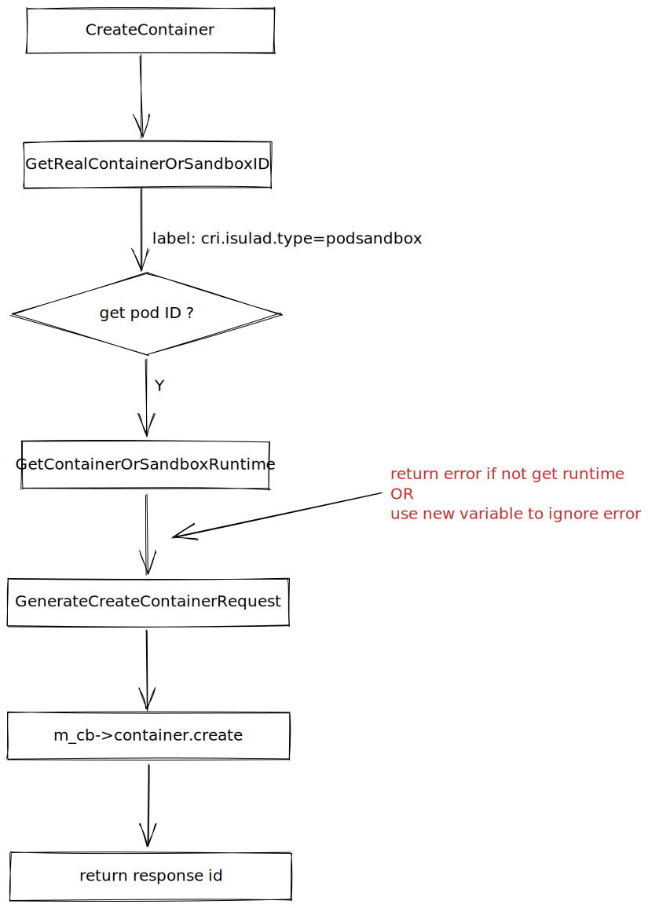

#### Detail
- GetRealContainerOrSandboxID
get container from *g_containers_store* by (short) id, and filter container with label *cri.isulad.type=podSandbox*
- GetContainerOrSandboxRuntime
get podSandbox runtime
- GenerateCreateContainerRequest
set *container_create_request*, include
    ```c
    // name
    std::string cname = CRINaming::MakeContainerName(podSandboxConfig, containerConfig)
    // runtime
    request->runtime = util_strdup_s(podSandboxRuntime.c_str())
    // image
    request->image = util_strdup_s(containerConfig.image().image().c_str())
    // cgroup parent
    hostconfig->cgroup_parent = util_strdup_s(podSandboxConfig.linux().cgroup_parent().c_str())
    // labels
    custom_config->labels = CRIHelpers::MakeLabels(containerConfig.labels(), error)
    // cri.isulad.type=container
    append_json_map_string_string(custom_config->labels, CRIHelpers::Constants::CONTAINER_TYPE_LABEL_KEY.c_str(), CRIHelpers::Constants::CONTAINER_TYPE_LABEL_CONTAINER.c_str()
    // log path
    append_json_map_string_string(custom_config->labels, CRIHelpers::Constants::CONTAINER_LOGPATH_LABEL_KEY.c_str(), real_logpath)
    // annotations
    CRIHelpers::MakeAnnotations(containerConfig.annotations(), error)
    // mount
    CRIHelpers::GenerateMountBindings(containerConfig.mounts(), hostconfig, error)
    // device
    PackCreateContainerHostConfigDevices(containerConfig, hostconfig, error)
    // security context
    PackCreateContainerHostConfigSecurityContext(containerConfig, hostconfig, error)
    ...
    ```

## StartContainer
#### interface
```
// StartContainer starts the container.
rpc StartContainer(StartContainerRequest) returns (StartContainerResponse) {}
```

#### Flow chart
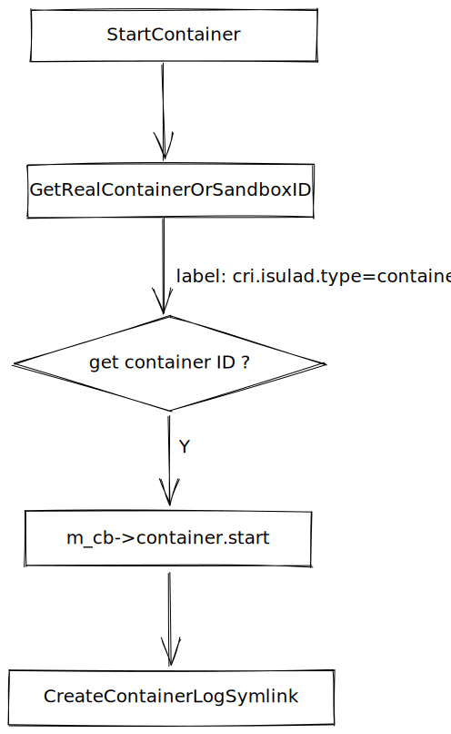

#### Detail
- GetRealContainerOrSandboxID
get container from *g_containers_store* by (short) id, and filter container with label *cri.isulad.type=container*
- CreateContainerLogSymlink
*inspect_container* , get *cri.container.logpath* annotation and container *log_path*, then create a symbolic from  *log_path* to *cri.container.logpath*

## StopContainer
#### interface
```
// StopContainer stops a running container with a grace period (i.e., timeout).
// This call is idempotent, and must not return an error if the container has
// already been stopped.
// The runtime must forcibly kill the container after the grace period is
// reached.
rpc StopContainer(StopContainerRequest) returns (StopContainerResponse) {}
```

#### Flow chart
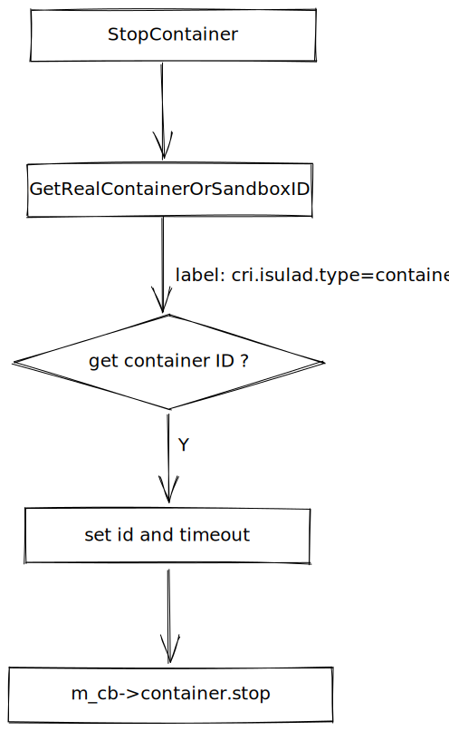

#### Detail
- Timeout
*timeout* in seconds to wait for the container to stop before forcibly terminating it, default value is 0

## RemoveContainer
#### interface
```
// RemoveContainer removes the container. If the container is running, the
// container must be forcibly removed.
// This call is idempotent, and must not return an error if the container has
// already been removed.
rpc RemoveContainer(RemoveContainerRequest) returns (RemoveContainerResponse) {}
```

#### Flow chart
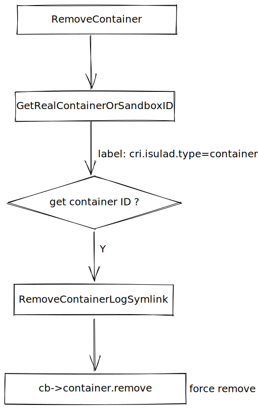

#### Detail
- RemoveContainerLogSymlink
*inspect_container* , get *cri.container.logpath* annotation and container *log_path*, then delete *cri.container.logpath*

## ListContainers
#### interface
```
// ListContainers lists all containers by filters.
rpc ListContainers(ListContainersRequest) returns (ListContainersResponse) {}
```

#### Flow chart
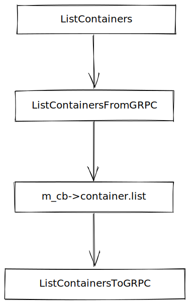

#### Detail
- ListContainersFromGRPC
convert filter from GRPC request,  and add *cri.isulad.type=container* to filter
    ```c
    // Add filter to get only non-sandbox containers
    CRIHelpers::FiltersAddLabel((*request)->filters, CRIHelpers::Constants::CONTAINER_TYPE_LABEL_KEY, CRIHelpers::Constants::CONTAINER_TYPE_LABEL_CONTAINER)
    // convert filter
    // id
    CRIHelpers::FiltersAdd((*request)->filters, "id", filter->id())
    // status
    CRIHelpers::FiltersAdd((*request)->filters, "status", CRIHelpers::ToIsuladContainerStatus(filter->state()))
    // sandbox id
    CRIHelpers::FiltersAddLabel((*request)->filters, CRIHelpers::Constants::SANDBOX_ID_LABEL_KEY, filter->pod_sandbox_id())
    // label selector
    for (auto &iter : filter->label_selector()) {
        CRIHelpers::FiltersAddLabel((*request)->filters, iter.first, iter.second) 
    }
    ```
- ListContainersToGRPC
convert containers information to GRPC response, include
    ```c
    for (size_t i {}; i < response->containers_len; i++) {
        // id
        container->set_id(response->containers[i]->id)
        // labels
        CRIHelpers::ExtractLabels(response->containers[i]->labels, *container->mutable_labels())
        // annotations
        CRIHelpers::ExtractAnnotations(response->containers[i]->annotations, *container->mutable_annotations())
        // name
        CRINaming::ParseContainerName(container->annotations(), container->mutable_metadata(), error)
        // image
        image->set_image(response->containers[i]->image)
        std::string imageID = CRIHelpers::ToPullableImageID(response->containers[i]->image, response->containers[i]->image_ref)
        container->set_image_ref(imageID)
        // runtime
        CRIHelpers::ContainerStatusToRuntime(Container_Status(response->containers[i]->status))
        ...
    }
    ```

## ContainerStatus
#### interface
```
// ContainerStatus returns status of the container. If the container is not
// present, returns an error.
rpc ContainerStatus(ContainerStatusRequest) returns (ContainerStatusResponse) {}
```

#### Flow chart
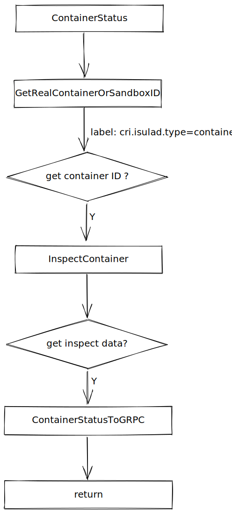

#### Detail
- ContainerStatusToGRPC
add container information to GRPC response, include
    ```c
    // timestamps
    CRIHelpers::GetContainerTimeStamps(inspect, &createdAt, &startedAt, &finishedAt, error)
    // image
    PackContainerImageToStatus(inspect, contStatus, error)
    // container status
    UpdateBaseStatusFromInspect(inspect, createdAt, startedAt, finishedAt, contStatus)
    // labels
    PackLabelsToStatus(inspect, contStatus)
    // mount
    ConvertMountsToStatus(inspect, contStatus);
    ```

## UpdateContainerResources
#### interface
```
// UpdateContainerResources updates ContainerConfig of the container synchronously.
// If runtime fails to transactionally update the requested resources, an error is returned.
rpc UpdateContainerResources(UpdateContainerResourcesRequest) returns (UpdateContainerResourcesResponse) {}
```

#### Flow chart


#### Detail
- Generate HostConfig
set resources, include
    ```c
    // cpu
    hostconfig->cpu_period = resources.cpu_period()
    hostconfig->cpu_quota = resources.cpu_quota()
    hostconfig->cpu_shares = resources.cpu_shares()
    hostconfig->cpuset_cpus = util_strdup_s(resources.cpuset_cpus().c_str())
    hostconfig->cpuset_mems = util_strdup_s(resources.cpuset_mems().c_str())
    // memory
    hostconfig->memory_swap_limit_in_bytes = resources.memory_swap_limit_in_bytes()
    hostconfig->memory = resources.memory_limit_in_bytes()
    // cgroupv2 unified
    for (auto &iter : resources.unified()) {
        append_json_map_string_string(unified, iter.first.c_str(), iter.second.c_str())
    }
    // huge page
    for (int i = 0; i < resources.hugepage_limits_size(); i++) {
        hostconfig->hugetlbs[i]->page_size = util_strdup_s(resources.hugepage_limits(i).page_size().c_str())
        hostconfig->hugetlbs[i]->limit = resources.hugepage_limits(i).limit()
        hostconfig->hugetlbs_len++
    }
    ```

## ExecSync
#### interface
```
// ExecSync runs a command in a container synchronously.
rpc ExecSync(ExecSyncRequest) returns (ExecSyncResponse) {}
```

#### Flow chart
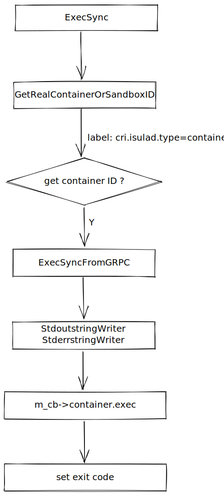


#### Detail
- ExecSyncFromGRPC
set *container_exec_request*, include
    ```c
    (*request)->tty = false
    (*request)->attach_stdin = false
    (*request)->attach_stdout = true
    (*request)->attach_stderr = true
    (*request)->timeout = timeout
    (*request)->container_id = util_strdup_s(containerID.c_str())
    // execution command
    for (int i = 0; i < cmd.size(); i++) {
        (*request)->argv[i] = util_strdup_s(cmd[i].c_str())
        (*request)->argv_len++
    }
    // generate random suffix
    (*request)->suffix = CRIHelpers::GenerateExecSuffix()
    ```
- StringWriter
set stdoutWriter and stderrWriter, write string to reply *stdout/stderr*
    ```c
    StdoutstringWriter.context = (void *)reply->mutable_stdout()
    StdoutstringWriter.write_func = WriteToString

    StderrstringWriter.context = (void *)reply->mutable_stderr()
    StderrstringWriter.write_func = WriteToString

    static auto WriteToString(void *context, const void *data, size_t len) -> ssize_t
    {
        if (len == 0) {
            return 0;
        }

        std::string *str = reinterpret_cast<std::string *>(context);

        str->append(reinterpret_cast<const char *>(data), len);
        return (ssize_t)len;
    }
    ```

## Exec
#### interface
```
// Exec prepares a streaming endpoint to execute a command in the container.
rpc Exec(ExecRequest) returns (ExecResponse) {}
```

#### Flow chart
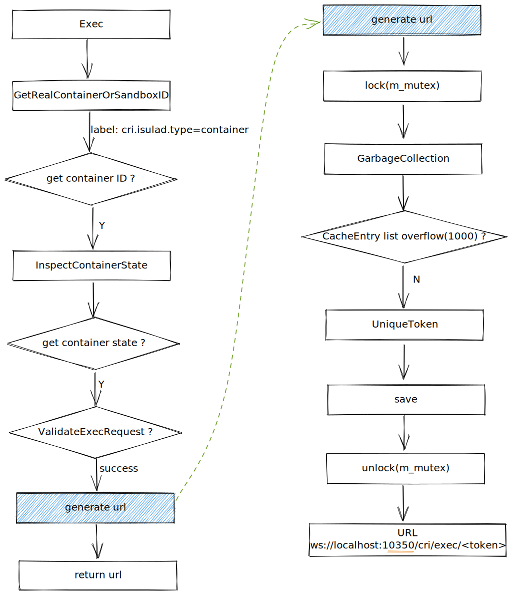

#### Detail
- ValidateExecRequest
1. check container is running
2. check container is not paused
3. check tty and stderr not both true
4. check one of stdin, stdout, stderr must be true 
- GarbageCollection
traverse from back of the *CacheEntry list* and remove the *expired requests*, also delete them in *token hash map*
    ```c
    void RequestCache::GarbageCollection()
    {
        auto now = std::chrono::system_clock::now();
        while (!m_ll.empty()) {
            auto oldest = m_ll.back();
            if (now < oldest.expireTime) {
                return;
            }
            if (oldest.req != nullptr) {
                delete oldest.req;
                oldest.req = nullptr;
            }
            m_ll.pop_back();
            m_tokens.erase(oldest.token);
        }
    }
    ```
- UniqueToken
`token=base64(random string))`. If token is exist in *token hash map*, retry generate token
- Save
save containerID, request, token in *CacheEntry list* and *token hash map*

## Attach
#### interface
```
// Attach prepares a streaming endpoint to attach to a running container.
rpc Attach(AttachRequest) returns (AttachResponse) {}
```

#### Flow chart
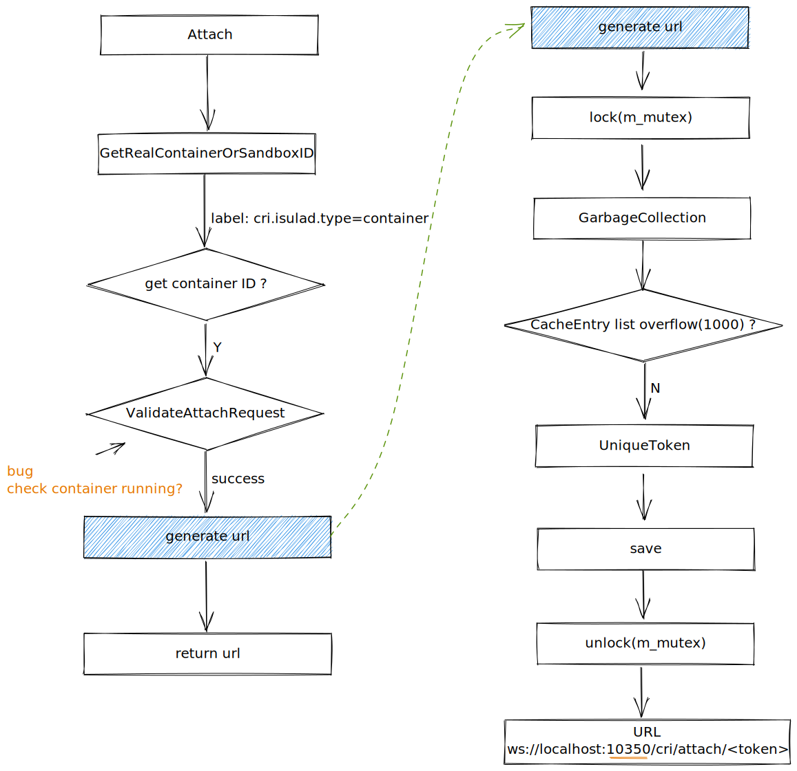

#### Detail
- ValidateAttachRequest
1. check tty and stderr not both true
2. check one of stdin, stdout, stderr must be true 

## Websocket

#### UML diagram
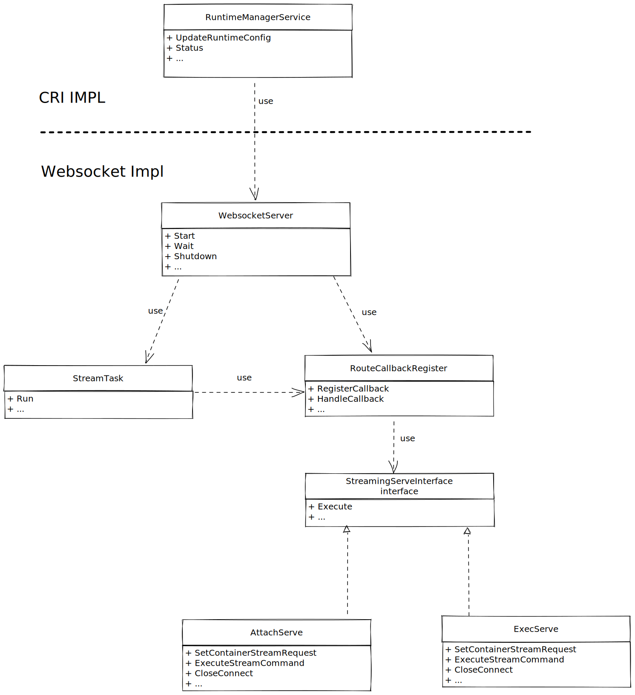

### Start/Stop Websocket Server
#### Flow chart
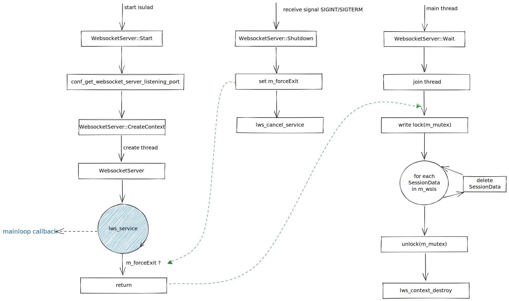

#### Detail
- CreateContext
create websocket server context
    ```c
    /*
    context->lws_lookup is allocated ( sizeof(struct lws *) * max_fds ) spaces,
    In general, max_fds should be the process maximum number of open file descriptor.
    If WS_ULIMIT_FDS set too large, context->lws_lookup will cost too much memory.
    If WS_ULIMIT_FDS set too small, maybe fd > max_fds and context->lws_lookup[fd] will overflow.
    */
    const size_t WS_ULIMIT_FDS { 10240 }

    info.port = m_listenPort
    info.iface = "127.0.0.1"
    info.protocols = m_protocols
    info.ssl_cert_filepath = nullptr
    info.ssl_private_key_filepath = nullptr
    info.gid = -1
    info.uid = -1
    info.options = LWS_SERVER_OPTION_VALIDATE_UTF8 | LWS_SERVER_OPTION_DISABLE_IPV6
    info.max_http_header_pool = MAX_HTTP_HEADER_POOL
    info.extensions = nullptr

    m_context = lws_create_context(&info)
    ```

### Websocket Main Callback
#### Flow chart
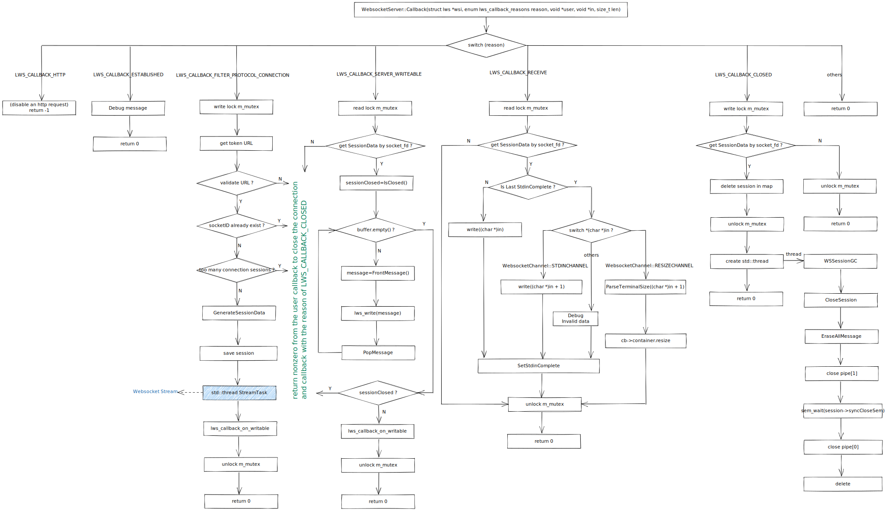

#### Detail
- LWS_CALLBACK_FILTER_PROTOCOL_CONNECTION
called when the handshake has been received and parsed from the client, but the response is not sent yet.  Return non-zero to disallow the connection.
    ```c
    // Write Lock
    WriteGuard<RWMutex> lock(m_mutex)

    // get TOKEN URL
    lws_hdr_copy(wsi, buf, sizeof(buf), WSI_TOKEN_GET_URI)

    // Validate URL
    // URL format: "/cri/" + method + "/" + token + "/" + arg(container=cmd)
    auto vec = CXXUtils::Split(buf + 1, '/');
    // method: exec and attach
    // token is exist in token hash map
    if vec.size() >= 3 && m_handler.IsValidMethod(vec.at(1)) && cache->IsValidToken(vec.at(2))

    // socketID already exist ?
    int socketID = lws_get_socket_fd(wsi)
    if m_wsis.count(socketID) == 0

    // too many connection sessions ?
    if m_wsis.size() <= MAX_SESSION_NUM(128)

    // generate SessionData
    GenerateSessionData(session, containerID)

    // save session
    m_wsis.insert(std::make_pair(socketID, session))

    // create StreamTask
    std::thread streamTh([ = ]() {
        StreamTask(&m_handler, session, vec.at(1), vec.at(2)).Run();
    })
    streamTh.detach()

    // Trigger polling in LWS_CALLBACK_SERVER_WRITEABLE
    lws_callback_on_writable(wsi)
    ```
- LWS_CALLBACK_SERVER_WRITEABLE
If you call lws_callback_on_writable() on a connection, you will get one of these callbacks coming when the connection socket is able to accept another write packet without blocking.
If it already was able to take another packet without blocking, you'll get this callback at the next call to the service loop function.
    ```c
    // Read Lock
    ReadGuard<RWMutex> lock(m_mutex)

    // get SessionData
    int socketID = lws_get_socket_fd(wsi)
    auto it = m_wsis.find(socketID)
    if it != m_wsis.end()

    // record session closed
    auto sessionClosed = it->second->IsClosed()

    // write message
    while (!it->second->buffer.empty()) {
        auto *message = it->second->FrontMessage()
        // send success! free it and erase for list
        WebsocketServer::GetInstance()->Wswrite(wsi, const_cast<const unsigned char *>(message))
        free(message)
        it->second->PopMessage()
    }

    // return non-zero if session closed
    if (sessionClosed) {
        DEBUG("websocket session disconnected")
        return -1
    }

    // return zero and callback with the reason of LWS_CALLBACK_SERVER_WRITEABLE again
    lws_callback_on_writable(wsi)
    ```
- LWS_CALLBACK_RECEIVE
data has appeared for this server endpoint from a remote client, it can be found at in and is len bytes long
    ```c
    // Read Lock
    ReadGuard<RWMutex> lock(m_mutex)

    // get SessionData
    auto it = m_wsis.find(socketID)
    if it != m_wsis.end()

    // Last Stdin Uncomplete
    if (!it->second->IsStdinComplete()) {
        util_write_nointr_in_total(m_wsis[socketID]->pipes.at(1), (char *)in, len)
    }

    // RESIZECHANNEL
    if (*static_cast<char *>(in) == WebsocketChannel::RESIZECHANNEL) {
        ParseTerminalSize(jsonData, len, width, height)
        int ret = cb->container.resize(req, &res)
    }

    // STDINCHANNEL
    if (*static_cast<char *>(in) == WebsocketChannel::STDINCHANNEL) {
        util_write_nointr_in_total(m_wsis[socketID]->pipes.at(1), (char *)in + 1, len - 1)
    }

    // SetStdinComplete
    size_t bytesLen = lws_remaining_packet_payload(wsi)
    it->second->SetStdinComplete(bytesLen == 0)
    ```
- LWS_CALLBACK_CLOSED
when the websocket session ends
    ```c
    void WebsocketServer::CloseWsSession(int socketID)
    {
        // write lock
        m_mutex.wrlock();
        auto it = m_wsis.find(socketID);
        if (it == m_wsis.end()) {
            m_mutex.unlock();
            return;
        }

        auto session = it->second;
        it->second = nullptr;
        // delete session in map
        m_wsis.erase(it);
        m_mutex.unlock();

        std::thread([session]() {
            prctl(PR_SET_NAME, "WSSessionGC");
            session->CloseSession();
            session->EraseAllMessage();
            // close the pipe write endpoint first, make sure io copy thread exit,
            // otherwise epoll will trigger EOF
            if (session->pipes.at(1) >= 0) {
                close(session->pipes.at(1));
                session->pipes.at(1) = -1;
            }
            (void)sem_wait(session->syncCloseSem);
            (void)sem_destroy(session->syncCloseSem);
            delete session->syncCloseSem;
            session->syncCloseSem = nullptr;
            close(session->pipes.at(0));
            delete session->sessionMutex;
            session->sessionMutex = nullptr;
            delete session;
        }).detach();
    }
    ```

### Websocket Stream
#### Flow chart
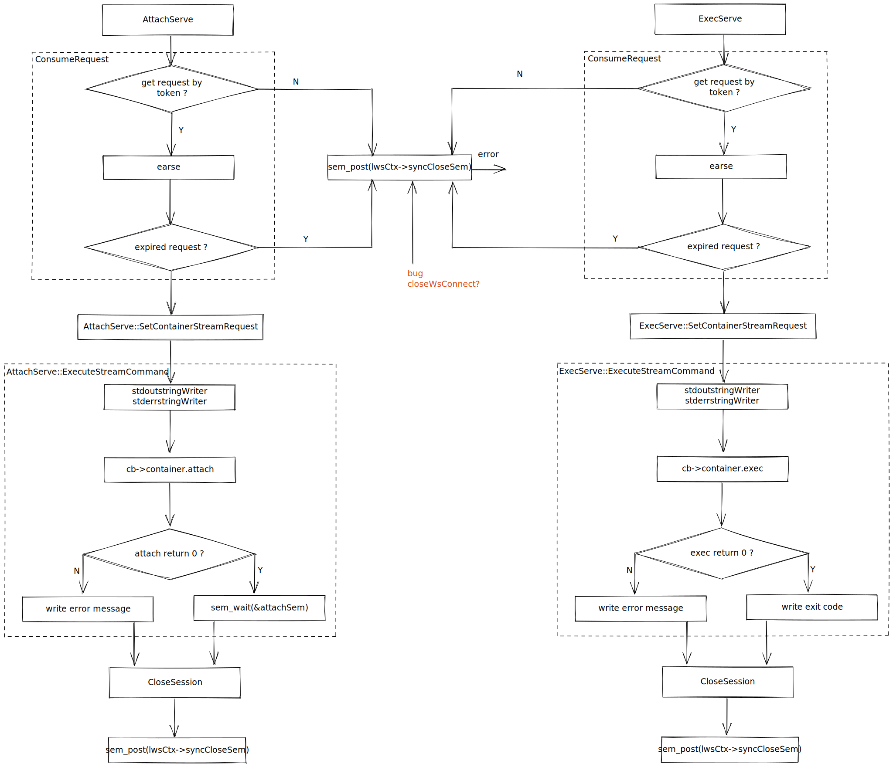

#### Detail
- ConsumeRequest
    ```c
    // Consume the token (remove it from the cache) and return the cached request, if found.
    ::google::protobuf::Message *RequestCache::ConsumeRequest(const std::string &token)
    {
        std::lock_guard<std::mutex> lock(m_mutex);

        if (m_tokens.count(token) == 0) {
            ERROR("Invalid token");
            return nullptr;
        }

        CacheEntry ele = m_tokens[token];
        for (auto it = m_ll.begin(); it != m_ll.end(); it++) {
            if (it->token == token) {
                m_ll.erase(it);
                break;
            }
        }
        m_tokens.erase(token);
        if (std::chrono::system_clock::now() > ele.expireTime) {
            return nullptr;
        }

        return ele.req;
    }
    ```
- AttachServe::SetContainerStreamRequest
set stdin, stdout and stderr
    ```c
    m_request->attach_stdin = grequest->stdin()
    m_request->attach_stdout = grequest->stdout()
    m_request->attach_stderr = grequest->stderr()
    ```
- AttachServe::ExecuteStreamCommand
    ```c
    // StringWriter
    // write stdout to client if attach stdout is true
    stdoutContext.attachWriter = m_request->attach_stdout ? WsWriteStdoutToClient : WsDoNotWriteStdoutToClient
    // sem_post attachSem
    stdoutstringWriter.close_func = AttachConnectClosed
    // write stderr to client if attach stderr is true
    stderrContext.attachWriter = m_request->attach_stderr ? WsWriteStderrToClient : WsDoNotWriteStderrToClient
    stderrstringWriter.close_func = nullptr

    // call attach
    // nonblocking
    int ret = cb->container.attach(m_request, &m_response, m_request->attach_stdin ? lwsCtx->pipes.at(0) : -1, &stdoutstringWriter, &stderrstringWriter)

    // handle attach return value
    if (ret != 0) {
        // join io copy thread in attach callback
        ERROR("Failed to attach container: %s", m_request->container_id);

        std::string message;
        if (m_response != nullptr && m_response->errmsg != nullptr) {
            message = m_response->errmsg;
        } else {
            message = "Failed to call attach container callback. ";
        }
        WsWriteStdoutToClient(lwsCtx, message.c_str(), message.length());
    } else {
        // wait io copy thread complete
        (void)sem_wait(&attachSem);
    }
    ```
- ExecServe::SetContainerStreamRequest
set tty, stdin, stdout, stderr, container_id, args and suffix
    ```c
    m_request->tty = grequest->tty()
    m_request->attach_stdin = grequest->stdin()
    m_request->attach_stdout = grequest->stdout()
    m_request->attach_stderr = grequest->stderr()
    m_request->container_id = util_strdup_s(grequest->container_id().c_str())
    m_request->suffix = util_strdup_s(suffix.c_str())

    // args
    if (grequest->cmd_size() > 0) {
        m_request->argv = (char **)util_smart_calloc_s(sizeof(char *), grequest->cmd_size());
        for (int i = 0; i < grequest->cmd_size(); i++) {
            m_request->argv[i] = util_strdup_s(grequest->cmd(i).c_str());
        }
        m_request->argv_len = static_cast<size_t>(grequest->cmd_size());
    }
    ```
- ExecServe::ExecuteStreamCommand
    ```c
    // StringWriter
    StdoutstringWriter.write_func = WsWriteStdoutToClient
    StdoutstringWriter.close_func = nullptr
    StderrstringWriter.write_func = WsWriteStderrToClient
    StderrstringWriter.close_func = nullptr

    // call exec
    int ret = cb->container.exec(m_request, &m_response, m_request->attach_stdin ? lwsCtx->pipes.at(0) : -1, m_request->attach_stdout ? &StdoutstringWriter : nullptr, m_request->attach_stderr ? &StderrstringWriter : nullptr)

    // handle exec return value
    if (ret != 0) {
        std::string message;
        if (m_response != nullptr && m_response->errmsg != nullptr) {
            message = m_response->errmsg;
        } else {
            message = "Failed to call exec container callback. ";
        }
        WsWriteStdoutToClient(lwsCtx, message.c_str(), message.length());
    }
    if (m_response != nullptr && m_response->exit_code != 0) {
        std::string exit_info = "Exit code :" + std::to_string((int)m_response->exit_code) + "\n";
        WsWriteStdoutToClient(lwsCtx, exit_info.c_str(), exit_info.length());
    }
    ```
