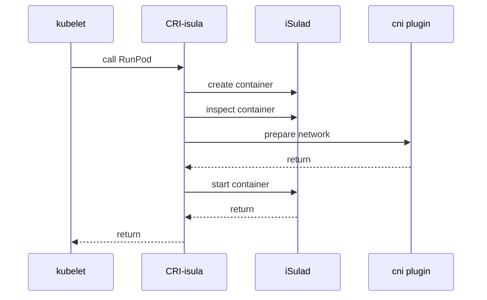
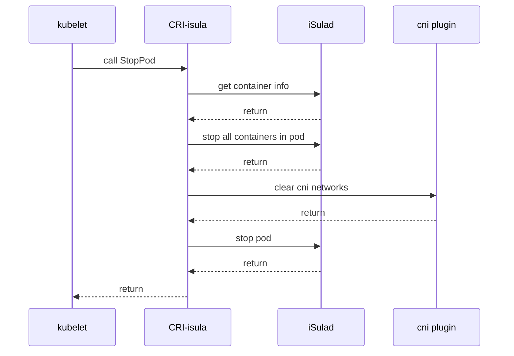
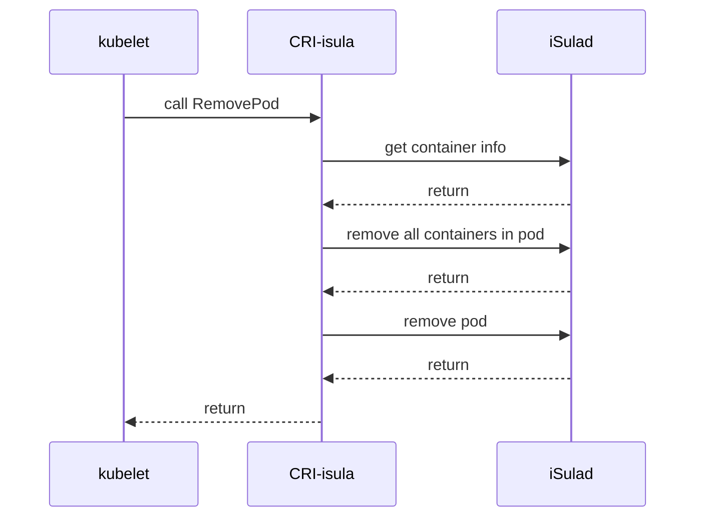
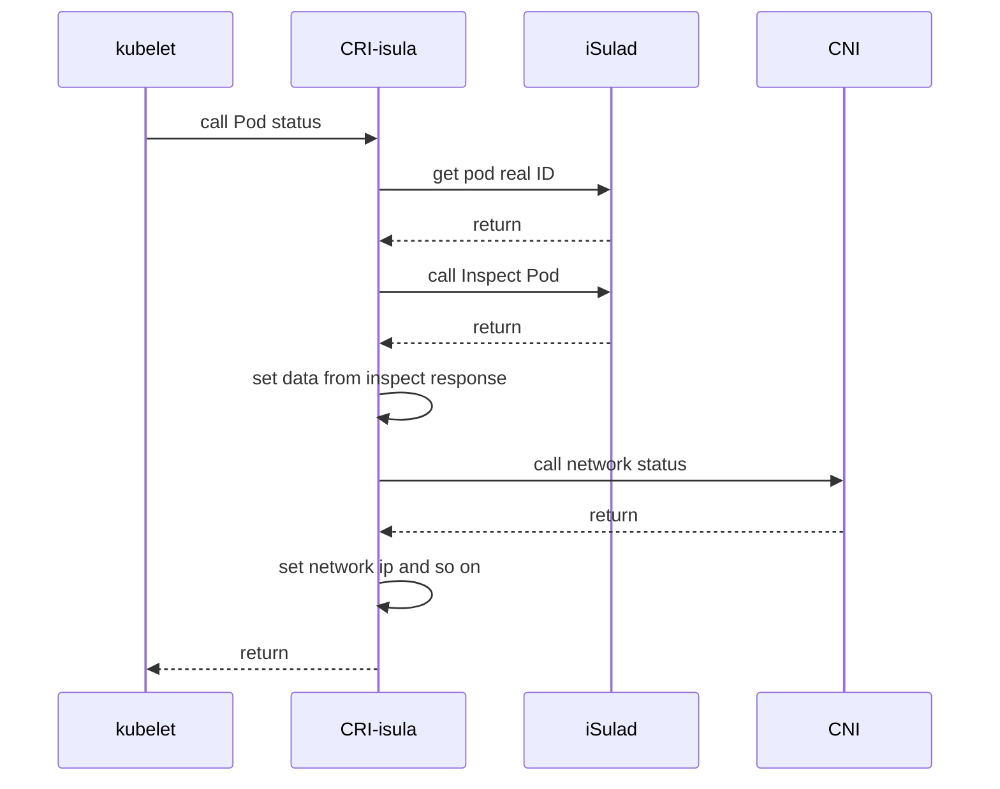
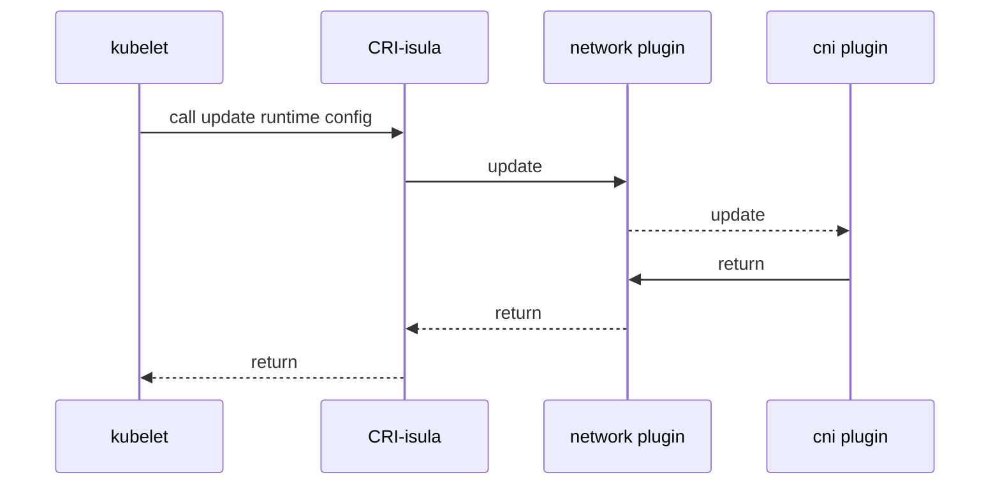
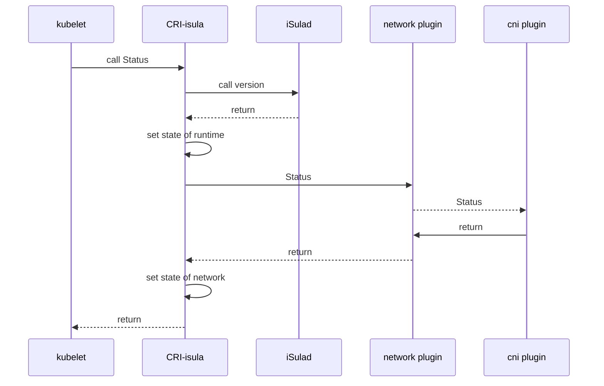
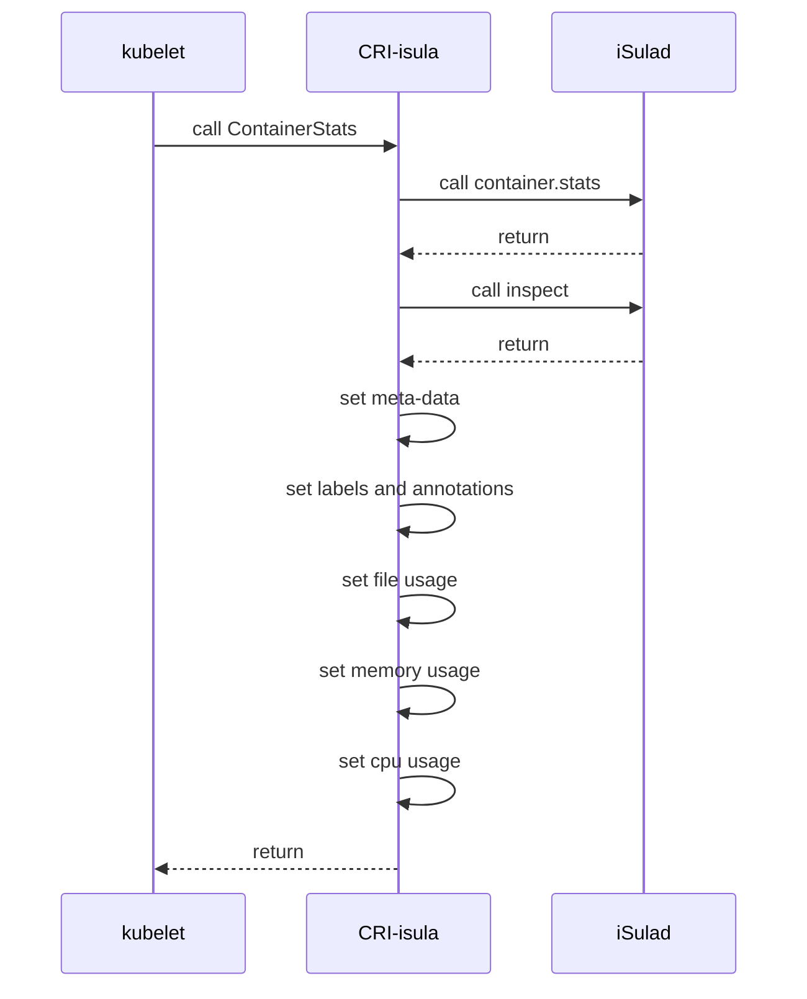
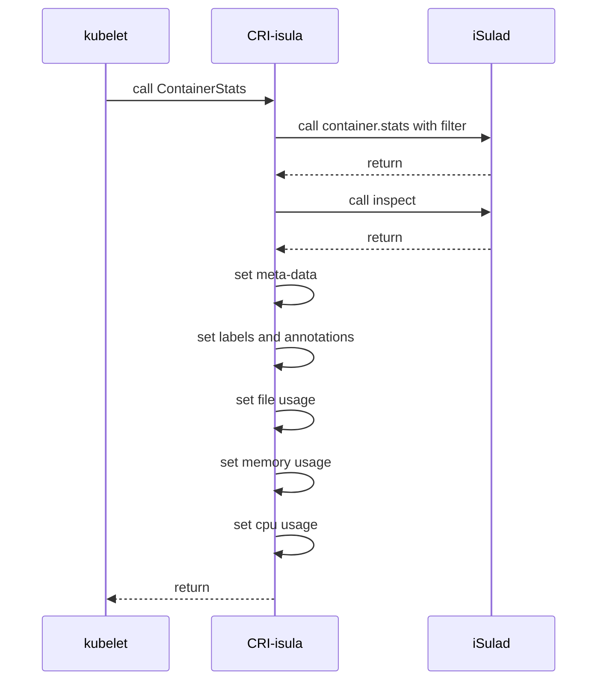

| Author | 刘昊                                       |
| ------ | ------------------------------------------ |
| Date   | 2023-03-06                                 |
| Email  | [liuhao27@huawei.com](liuhao27@huawei.com) |

本文主要对 `iSulad` 的 `CRI` 实现部分进行源码级别的学习和研究，为后续想了解 `CRI` 或者 `iSulad` 的同学提供帮助。

*注：本文以iSulad 2.0.18版本为分析对象。*

本文主要是针对 `CRI` 的 `RuntimeService` 部分，涉及如下接口：
- `RunPodSandbox`
- `StopPodSandbox`
- `RemovePodSandbox`
- `PodSandboxStatus`
- `ListPodSandbox`
- `UpdateRuntimeConfig`
- `Status`
- `ContainerStats`
- `ListContainerStats`

## CRI 代码结构

CRI 涉及代码文件如下：

```c
// CRI proto文件
src/api/services/cri/api.proto
// proto 文件解析生成入口
cmake/protoc.cmake

// grpc服务注册入口
src/daemon/entry/connect/grpc/grpc_service.cc
// cri 镜像部分的封装类
src/daemon/entry/connect/grpc/runtime_image_service.h
// cri runtime 部分的封装类
src/daemon/entry/connect/grpc/runtime_runtime_service.h

// cri 具体实现目录
src/daemon/entry/cri/
```

### CRI gRPC 服务注册和封装

iSulad `gRPC` 模式下，直接在 `gRPC` 服务初始化时，注册了 `CRI` 服务：

```c
// src/daemon/entry/connect/grpc/grpc_service.cc
int Init(const struct service_arguments *args)
{
    // 注册CRI runtime服务
    m_builder.RegisterService(&m_runtimeRuntimeService);
    // 注册CRI 镜像服务
    m_builder.RegisterService(&m_runtimeImageService);
}
```

`CRI` 服务初始化：

```c
// src/daemon/entry/connect/grpc/runtime_runtime_service.cc
void RuntimeRuntimeServiceImpl::Init(Network::NetworkPluginConf mConf, isulad_daemon_configs *config, Errors &err)
{
    ...
    // 初始化 CNI 网络插件
    Network::ProbeNetworkPlugins(mConf.GetPluginConfDir(), mConf.GetPluginBinDir(), &plugins);
    Network::InitNetworkPlugin(&plugins, mConf.GetPluginName(), mConf.GetHairpinMode(), mConf.GetNonMasqueradeCIDR(), mConf.GetMTU(), &chosen, err);

    // 初始化，CRI 服务具体实现的类
    RuntimeVersionerService *runtimeVersioner = new RuntimeVersionerServiceImpl(cb);
    ContainerManagerService *containerManager = new ContainerManagerServiceImpl(cb);
    PodSandboxManagerService *podSandboxManager = new PodSandboxManagerServiceImpl(podSandboxImage, cb, pluginManager);
    RuntimeManagerService *runtimeManager = new RuntimeManagerServiceImpl(cb, pluginManager);
    std::unique_ptr<CRI::CRIRuntimeService> service(
        new CRIRuntimeServiceImpl(runtimeVersioner, containerManager, podSandboxManager, runtimeManager));
    rService = std::move(service);
    // 初始化websocket服务
    websocket_server_init(err);
    ...
}
```

由于 `CRI` 具体实现类，定义在 `src/daemon/entry/cri/` 目录中；iSulad 通过封装的方式，在 `grpc` 服务提供了统一的入口，包括镜像和runtime两个封装类：
- src/daemon/entry/connect/grpc/runtime_image_service.cc
- src/daemon/entry/connect/grpc/runtime_runtime_service.cc

## PodSandbox 相关接口

第一部分，对 `CRI` 的新增的 `Pod` 相关的接口进行详细的探讨。

### RunPodSandbox

`RunPodSandbox` 负责 `Pod` 的创建、启动，以及网络环境准备等操作。

相关组件的序列图如下：



源码实现，概要逻辑如下：

```c
// src/daemon/entry/cri/cri_pod_sandbox_manager_service_impl.cc
auto PodSandboxManagerServiceImpl::RunPodSandbox(const runtime::v1alpha2::PodSandboxConfig &config, const std::string &runtimeHandler, Errors &error) -> std::string
{
    ...
    // Step1：根据Pod镜像策略，如果镜像不存在，是否下载
    EnsureSandboxImageExists()
    // Step2：根据Pod配置，生成Pod对应容器的配置；
    // 根据runtime选择对应的容器运行时；
    CreateSandboxContainer()
    // Step3：标识Pod网络状态为false
    SetNetworkReady()
    // Step4：通过inspect获取Pod信息，用于后续流程；
    // 以及判定Pod状态是否符合预期；
    InspectContainer()
    // Step5：判断网络模式为file，是则先创建网络命名空间；
    // 并且调用CNI插件，设置网络设备；
    util_mount_namespace()
    SetupSandboxNetwork()
    // Step6：启动Pod
    StartSandboxContainer()
    // Step7：非file网络模式，则使用容器启动创建的网络名空间；
    // 然后调用CNI插件，设置网络设备；
    SetupSandboxNetwork()
    ...
}
```

详细的代码走读，代码流程图如下：


### StopPodSandbox

`StopPodSandbox` 负责 `Pod` 的停止，以及网络资源的清理。

相关组件的序列图如下：



源码实现，概要逻辑如下：

```c
void PodSandboxManagerServiceImpl::StopPodSandbox(const std::string &podSandboxID, Errors &error)
{
    // Step1: get real pod ID
    GetRealSandboxIDToStop(podSandboxID, hostNetwork, name, ns, realSandboxID, stdAnnos, error);
    // Step2: stop all containers in pod
    StopAllContainersInSandbox(realSandboxID, error);
    // Step3: clear cni network
    ClearCniNetwork(realSandboxID, hostNetwork, ns, name, errlist, stdAnnos, error);
    // Step4: stop pod
    StopContainerHelper(realSandboxID, error);
}
```

详细的代码走读，代码流程图如下：


### RemovePodSandbox

`RemovePodSandbox` 负责删除 `Pod` ，包括对应容器的删除和其他数据的清理。

相关组件的序列图如下：



源码实现，概要逻辑如下：

```c
void PodSandboxManagerServiceImpl::RemovePodSandbox(const std::string &podSandboxID, Errors &error)
{
    // Step1: get real pod ID
    GetRealSandboxIDToStop(podSandboxID, hostNetwork, name, ns, realSandboxID, stdAnnos, error);
    // Step2: remove all containers in pod
    RemoveAllContainersInSandbox(realSandboxID, errors);
    // Step3: remove pod
    DoRemovePodSandbox(realSandboxID, errors);
}
```

详细的代码走读，代码流程图如下：


### PodSandboxStatus

`PodSandboxStatus` 负责获取 `Pod` 的状态信息，包括网络信息、创建时间、state、meta-data等等数据。

相关组件的序列图如下：



源码实现，概要逻辑如下：

```c
std::unique_ptr<runtime::v1alpha2::PodSandboxStatus>
PodSandboxManagerServiceImpl::PodSandboxStatus(const std::string &podSandboxID, Errors &error)
{
    // Step1: get real pod ID
    GetRealSandboxIDToStop(podSandboxID, hostNetwork, name, ns, realSandboxID, stdAnnos, error);
    // Step2: inspect pod sandbox
    InspectContainer(realSandboxID, error, true);
    // Step3: set status from inspect reponse
    PodSandboxStatusToGRPC(inspect, realSandboxID, podStatus, error);
       // Step 3.1 set timestamp
       podStatus->set_created_at(createdAt);
       // Step 3.2 set state
       podStatus->set_state(runtime::v1alpha2::SANDBOX_READY);
       // Step 3.3 set labels and annotations
       CRIHelpers::ExtractLabels(inspect->config->labels, *podStatus->mutable_labels());
       CRIHelpers::ExtractAnnotations(inspect->config->annotations, *podStatus->mutable_annotations());
       // Step 3.4 set options
       options->set_network(SharesHostNetwork(inspect));
       options->set_pid(SharesHostPid(inspect));
       options->set_ipc(SharesHostIpc(inspect));
       // Step 3.5 set network status
       SetSandboxStatusNetwork(inspect, podSandboxID, podStatus, error);
}
```

详细的代码走读，代码流程图在 [StopPod代码走读中](#stoppodsandbox) 中进行了详细的分析，可以参考对应的部分。

## 通用接口

### UpdateRuntimeConfig

`UpdateRuntimeConfig` 负责对运行配置进行更新，当前只有  `CIDR` 的配置更新。

相关组件的序列图如下：



源码实现，概要逻辑如下：

```c
// src/daemon/entry/cri/cri_runtime_manager_service_impl.cc
void RuntimeManagerServiceImpl::UpdateRuntimeConfig(const runtime::v1alpha2::RuntimeConfig &config, Errors & /*error*/)
{
    // 设置用户传入的新CIDR值
    events[NET_PLUGIN_EVENT_POD_CIDR_CHANGE_DETAIL_CIDR] = config.network_config().pod_cidr();
    // 调用网络插件 --> CNI 网络模块，刷新CIDR配置
    m_pluginManager->Event(NET_PLUGIN_EVENT_POD_CIDR_CHANGE, events);
}
```

代码结构比较简单，只是更新了类的一个成员的值；因此，不做详细的分析。

### Status

`Status` 接口，主要用于获取容器引擎的 和 网络模块的状态是否正常。

相关组件的序列图如下：



源码实现，概要逻辑如下：

```c
// src/daemon/entry/cri/cri_runtime_manager_service_impl.cc
auto RuntimeManagerServiceImpl::Status(Errors &error) -> std::unique_ptr<runtime::v1alpha2::RuntimeStatus>
{
    // 获取isulad的版本信息
    m_cb->container.version(nullptr, &response);
    // 设置对应的状态
    runtimeReady->set_status(true/false);
    // 调用网络插件的Status
    m_pluginManager->Status(error);
    // 设置对应的状态信息
    networkReady->set_status(true/false);
}
```

代码结构比较简单，只是获取两个模块的状态，然后设置返回值；因此，不做详细的分析。

## 容器相关接口

### ContainerStats

`ContainerStats` 负责获取容器的度量数据。

相关组件的序列图如下：



源码实现，概要逻辑如下：

```c
// src/daemon/entry/cri/cri_container_manager_service_impl.cc
auto ContainerManagerServiceImpl::ContainerStats(const std::string &containerID, Errors &error)
-> std::unique_ptr<runtime::v1alpha2::ContainerStats>
{
    // 获取容器的stats信息
    m_cb->container.stats(request, &response);
    // 转换返回信息为CRI 对应的结果
    ContainerStatsToGRPC(response, &contStatsVec, error);
        // inspect容器，获取meta-data信息，设置到返回值中
        PackContainerStatsAttributes(response->container_stats[i]->id, container, error);
        // 获取容器使用的文件系统大小等度量数据
        PackContainerStatsFilesystemUsage(response->container_stats[i]->id, response->container_stats[i]->image_type, timestamp, container);
        // 设置内存度量数据
        container->mutable_memory()->mutable_working_set_bytes()->set_value(workingset);
        container->mutable_memory()->set_timestamp(timestamp);
        // 设置CPU度量数据
        container->mutable_cpu()->mutable_usage_core_nano_seconds()->set_value(response->container_stats[i]->cpu_use_nanos);
        container->mutable_cpu()->set_timestamp(timestamp);
}
```


由于 `ContainerStats` 和 `ListContainerStats` 实现基本一致，因此，详细分析部分放到一起分析，具体见 `ListContainerStats` 章节。

### ListContainerStats

`ListContainerStats` 负责获取多容器的度量数据。

相关组件的序列图如下：



    跟 `ContainerStats` 唯一的区别是，调用 `container->stats()` 的参数不同，`ListContainerStats` 根据过滤器去获取需要采集度量数据的容器列表，而 `ContainerStats` 只采集确定容器ID 的度量数据。

源码实现，概要逻辑如下：

```c
// src/daemon/entry/cri/cri_container_manager_service_impl.cc
void ContainerManagerServiceImpl::ListContainerStats(const runtime::v1alpha2::ContainerStatsFilter *filter, std::vector<std::unique_ptr<runtime::v1alpha2::ContainerStats>> *containerstats, Errors &error)
{
    // 根据用户参数，设置stats的过滤条件
    PackContainerStatsFilter(filter, request, error);
    // 获取容器的stats信息
    m_cb->container.stats(request, &response);
    // 转换返回信息为CRI 对应的结果 --> 与ContainerStats逻辑相同
    ContainerStatsToGRPC(response, &contStatsVec, error);
}
```

详细的代码走读，代码流程图如下：


