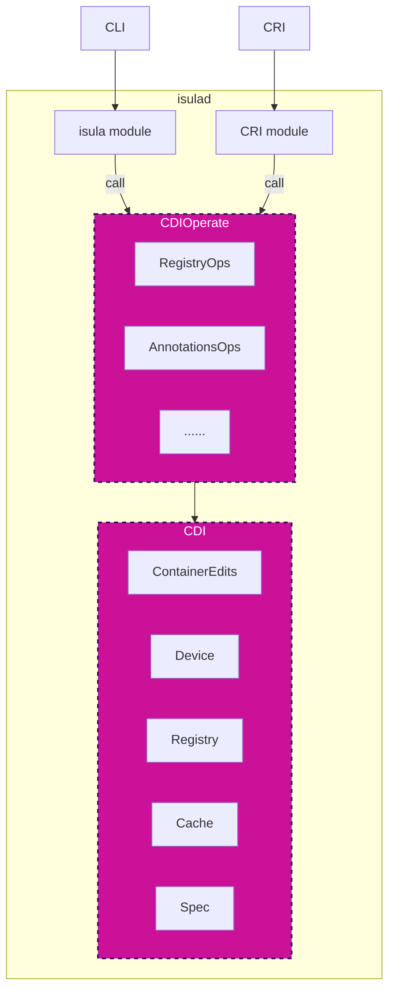
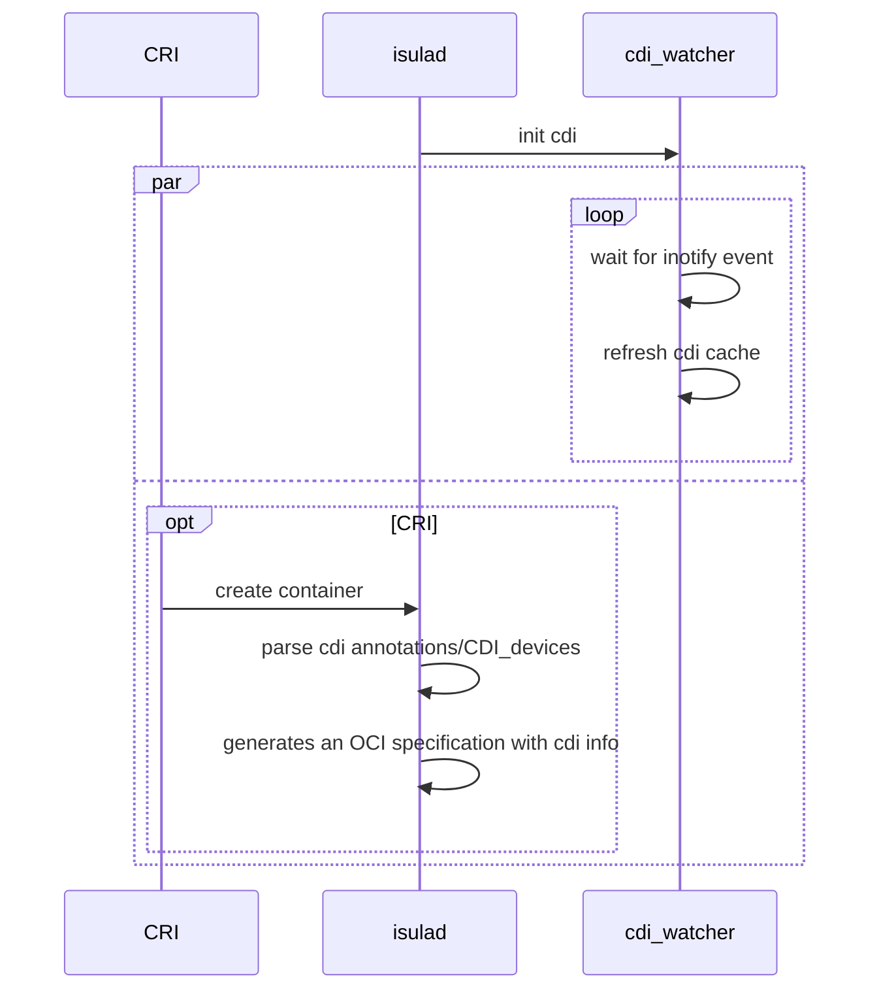
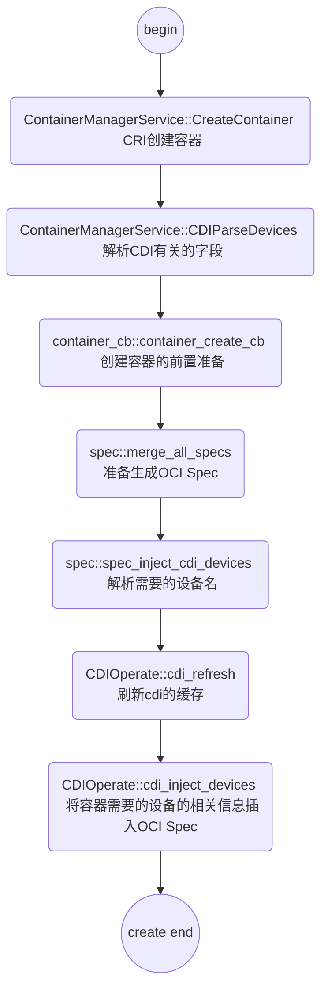
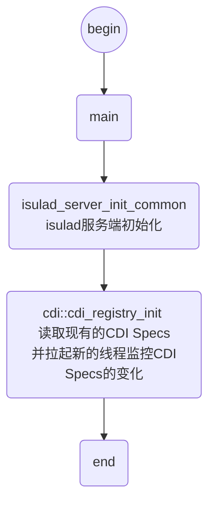
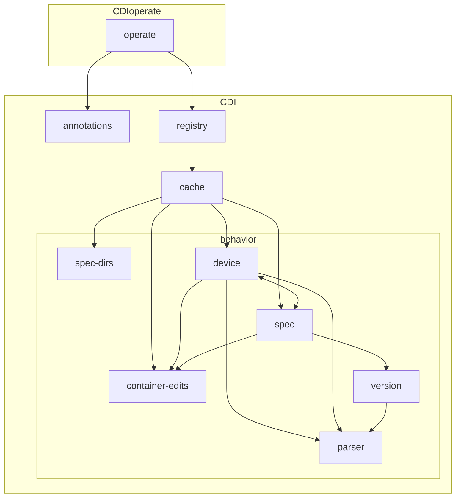

| Author | liuxu                 |
| ------ | --------------------- |
| Date   | 2024-02-27            |
| Email  | liuxu156@huawei.com   |

# 背景介绍
## What is CDI?
CDI（容器设备接口）是容器运行时的一种规范，用于支持第三方设备。

它引入了device作为资源的抽象概念。device由完全限定的名称唯一指定，该名称由vendor ID、一个device class和在每个vendor ID-device class对中唯一的name构成。
```
vendor.com/class=unique_name
```
vendor ID和device class （上例中的vendor.com/class）的组合称为device kind.

CDI只关心使容器能够感知设备。CDI明确地忽略了诸如资源管理之类的领域（并期望由编排器处理）。由于这个原因，CDI规范实现起来很简单，并且为运行时和编排器提供了极大的灵活性。

注：CDI模型基于容器网络接口（CNI）模型和规范。

## Why is CDI needed?
在Linux上，使容器具有设备感知能力过去只需在该容器中暴露一个设备节点。但是，随着设备和软件变得越来越复杂，供应商希望执行更多的操作，例如：
- 向容器公开设备可能需要公开多个设备节点、从运行时命名空间挂载文件或隐藏procfs条目。
- 执行容器和设备之间的兼容性检查（例如：检查容器是否可以在指定设备上运行）。
- 执行特定于运行时的操作（例如：虚拟机与基于Linux容器的运行时）。
- 执行特定于设备的操作（例如：清理GPU的内存或重新配置FPGA）。

在缺乏第三方设备标准的情况下，供应商通常不得不为不同的运行时编写和维护多个插件，甚至直接在运行时中贡献特定于供应商的代码。此外，运行时不统一地暴露插件系统（甚至根本不暴露插件系统），导致在更高级别的抽象（例如Kubernetes设备插件）中重复功能。

## How does CDI work?
要使CDI正常工作，需要完成以下操作：
- JSON格式的CDI文件应位于CDI规范目录中，它的作用是更新OCI spec。默认目录为/etc/cdi和/var/run/cdi
- 应使用CRI的annotations与CDI_devices（本次特性支持）将唯一的设备名称传递给运行时
- 容器运行时应该能够通过设备名称找到CDI文件在内存中对应的缓存信息，并使用缓存的内容更新容器配置。

## How to configure CDI?
### iSulad
daemon.json中开启cri-v1和cdi配置：

当 cdi-spec-dirs 不指定时，默认为"/etc/cdi", "/var/run/cdi"
```json
"enable-cri-v1": true,
"cdi-spec-dirs": ["/etc/cdi", "/var/run/cdi"],  # 指定CDI规范所在目录
"enable-cdi": true    # 打开CDI特性
```

在CRI创建容器的参数中使用CDI，以下两种方式均可：
1. annotations中指定设备
```json
{
    ... ...
    "annotations": [
        ... ...
        // key值格式要求含有cdi.k8s.io作为前缀，后面跟随pluginName
        {"cdi.k8s.io/test": "vendor.com/device=myDevice"},
        ... ...
    ]
    ... ...
}
```
2. CDI_Devices中指定设备
```json
{
    ... ...
    "CDI_Devices": [
        ... ...
        {"Name": "vendor.com/device=myDevice"},
        ... ...
    ]
    ... ...
}
```

# 方案目标
## 概述
容器设备接口（Container Device Interface，简称CDI）描述了容器运行时创建能够与第三方设备交互的容器的机制。

对于第三方设备，与这些设备进行交互通常需要容器运行时公开多个设备节点。例如，第三方设备可能需要加载内核模块、装载主机库、暴露/屏蔽特定procfs路径。

容器设备接口描述了一种允许第三方供应商执行这些操作的机制，从而不需要更改容器运行时。

使用的机制是一个JSON文件（类似于容器网络接口(CNI）)，它允许供应商描述容器运行时应该对容器的OCI规范执行的操作。

CDI 支持以下两个流程：

A.设备安装
1. 用户在机器上安装第三方设备驱动程序（和第三方设备/被测试的设备）。
2. 设备驱动程序安装软件会在一个已知路径（/etc/cdi/vendor.json）上写入一个 JSON 文件。

B.容器运行时
1. 用户在创建容器时，CRI中指定设备名称
2. 容器运行时会读取 JSON 文件。
3. 容器运行时会验证 JSON 文件中是否描述了设备。
4. 容器运行时会根据 JSON 文件中的指令转换 OCI 规范，并插入OCI Spec中
# 总体设计
**iSulad支持CDI功能目前仅支持CRI方式调用，CLI方式暂不支持**
## 整体结构



- CDIOperate封装了CDI模块，对外提供更合理的CDI功能的相关接口。
- CDI负责实现CDI Specs的读取、校验、解析、devices注入OCI Spec等具体功能。
## 时序设计
在isulad启动后，以创建一个容器为例。

图中isulad启动后，拉起一个新的线程isulad-cdi_watcher，负责监控cdi-spec-dirs，当cdi-spec-dirs中的cdi Spec文件发生修改、删除等动作时，重新扫描cdi-spec-dirs中的cdi Spec文件。



# 接口描述
## 3.1 结构体和常量说明

```c
// 实现CDI Spec规范中的json字段，参考 https://github1s.com/containerd/containerd/blob/main/vendor/tags.cncf.io/container-device-interface/specs-go/config.go#L9 
typedef struct {} cdi_spec;  
typedef struct {} cdi_spec_device;  
typedef struct {} cdi_spec_container_edits;  
typedef struct {} cdi_spec_device_node;  
typedef struct {} cdi_spec_mount;  
typedef struct {} cdi_spec_hook;

struct cdi_cache_device {
    const cdi_device *raw_device;
    const struct cdi_cache_spec *cache_spec;
};

struct cdi_cache_spec {
    cdi_spec *raw_spec;
    char *vendor;
    char *class;
    char *path;
    int priority;
    map_t *devices;  // MAP_STR_PTR  devices[cdi_device.name] = cdi_cache_device*
};

struct cdi_cache_ops {
    // injecting CDI devices into an OCI Spec.
    // Resolver
    int (*inject_devices)(struct cdi_cache *c, oci_runtime_spec *spec, string_array *devices);
    
    // refreshing the cache of CDI Specs and devices.
    // Refresher
    int (*configure)(struct cdi_cache *c, string_array *spec_dirs);
    int (*refresh)(struct cdi_cache *c);
};

struct cdi_watch {
    int watcher_fd; // inotify fd
    map_t *tracked; // MAP_STR_BOOL     tracked[spec_dirs[i]] = bool
    map_t *wd_dirs; // MAP_INT_STR      wd_dirs[wd] = spec_dirs[i]
};

// Cache stores CDI Specs loaded from Spec directories.
struct cdi_cache {
    pthread_mutex_t mutex;
    string_array *spec_dirs; // cdi-spec-dirs will scan for CDI Spec files
    map_t *specs;        // MAP_STR_PTR     specs[vendor] = common_array of cdi_cache_spec*
    // This map holding the reference to cdi device, the devices will not released when the map is freed.
    map_t *devices;      // MAP_STR_PTR     devices[cdi_device.name] = cdi_cache_device*
    bool refresh_error_flag;
    bool auto_refresh; 
    struct cdi_watch *watch;
};

struct cdi_registry {
    struct cdi_cache *cdi_cache;
    struct cdi_cache_ops *ops;
};
```
涉及修改现有的结构体：
```c
// 用于从CRI向executor传递devices数据
typedef struct {
    ... ...
    char **cdi_requested_devices;
    size_t cdi_requested_devices_len;
} host_config;

// isulad的daemon.json增加cdi相关的基本配置
typedef struct {
    ... ...
    char **cdi_spec_dirs;
    size_t cdi_spec_dirs_len;
    bool enable_cdi;
} isulad_daemon_configs;
```

## 3.2 接口说明
CDIOperate的设计目标：使得CDI规范有关的内容不过多的对外暴露，降低CDI模块和外部的耦合。
### RegistryOps
```c
int cdi_operate_registry_init(char **specs_dirs, size_t specs_dirs_len);

int cdi_operate_refresh(void);

int cdi_operate_inject_devices(oci_runtime_spec *spec, string_array *devices);

int cdi_operate_parse_annotations(json_map_string_string *annotations, string_array **keys,
                                  string_array **devices, char **error);
```

# 详细设计
## daemon.json
daemon.json中增加cdi配置：
```json
"cdi-spec-dirs": ["/etc/cdi", "/var/run/cdi"],
"enable-cdi": true
```
## CDIOperate被调用点
### CreateContainer
创建新的Container时需要将devices插入OCI Spec。
本次开发暂不涉及isula支持CDI。

为什么已经有isulad-cdi_watcher线程了，在create的时候还需要refresh?
1. isulad-cdi_watcher在触发inotify event后，如果为Rename、Remove、Write事件，会直接执行refresh，将重新扫描cdi-spec-dirs中的CDI Specs到内存。
2. 而在create container时，cdi_refresh先检查tracked，tracked标记了是否所有目录都已被跟踪，如果不是才会触发refresh。tracked在cache生成时初始化为未跟踪。



ContainerManagerService::CDIParseDevices 需要支持两种CDI devices解析方式：
1. CDIOperate::cdi_parse_annotations 解析ContainerConfig.annotations() 
2. 解析ContainerConfig.CDI_devices()
解析后放入container_create_request
### main
isulad 启动时，读取所有CDI Specs，初始化cache


## CDI 模块设计


### new cache

