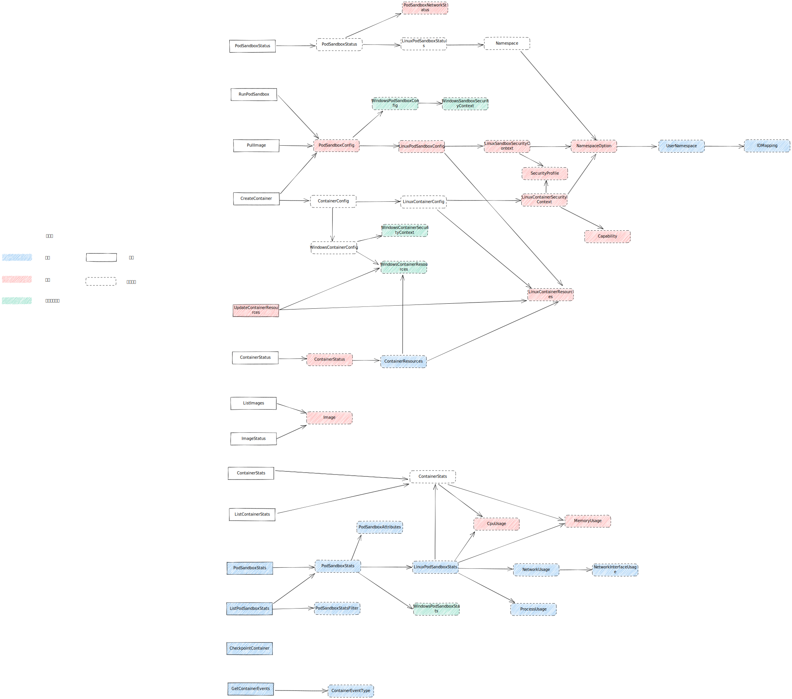

| Author | 张晓雨                   |
| ------ | ------------------------ |
| Date   | 2022-12-07               |
| Email  | zhangxiaoyu58@huawei.com |

### 参考代码

升级版本：1.25
参考地址：https://github.com/kubernetes/cri-api


### 变更依赖图



### 变更说明

##### PodSandboxNetworkStatus
行为变更
- Currently ignored for pods sharing the host networking namespace
- list of additional ips (not inclusive of PodSandboxNetworkStatus.Ip) of the PodSandBoxNetworkStatus

##### PodSandboxConfig
新增WindowsPodSandboxConfig字段，不支持，无需变更

##### LinuxPodSandboxConfig
新增字段
- overhead. Optional overhead represents the overheads associated with this sandbox
- resources. Optional resources represents the sum of container resources for this sandbox

##### LinuxSandboxSecurityContext
新增字段
- seccomp. Seccomp profile for the sandbox
- apparmor. AppArmor profile for the sandbox
废弃字段
- seccomp_profile_path

##### NamespaceOption
新增字段
- userns_options. UsernsOptions for this pod sandbox
行为变更
- pid. Support from (POD, CONTAINER, NODE) to (POD, CONTAINER, NODE, TARGET)

##### UserNamespace
新增字段
```proto
// UserNamespace describes the intended user namespace configuration for a pod sandbox.
message UserNamespace {
    // Mode is the NamespaceMode for this UserNamespace.
    // Note: NamespaceMode for UserNamespace currently supports only POD and NODE, not CONTAINER OR TARGET.
    NamespaceMode mode = 1;

    // Uids specifies the UID mappings for the user namespace.
    repeated IDMapping uids = 2;

    // Gids specifies the GID mappings for the user namespace.
    repeated IDMapping gids = 3;
}
```

##### IDMapping
新增字段
```proto
// IDMapping describes host to container ID mappings for a pod sandbox.
message IDMapping {
    // HostId is the id on the host.
    uint32 host_id = 1;
    // ContainerId is the id in the container.
    uint32 container_id = 2;
    // Length is the size of the range to map.
    uint32 length = 3;
}
```

##### LinuxContainerSecurityContext
新增字段
- seccomp. Seccomp profile for the container
- apparmor. AppArmor profile for the container
废弃字段
- apparmor_profile
- seccomp_profile_path

##### Capability
新增字段
- add_ambient_capabilities. List of ambient capabilities to add
行为变更
- Dropping a capability will drop it from all sets
- add/drop capabilities
	// If a capability is added to only the add_capabilities list then it gets added to permitted,
	// inheritable, effective and bounding sets, i.e. all sets except the ambient set.
	// If a capability is added to only the add_ambient_capabilities list then it gets added to all sets, i.e permitted
	// inheritable, effective, bounding and ambient sets.
	// If a capability is added to add_capabilities and add_ambient_capabilities lists then it gets added to all sets, i.e.
	// permitted, inheritable, effective, bounding and ambient sets.

##### UpdateContainerResourcesRequest
新增字段
- WindowsContainerResources. 不支持，无需变更
- annotations. Unstructured key-value map holding arbitrary additional information for container resources updating

##### LinuxContainerResources
新增字段
- unified. Unified resources for cgroup v2
- memory_swap_limit_in_bytes. Memory swap limit in bytes

##### (message) ContainerStatus
新增字段
- resources. Resource limits configuration of the container

##### ContainerResources
新增字段。WindowsContainerResources不支持。
```proto
// ContainerResources holds resource limits configuration for a container.
message ContainerResources {
    // Resource limits configuration specific to Linux container.
    LinuxContainerResources linux = 1;
    // Resource limits configuration specific to Windows container.
    WindowsContainerResources windows = 2;
}
```

##### Image
新增字段
- pinned. Recommendation on whether this image should be exempt from garbage collection

##### CpuUsage
新增字段
- usage_nano_cores. Total CPU usage (sum of all cores) averaged over the sample window

##### MemoryUsage
新增字段
- available_bytes. Available memory for use
- usage_bytes. Total memory in use
- rss_bytes. The amount of anonymous and swap cache memory (includes transparent hugepages)
- page_faults. Cumulative number of minor page faults
- major_page_faults. Cumulative number of major page faults

##### (rpc) PodSandboxStats
新增接口
PodSandboxStats returns stats of the pod sandbox
```proto
message PodSandboxStatsRequest {
    // ID of the pod sandbox for which to retrieve stats.
    string pod_sandbox_id = 1;
}

message PodSandboxStatsResponse {
    PodSandboxStats stats = 1;
}
```

##### (message) PodSandboxStats
新增字段。WindowsPodSandboxStats不支持
```proto
// PodSandboxStats provides the resource usage statistics for a pod.
// The linux or windows field will be populated depending on the platform.
message PodSandboxStats {
    // Information of the pod.
    PodSandboxAttributes attributes = 1;
    // Stats from linux.
    LinuxPodSandboxStats linux = 2;
    // Stats from windows.
    WindowsPodSandboxStats windows = 3;
}
```

##### PodSandboxAttributes
新增字段
```proto
// PodSandboxAttributes provides basic information of the pod sandbox.
message PodSandboxAttributes {
    // ID of the pod sandbox.
    string id = 1;
    // Metadata of the pod sandbox.
    PodSandboxMetadata metadata = 2;
    // Key-value pairs that may be used to scope and select individual resources.
    map<string,string> labels = 3;
    // Unstructured key-value map holding arbitrary metadata.
    // Annotations MUST NOT be altered by the runtime; the value of this field
    // MUST be identical to that of the corresponding PodSandboxStatus used to
    // instantiate the PodSandbox this status represents.
    map<string,string> annotations = 4;
}
```

##### LinuxPodSandboxStats
新增字段
```proto
// LinuxPodSandboxStats provides the resource usage statistics for a pod sandbox on linux.
message LinuxPodSandboxStats {
    // CPU usage gathered for the pod sandbox.
    CpuUsage cpu = 1;
    // Memory usage gathered for the pod sandbox.
    MemoryUsage memory = 2;
    // Network usage gathered for the pod sandbox
    NetworkUsage network = 3;
    // Stats pertaining to processes in the pod sandbox.
    ProcessUsage process = 4;
    // Stats of containers in the measured pod sandbox.
    repeated ContainerStats containers = 5;
}
```

##### NetworkUsage
新增字段
```proto
// NetworkUsage contains data about network resources.
message NetworkUsage {
    // The time at which these stats were updated.
    int64 timestamp = 1;
    // Stats for the default network interface.
    NetworkInterfaceUsage default_interface = 2;
    // Stats for all found network interfaces, excluding the default.
    repeated NetworkInterfaceUsage interfaces = 3;
}
```

##### NetworkInterfaceUsage
新增字段
```proto
// NetworkInterfaceUsage contains resource value data about a network interface.
message NetworkInterfaceUsage {
    // The name of the network interface.
    string name = 1;
    // Cumulative count of bytes received.
    UInt64Value rx_bytes = 2;
    // Cumulative count of receive errors encountered.
    UInt64Value rx_errors = 3;
    // Cumulative count of bytes transmitted.
    UInt64Value tx_bytes = 4;
    // Cumulative count of transmit errors encountered.
    UInt64Value tx_errors = 5;
}
```

##### ListPodSandboxStats
新增接口
ListPodSandboxStats returns stats of the pod sandboxes matching a filter
```proto
message ListPodSandboxStatsRequest {
    // Filter for the list request.
    PodSandboxStatsFilter filter = 1;
}

message ListPodSandboxStatsResponse {
    // Stats of the pod sandbox.
    repeated PodSandboxStats stats = 1;
}
```

##### PodSandboxStatsFilter
新增字段
```proto
// PodSandboxStatsFilter is used to filter the list of pod sandboxes to retrieve stats for.
// All those fields are combined with 'AND'.
message PodSandboxStatsFilter {
    // ID of the pod sandbox.
    string id = 1;
    // LabelSelector to select matches.
    // Only api.MatchLabels is supported for now and the requirements
    // are ANDed. MatchExpressions is not supported yet.
    map<string, string> label_selector = 2;
}
```

##### ProcessUsage
新增字段
```proto
// ProcessUsage are stats pertaining to processes.
message ProcessUsage {
    // The time at which these stats were updated.
    int64 timestamp = 1;
    // Number of processes.
    UInt64Value process_count = 2;
}
```

##### CheckpointContainer
新增接口
CheckpointContainer checkpoints a container
```proto
message CheckpointContainerRequest {
    // ID of the container to be checkpointed.
    string container_id = 1;
    // Location of the checkpoint archive used for export
    string location = 2;
    // Timeout in seconds for the checkpoint to complete.
    // Timeout of zero means to use the CRI default.
    // Timeout > 0 means to use the user specified timeout.
    int64 timeout = 3;
}

message CheckpointContainerResponse {}
```

##### GetContainerEvents
新增接口
GetContainerEvents gets container events from the CRI runtime
```proto
message GetEventsRequest {}

message ContainerEventResponse {
    // ID of the container
    string container_id = 1;

    // Type of the container event
    ContainerEventType container_event_type = 2;

    // Creation timestamp of this event
    int64 created_at = 3;

    // ID of the sandbox container
    PodSandboxMetadata pod_sandbox_metadata = 4;
}
```

##### ContainerEventType
新增字段
```proto
enum ContainerEventType {
    // Container created
    CONTAINER_CREATED_EVENT = 0;

    // Container started
    CONTAINER_STARTED_EVENT = 1;

    // Container stopped
    CONTAINER_STOPPED_EVENT = 2;

    // Container deleted
    CONTAINER_DELETED_EVENT = 3;
}
```

##### SecurityProfile
新增字段
```proto
// A security profile which can be used for sandboxes and containers.
message SecurityProfile {
    // Available profile types.
    enum ProfileType {
        // The container runtime default profile should be used.
        RuntimeDefault = 0;
        // Disable the feature for the sandbox or the container.
        Unconfined = 1;
        // A pre-defined profile on the node should be used.
        Localhost = 2;
    }
    // Indicator which `ProfileType` should be applied.
    ProfileType profile_type = 1;
    // Indicates that a pre-defined profile on the node should be used.
    // Must only be set if `ProfileType` is `Localhost`.
    // For seccomp, it must be an absolute path to the seccomp profile.
    // For AppArmor, this field is the AppArmor `<profile name>/`
    string localhost_ref = 2;
}
```


### 变更，不支持

- WindowsPodSandboxConfig
- WindowsPodSandboxStats
- WindowsSandboxSecurityContext
- WindowsContainerSecurityContext
- WindowsContainerResources
