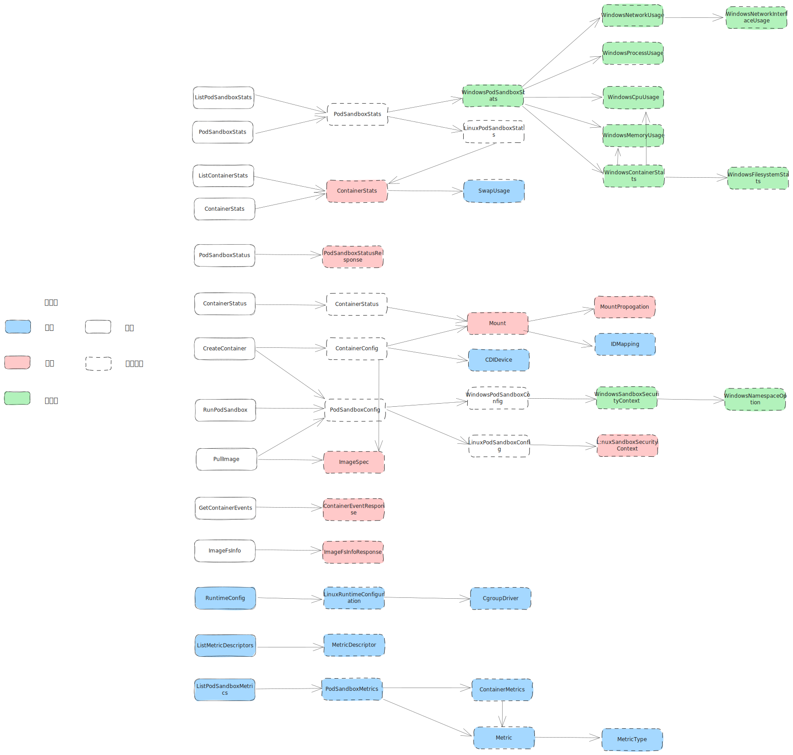

| Author | 吉凯                   |
| ------ | ------------------------ |
| Date   | 2023-12-22               |
| Email  | jikai11@huawei.com |

### 参考代码

升级版本：1.29
参考地址：<https://github.com/kubernetes/cri-api/tree/kubernetes-1.29.0>

### 变更依赖图

### 变更说明

##### [CRI: Add Windows Podsandbox Stats](https://github.com/kubernetes/kubernetes/pull/110754)

不支持，无需变更

- Added fields to the type `WindowsPodSandboxStats` expressing stats required to be collected from windows pods.

##### [Windows hostnetwork alpha](https://github.com/kubernetes/kubernetes/pull/112961)

不支持，无需变更

- New type `WindowsNamespaceOption` introduced
- The type `WindowsSandboxSecurityContext` has a new field `namespace_options` of type `WindowsNamespaceOption`

##### [Improve the API description of `PodSecurityContext.SupplementalGroups` to clarify its unfamiliar behavior](https://github.com/kubernetes/kubernetes/pull/113047)

描述修改，优化`PodSecurityContext.SupplementalGroups`的注释，明确容器镜像定义的主UID不在该列表下的行为

- Clarified the expected behavior of `SupplementalGroups` field of `PodSecurityContext`

##### [Add Support for Evented PLEG](https://github.com/kubernetes/kubernetes/pull/111384)

新增字段，`GetContainerEvent`提供pod status和container status信息，`PodSandboxStatus`提供container status信息，[KEP-3386](https://github.com/kubernetes/enhancements/blob/master/keps/sig-node/3386-kubelet-evented-pleg/README.md)

- The type `ContainerEventResponse` updated: the field `pod_sandbox_metadata` removed and fields `pod_sandbox_status` and `containers_statuses` added.
- The type `PodSandboxStatusResponse` has a new fields `containers_statuses` and `timestamp`

##### [CRI: Add CDI device info for containers](https://github.com/kubernetes/kubernetes/pull/115891/)

新增字段，CDI特性支持，CDI设备信息不再从annotation获取，直接从`ContainerConfig`获取，[KEP-3063](https://github.com/kubernetes/enhancements/blob/master/keps/sig-node/3063-dynamic-resource-allocation/README.md)

- New type `CDIDevice` was introduced and added to container config

##### [Add mappings for volumes](https://github.com/kubernetes/kubernetes/pull/116377)

新增字段，`Mount`中新增UID/GID映射信息，要求CRI创建挂载绑定时指定UID/GID映射信息，Kubelet不再负责映射，
[KEP-127](https://github.com/kubernetes/enhancements/tree/master/keps/sig-node/127-user-namespaces)

- Added new fields to the type `Mount` expressing runtime UID/GID mappings for the mount.

##### [cri-api: fix comment lines about PROPAGATION_PRIVATE](https://github.com/kubernetes/kubernetes/pull/115704)

描述修改，修改对PROPAGATION_PRIVATE的不正确注释

- Fixed comment lines about PROPAGATION_PRIVATE

##### [Add user specified image to CRI ContainerConfig](https://github.com/kubernetes/kubernetes/pull/118652)

新增字段，`ImageSpec`新增`user_specified_image`，确保创建容器时验证正确的镜像

- Added the `user_specified_image` field to type `ImageSpec`

##### [kubelet: get cgroup driver config from CRI](https://github.com/kubernetes/kubernetes/pull/118770)

新增rpc，获取cgroup驱动配置，[KEP-4033](https://github.com/kubernetes/enhancements/tree/master/keps/sig-node/4033-group-driver-detection-over-cri)

- Added rpc for querying runtime configuration
- Added cavieats about cgroup driver field

##### [Add swap to stats to Summary API and Prometheus endpoints (/stats/summary and /metrics/resource)](https://github.com/kubernetes/kubernetes/pull/118865)

新增字段，`ContainerStats`中新增虚拟内存使用情况信息，[KEP-2400](https://github.com/kubernetes/enhancements/blob/master/keps/sig-node/2400-node-swap/README.md#beta-1)

- Added `SwapUsage` type
- Added `SwapUsage` field to `ContainerStats` type

##### [Expose commit memory used in WindowsMemoryUsage struct](https://github.com/kubernetes/kubernetes/pull/119238)

不支持，无需变更。

- Added the `commit_memory_bytes` field to type `WindowsMemoryUsage`

##### [Add runtime handler field to ImageSpec struct](https://github.com/kubernetes/kubernetes/pull/121121)

新增字段，指定拉取镜像所采用的运行时处理，[KEP-4216](https://github.com/kubernetes/enhancements/tree/master/keps/sig-node/4216-image-pull-per-runtime-class)

- Added `runtime_handler` field to type `ImageSpec`

##### [kubelet: add support for broadcasting metrics from CRI](https://github.com/kubernetes/kubernetes/pull/113609)

新增rpc，`ListMetricDescriptors`和`ListPodSandboxMetrics`获取metrics信息，[KEP-2371](https://github.com/kubernetes/enhancements/blob/master/keps/sig-node/2371-cri-pod-container-stats/README.md)

- Added rpc for pulling the metrics from CRI and broadcasting them to prometheus
- Added cavieats about metrics

##### [Kubelet disk api cri update](https://github.com/kubernetes/kubernetes/pull/120914)

新增字段，`ImageFsInfo`返回值添加容器文件系统信息，[KEP-4191](https://github.com/kubernetes/enhancements/blob/master/keps/sig-node/4191-split-image-filesystem/README.md)

- Added `container_filesystems` field to type `ImageFsInfoResponse`
