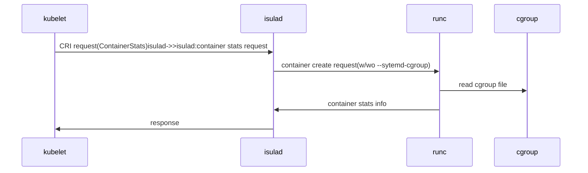
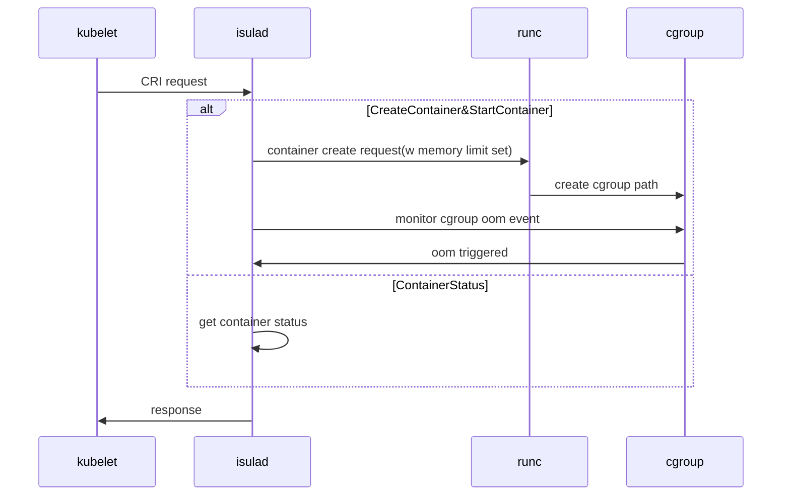
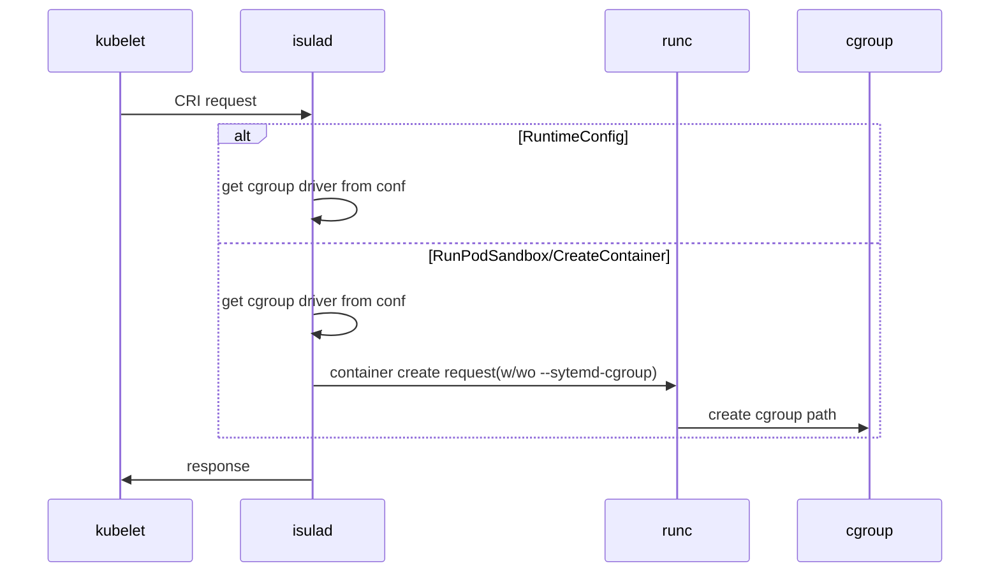
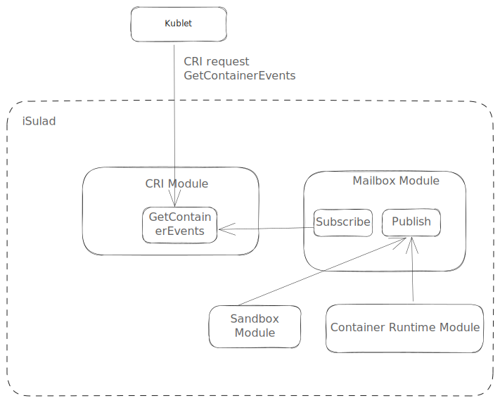

| Author | 吉凯                   |
| ------ | ----------------------|
| Date   | 2024-02-20            |
| Email  | jikai11@huawei.com    |

### 方案目标

当前iSulad CRI接口版本采用的1.25版本, 预期升级至1.29版本，iSulad CRI接口需要对升级后的新增CRI字段进行补充。

该需求需要iSulad对K8S新版本CRI接口1.29提供支持，在K8S 1.25及之前，K8S存在CRI V1alpha2 和 CRI V1两种版本的CRI接口，
但从1.26开始，K8S开始仅提供对于新版本CRI V1的支持，对1.25及之前的CRI接口，此次升级中，iSulad引用CRI V1，
对于1.25及之前的CRI接口，V1alpha2和V1功能保持一致，1.26及之后新增的特性仅在CRI V1中提供支持。

CRI V1使能：

1、编译iSulad时开启ENABLE_CRI_API_V1编译选项

```bash
cmake ../ -D ENABLE_CRI_API_V1=ON
```

2、daemon.json中enable-cri-v1设置为true

```json
{
    "group": "isula",
    "default-runtime": "runc",
    "graph": "/var/lib/isulad",
    "state": "/var/run/isulad",
    "log-level": "ERROR",
    "pidfile": "/var/run/isulad.pid",
    ...
    "enable-cri-v1": true,
}
```

### 总体设计

#### 变更文档

<https://gitee.com/openeuler/iSulad/blob/master/docs/design/detailed/CRI/CRI_1.29_interface_change.md>

#### 总体设计图


#### 此次更新包含以下变更

##### [kubelet: get cgroup driver config from CRI](https://github.com/kubernetes/kubernetes/pull/118770)

`RuntimeConfig` 获取cgroup驱动配置 cgroupfs 或 systemd-cgroup

##### [Add Support for Evented PLEG](https://github.com/kubernetes/kubernetes/pull/111384)

`GetContainerEents`，提供对pod生命周期相关事件流

`PodSandboxStatus`有相应调整

##### [Add swap to stats to Summary API and Prometheus endpoints (/stats/summary and /metrics/resource)](https://github.com/kubernetes/kubernetes/pull/118865)

`ContainerStats`新增虚拟内存使用情况信息： `SwapUsage`

##### 变更排查

1、[Propose comment to standardize the reason field](https://github.com/kubernetes/kubernetes/pull/112977)

Must be set to "OOMKilled" for containers terminated by cgroup-based Out-of-Memory killer.

container status中reason字段在cgroup out-of-memory时应该设置为OOMKilled

2、[Improve the API description of `PodSecurityContext.SupplementalGroups` to clarify its unfamiliar behavior](https://github.com/kubernetes/kubernetes/pull/113047)

描述修改，优化`PodSecurityContext.SupplementalGroups`的注释，明确容器镜像定义的主UID不在该列表下的行为

- Clarified the expected behavior of `SupplementalGroups` field of `PodSecurityContext`

```txt
    // List of groups applied to the first process run in the sandbox, in
    // addition to the sandbox's primary GID, and group memberships defined
    // in the container image for the sandbox's primary UID of the container process.
    // If the list is empty, no additional groups are added to any container.
    // Note that group memberships defined in the container image for the sandbox's primary UID
    // of the container process are still effective, even if they are not included in this list.
```

3、[cri-api: document expectation of 16 MB limit](https://github.com/kubernetes/kubernetes/pull/110435)

```txt
    // Captured command stdout output.
    // The runtime should cap the output of this response to 16MB.
    // If the stdout of the command produces more than 16MB, the remaining output
    // should be discarded, and the command should proceed with no error.
    // See CVE-2022-1708 and CVE-2022-31030 for more information.
```

##### 其它不涉及

1、windows相关

[CRI: Add Windows Podsandbox Stats](https://github.com/kubernetes/kubernetes/pull/110754)

[Windows hostnetwork alpha](https://github.com/kubernetes/kubernetes/pull/112961)

[Expose commit memory used in WindowsMemoryUsage struct](https://github.com/kubernetes/kubernetes/pull/119238)

2、iSulad 底层暂不支持

[Add mappings for volumes](https://github.com/kubernetes/kubernetes/pull/116377)

[CRI: Add CDI device info for containers](https://github.com/kubernetes/kubernetes/pull/115891/)

3、K8S KEP 初期，其它容器引擎未支持，iSulad暂不支持

[kubelet: add support for broadcasting metrics from CRI](https://github.com/kubernetes/kubernetes/pull/113609)

4、其它

[Add user specified image to CRI ContainerConfig](https://github.com/kubernetes/kubernetes/pull/118652)

[Add runtime handler field to ImageSpec struct](https://github.com/kubernetes/kubernetes/pull/121121)

[cri-api: fix comment lines about PROPAGATION_PRIVATE](https://github.com/kubernetes/kubernetes/pull/115704)

[Kubelet disk api cri update](https://github.com/kubernetes/kubernetes/pull/120914)

### 详细设计

#### Add swap stats to ContainerStats

`ContainerStats`新增虚拟内存使用情况信息： `SwapUsage`



#### define reason to ContainerStatus

container status中reason字段在cgroup out-of-memory时应该设置为OOMKilled



#### kubelet: get cgroup driver config from CRI

KEP：<https://github.com/kubernetes/enhancements/issues/4033>

##### RuntimeConfig CRI API修改

新增rpc，获取cgroup驱动配置: cgroupfs 或者 systemd-cgroup

##### iSulad RuntimeConfig 设计

仅提供对runc的支持

配置文件daemon.json: systemd-cgroup: true表示使用systemd-cgroup否则使用cgroupfs

在iSulad配置cgroup driver为systemd-cgroup时，底层runc采用对应的systemd-cgroup



#### Add Support for Evented PLEG

##### GetContainerEvents CRI API修改

`GetContainerEvents` rpc接口此前尚未支持，此次提供对该接口的支持

##### iSulad GetContainerEvents设计

CRIContainerEvents 模块

增加接口mailbox_publish

事件包括沙箱和容器以下几种类型生命周期事件

```proto
enum ContainerEventType {
    // Container created
    CONTAINER_CREATED_EVENT = 0;

    // Container started
    CONTAINER_STARTED_EVENT = 1;

    // Container stopped
    CONTAINER_STOPPED_EVENT = 2;

    // Container deleted
    CONTAINER_DELETED_EVENT = 3;
}
```



### 使用限制

以上特性仅保证容器运行时设置为runc时支持。
