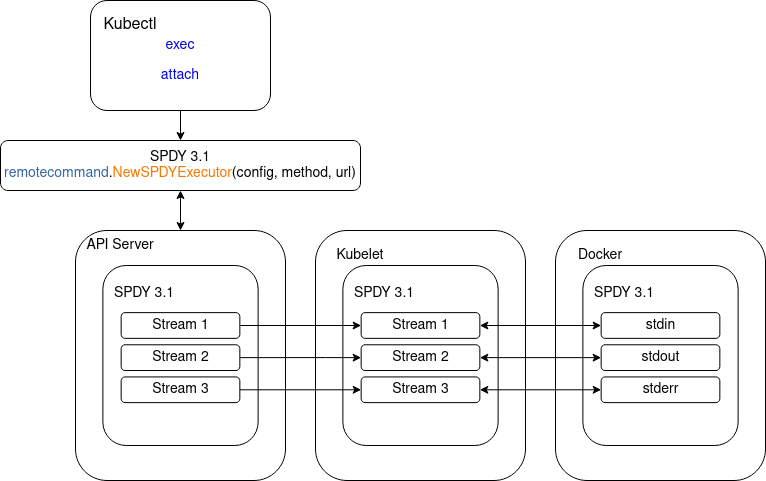

| Author | Ilya Kuksenok                                        |
| ------ | ---------------------------------------------------- |
| Date   | 2022-12-19                                           |
| Email  | [ilya.kuksenok@huawei.com](ilya.kuksenok@huawei.com) |

# Problem defenition

Right now in **Kubectl** supports only [SPDY](https://www.chromium.org/spdy/), protocol for [exec](https://github.com/kubernetes/kubernetes/blob/release-1.25/staging/src/k8s.io/kubectl/pkg/cmd/exec/exec.go#L121) cp [attach](https://github.com/kubernetes/kubernetes/blob/release-1.25/staging/src/k8s.io/kubectl/pkg/cmd/attach/attach.go#L158) and port forwarding.
SPDY was deprecated a few years ago and now should be switched to something else, for example [websockets](https://www.rfc-editor.org/rfc/rfc6455.html) or [HTTP/2](https://www.rfc-editor.org/rfc/rfc7540).

Visual representation of the problem

## SPDY version of Kubectl

As you can see on this diagram, SPDY is widely used in communication between all necessary components.

## Websockets version

Desired communication diagram.

## Some brief history

This section should help you to understand why websockets approach still wasn't implemented in current k8s implementation.

### 2015

[SPDY is deprecated. Switch to HTTP/2.](https://github.com/kubernetes/kubernetes/issues/7452)

Is this issue community trying to deside is it ok to use HTTP/2 or no and generaly speaking, this is not a best idea because websockets are
already used in some parts of k8s, like in kubelet. In this case if HTTP/2 will be implemented consistency in the project will be broken
[link](https://github.com/kubernetes/kubernetes/issues/7452#issuecomment-896384340).

and  nevertheless  looks like all faced problems until now
have been resolved, but now they dont have any sort of consesus about HTTP/2 or
other possible ways of SPDY deprecation.

### 2020

In the issue [kubectl exec/attach using websockets](https://github.com/kubernetes/kubernetes/issues/89163) Kubernetes team discussing faced problems related to *SPDY -> websockets* migration.

As for now, Websockets are highly used in API server and kubelet, for example, starting from version release-1.19,
look [here](https://github.com/kubernetes/kubernetes/blob/release-1.19/pkg/kubelet/cri/streaming/remotecommand/websocket.go#L26) for details.

## Current situation

Right now some big parts of k8s are already using websockets;
if  you look closely to the source code you will find that main websocket library is a part of standard
[golang networking](https://pkg.go.dev/golang.org/x/net)
package [websocket](https://pkg.go.dev/golang.org/x/net/websocket),
also you can find gorilla/websockets package. In other words,
the k8s community is actively trying to remove SPDY.

## KubeCTL

This package uses SPDY for container control and communication, for example [here](https://github.com/kubernetes/kubernetes/blob/master/staging/src/k8s.io/client-go/tools/remotecommand/remotecommand.go#L31).

There were several tryouts about untroducing websockets into kubetcl, for example:

[Latest](https://github.com/kubernetes/kubernetes/pull/110142)

[Previous](https://github.com/kubernetes/kubernetes/pull/107125)

## Currently faced problems

1) [Flawed exec over websocket protocol](https://github.com/kubernetes/kubernetes/issues/89899) Protocol related issue
2) [Gorilla Toolkit](https://github.com/gorilla) will be [archived](https://docs.github.com/en/repositories/archiving-a-github-repository/archiving-repositories) by the [end of 2022](https://github.com/gorilla#gorilla-toolkit).

Lets discuss these problems in a more detailed manner.

### Issue 1  Flawed exec over websocket protocol

Problem definition:

Websocket protocol does not support **half-close** feature look at [RFC6455](https://www.rfc-editor.org/rfc/rfc6455), exactly to [section-7.1.2](https://www.rfc-editor.org/rfc/rfc6455#section-7.1.2) and [section-7.1.6](https://www.rfc-editor.org/rfc/rfc6455#section-7.1.6) for more detailed info, but at the same time SPDY [supports](https://mbelshe.github.io/SPDY-Specification/draft-mbelshe-spdy-00.xml#StreamHalfClose) it.

In case of SPDY this behavior is defined by FLAG_FIN, in case of websockets we dont have same possibility out of the box.

#### Why this is important

According to [STDIN close issue](https://github.com/kubernetes/kubernetes/issues/89899) to have some sort of *half-close* feature implementation would be very useful,
for more details please look [here](https://github.com/kubernetes/kubernetes/issues/89899#issuecomment-1132502190) and [here](https://github.com/kubernetes/kubernetes/issues/89899#issuecomment-1143026673).

Based on this [websockets protocol enhancements](https://github.com/kubernetes/enhancements/issues/3396) are required,
this will allow to fix existing issues, like half-closed connections without big troubles,
and in future it will prevent other possible websocket relaterd issues.

#### Current protocol update/change related issues

1) Break backward compatibility with old clients
2) Huge amount of refactoring (current implementation is hardly tired to SPDY)

### Issue 2 Gorilla Toolkit deprecation

As I have already mentioned, [Gorilla Toolkit](https://github.com/gorilla) already archived, and we or anyone else **should not**
use it in any production scenario, even in case of MEDIUM CVE (described in paragraph 4 table 12 of [CVSS-Specification](https://www.first.org/cvss/v3.1/specification-document)) or any other CVE,
we cant get a fix from the package developer and we will have to fix it on our end which is bad in terms of user and developer experience.

# What next

Because of declared issues K8S developers community finally made a decision to drop SPDY and move to websockets [KEP-3396](https://github.com/kubernetes/enhancements/pull/3401/files), but new protocol still in development stage, as for now development process looks frozen and no concrete plan of development was introduced, but at least process started.

# Some useful links

[Half closed TCP](https://www.excentis.com/blog/tcp-half-close-a-cool-feature-that-is-now-broken/)

[SPDY Deprecation](https://blog.cloudflare.com/deprecating-spdy/)

[Web Sockets protocol](https://www.rfc-editor.org/rfc/rfc6455)

[SPDY protocol](https://www.chromium.org/spdy/spdy-protocol/)

[HTTP/2 Protocol](https://www.rfc-editor.org/rfc/rfc7540)
