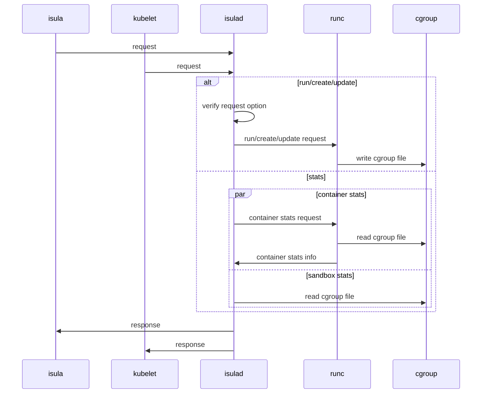

| Author | zhongtao              |
| ------ | --------------------- |
| Date   | 2024-02-19            |
| Email  | zhongtao17@huawei.com |
# 方案目标

cgroup是linux中用于限制进程组资源的功能。cgroup目前包括两个版本，cgroup v1和cgroup v2。cgroup v2的目标是取代cgroup v1，出于兼容性的考虑，cgroup v1并没有在内核中删除，并且大概率会长期存在。该需求的目的为使得iSulad支持cgroup v2.

## 与cgroup v1差异
无论是cgroup v1还是cgroup v2，iSulad提供给用户使用的接口都是一致的。不过由于有部分cgroup v1支持的功能在cgroup v2中被去掉了或者实现方式有所变化，因此部分接口在cgroup v2中不可用或者含义发生变化。iSulad支持限制如下资源：

|资源|功能|和cgroup v1的差异|
|---|---|---|
|devices|限制对应的设备是否可以在容器中访问以及访问权限|devcies子系统不再使用往cgroup文件里写值的方式进行限制，而是采用ebpf的方式进行限制|
|memory|限制容器的内存资源|不支持swappiness，不支持kmem相关参数，不支持oom_control|
|cpu/cpuset|限制容器的cpu资源|不支持rt_*相关(实时线程)的限制|
|blkio/io|限制容器的块设备io|不仅限制块设备的IO，也能限制buffer IO|
|hugetlb|限制大页内存的使用|无差异|
|pids|限制容器使用的pid|无差异|
|files|限制容器使用的fd|无差异|
|freeze|暂停容器|无差异|

## 使用方式

使用的示例如下：

1. 以限制内存资源为例，假设我们需要限制单个容器最多使用10M内存，则可以在运行容器时加上-m 10m参数进行限制：
    
    ```sh
    [root@openEuler iSulad]# isula run -tid -m 10m busybox sh
    000c0c6eb609179062b19a3d2de4d7c38a42c887f55e2a7759ed9df851277163
    ```
    
    -m 10m表示限制容器内最多只能使用10m内存，可以通过isula stats命令查看资源的限制情况：

    ```sh
    [root@openEuler iSulad]# isula stats --no-stream 000c0c6eb6
    CONTAINER CPU % MEM USAGE / LIMIT MEM % BLOCK I / O PIDS
    000c0c6eb609 0.00 104.00 KiB / 10.00 MiB 1.02 0.00 B / 0.00 B 1
    ```
    
    可以动态更新资源的限制：
    ```sh
    [root@openEuler iSulad]# isula update -m 20m 000c0c6eb6
    000c0c6eb6
    [root@openEuler iSulad]# isula stats --no-stream 000c0c6eb6
    CONTAINER CPU % MEM USAGE / LIMIT MEM % BLOCK I / O PIDS
    000c0c6eb609 0.00 104.00 KiB / 20.00 MiB 0.51 0.00 B / 0.00 B 1
    ```
    
2. 假设我们要将设备/dev/sda挂载到容器中成为/dev/sdx并限制为只读设备，则可以这么配置：

```sh
    [root@openEuler iSulad]# isula run -ti --rm --device=/dev/sda:/dev/sdx:wm busybox fdisk /dev/sdx
    fdisk: can't open '/dev/sdx'
    [root@openEuler iSulad]#
```

挂载设备到容器的语法为`--device=$host:$container:rwm $host`指定设备在主机上的绝对路径，$container指定设备在容器内的绝对路径，r表示可读，w表示可写，m表示可以创建node 上述命令中rwm三个参数缺少r参数，也就是说允许写和创建node但是不允许读(即只读)。

3. 使用cri的PodSandboxStats接口与ContainerStats接口获取容器的资源使用状况：

```sh
[root@openEuler ~]# crictl statsp c3
    POD POD ID CPU % MEM
    test-sandbox c32556d3bb139 0.00 196.6kB
[root@openEuler ~]# crictl statsp --output json c3
......
      "linux": {
        "cpu": {
          "timestamp": "1708499622485777700",
          "usageCoreNanoSeconds": {
            "value": "180973"
          },
          "usageNanoCores": null
        },
        "memory": {
          "timestamp": "1708499622485777700",
          "workingSetBytes": {
            "value": "196608"
          },
          "availableBytes": {
            "value": "0"
          },
          "usageBytes": {
            "value": "4386816"
          },
          "rssBytes": {
            "value": "176128"
          },
          "pageFaults": {
            "value": "1193"
          },
          "majorPageFaults": {
            "value": "6"
          }
        },
        "network": null,
        "process": {
          "timestamp": "1708499622485777700",
          "processCount": {
            "value": "2"
          }
        },
.....

[root@openEuler ~]# crictl stats 01
CONTAINER CPU % MEM DISK INODES
01a726f61c5c3 0.01 3.801MB 16.4kB 8
[root@openEuler ~]#
```

# 总体设计

在原有只支持cgroup v1的基础上，对cgroup模块进行了重构，重构后的架构图如下：


主要功能为以下两种：

1. iSulad在资源控制参数设置和更新过程中，负责参数的合法校验，用于拦截非法请求，真正的cgroup操作由容器运行时完成。

2. iSulad在获得sandbox资源使用信息时，直接读取sandbox cgroup文件信息。

# 接口描述 
由于无论是cgroup v1还是cgroup v2，iSulad提供给用户使用的接口都是一致的。
无新增接口。

```c
int verify_container_settings(const oci_runtime_spec *container, const sysinfo_t *sysinfo);

int verify_host_config_settings(host_config *hostconfig, const sysinfo_t *sysinfo, bool update);


typedef struct {
    int (*get_cgroup_info)(cgroup_mem_info_t *meminfo, cgroup_cpu_info_t *cpuinfo,
                            cgroup_hugetlb_info_t *hugetlbinfo, cgroup_blkio_info_t *blkioinfo,
                            cgroup_cpuset_info_t *cpusetinfo, cgroup_pids_info_t *pidsinfo,
                            cgroup_files_info_t *filesinfo, bool quiet);
    int (*get_cgroup_metrics)(const char *cgroup_path, cgroup_metrics_t *cgroup_metrics);

    int (*common_find_cgroup_mnt_and_root)(const char *subsystem, char **mountpoint, char **root);

    char *(*sysinfo_cgroup_controller_cpurt_mnt_path)(void);
} cgroup_ops;

int cgroup_v2_ops_init(cgroup_ops *ops)
{
    if (ops == NULL) {
        return -1;
    }
    ops->get_cgroup_info = common_get_cgroup_info_v2;
    ops->get_cgroup_metrics = common_get_cgroup_v2_metrics;
    ops->common_find_cgroup_mnt_and_root = common_find_cgroup_v2_mnt_and_root;
    return 0;
}
```

# 详细设计



# 使用限制

1. 只支持cgroup 挂载点在/sys/fs/cgroup
2. cgroup v1与cgrooup v2混用场景不支持
3. 该需求只涉及cgroup v2对runc容器运行时的支持

