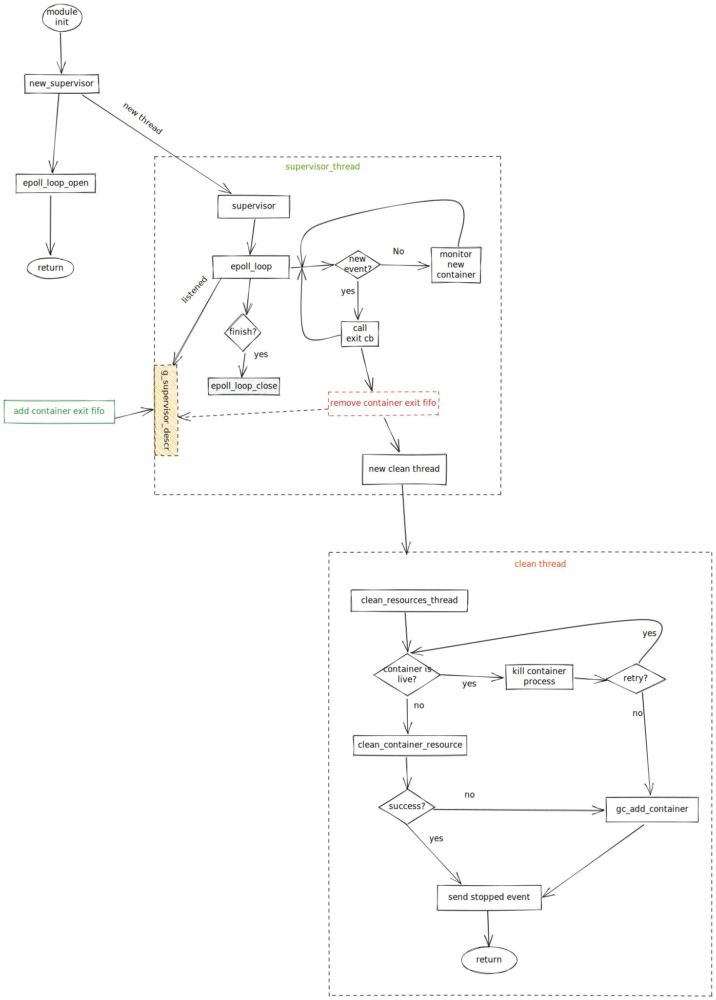
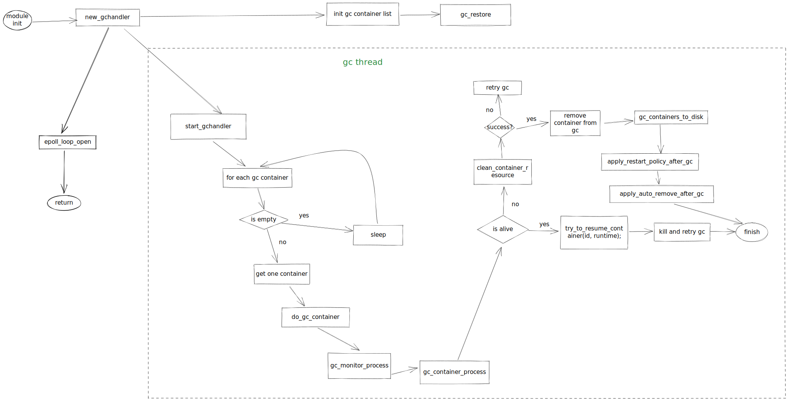

| Author | haozi007 |
| ------ | ---- |
| Date    |  2022-04-15     |
| Email       |     liuhao27@huawei.com       |

# Program Objectives

## supervisor module

In the `iSulad` architecture, the exit status of the container process is obtained by the parent process (different runtimes have different implementations, taking shim v1 as an example is `isulad-shim`), while the parent process of the container process and the `iSulad` process There is no parent-child relationship, resulting in imperceptible state changes. Therefore, a mechanism is needed to monitor changes in the state of the container process. The `supervisor` module is designed to solve this problem.

## gc module

The exit phase of the container life cycle requires cleanup of container resources (for example, cgroup directories, mount points, temporary files, etc.). When the container process is abnormal (for example, the D state reaches only cgroup resources that cannot be cleaned up, etc.), a guarantee mechanism is required. The `gc` module can provide a guarantee. When the container exits abnormally, you can continue to clean up resources; and after `iSulad` exits, the container in the `gc` state can be re-managed after restarting.

# Overall Design

## timing diagram

````mermaid
sequenceDiagram
    participant container_module
    participant supervisor
    participant gc
    container_module -->> gc: new_gchandler
    gc -->> gc: init gc list
    gc -->> gc: restore gc containers
    container_module -->> supervisor: new_supervisor
    supervisor -->> supervisor: start supervisor thread
    loop epoll
        supervisor --> supervisor: wait new events
    end
    container_module -->> container_module: containers_restore
    container_module -->> gc: start_gchandler
    loop do_gc
        gc --> gc: do_gc_container
    end

    par supervisor new container
        container_module -->> supervisor: add new container
    and container into gc
        supervisor -->> gc: add container to gc
    end
````

## state transition diagram

Used to describe the process of changing the state of the container in multiple components.

````mermaid
stateDiagram
    state if_state <<choice>>
    [*] --> Started
    Started --> Stopping
    Stopping --> if_state
    if_state --> GC: if something is wrong
    GC --> GC: gc failed
    GC --> Stopped: gc success
    if_state --> Stopped: all things are ok
````

# Interface Description

## supervisor module
````c
// supervisor module initialization
int new_supervisor();

// Constructor that senses the full path of the fifo that the container exits
char *exit_fifo_name(const char *cont_state_path);

// Add the container to the supervisor module for exit status monitoring
int container_supervisor_add_exit_monitor(int fd, const pid_ppid_info_t *pid_info, const char *name, const char *runtime);

// Open the fifo file that senses container exit
int container_exit_fifo_open(const char *cont_exit_fifo);

// Create a fifo file that senses container exit
char *container_exit_fifo_create(const char *cont_state_path);
````

## gc module

````c
// gc module initialization
int new_gchandler();

// Add the container to the gc module for resource cleanup
int gc_add_container(const char *id, const char *runtime, const pid_ppid_info_t *pid_info);

// When isulad restarts, reload the container state that has entered gc before
int gc_restore();

// start the gc processing thread
int start_gchandler();

// Determine if the container is in gc state
bool gc_is_gc_progress(const char *id);
````

# Detailed Design

## flowchart

### supervisor flowchart



### gc flowchart

