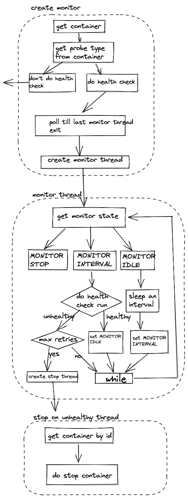
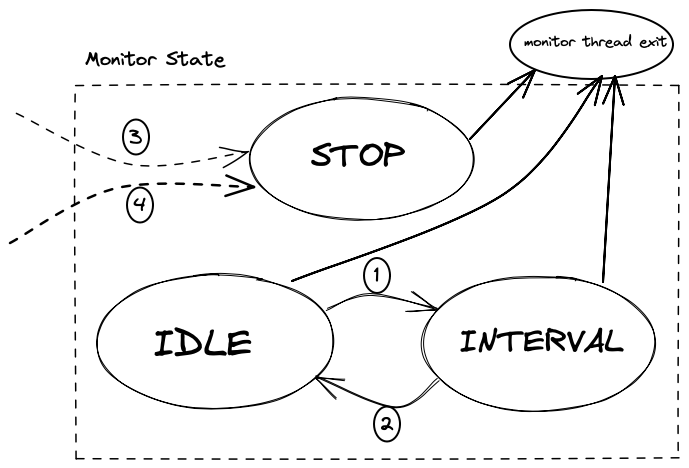
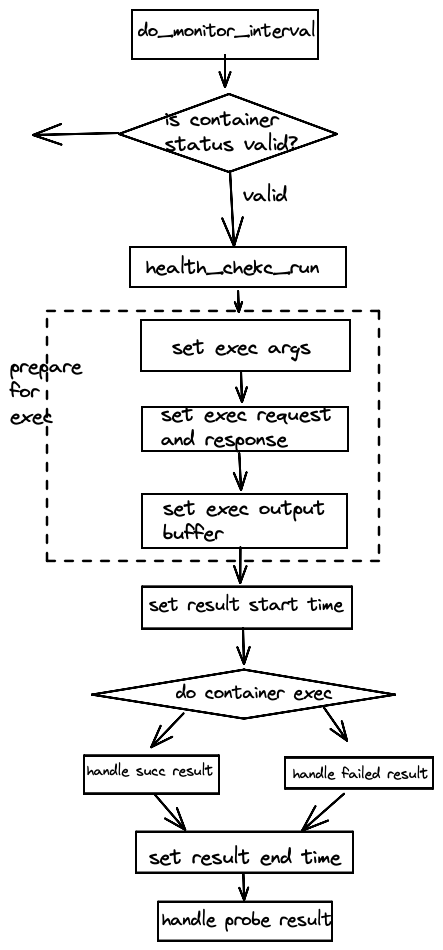

|Author | 王润泽      |
|------ | ---------- |
| Date  | 2022-09-19 |
| Emial | wangrunze13@huawei.com|

# 1.方案目标
为了从业务层面检查容器状态， 确定容器内运行的服务状态是否正常，需要从容器内部执行健康检查。在isulad中，可以配置单个容器健康检查的命令，方式，周期等， health check模块会依照这些配置在容器内部执行检查并处理检查结果。

# 2.整体设计
这里是Health Check模块整体的流程图:



health check模块主要做以下几件事：
* 处理健康检查的参数，为容器初始化health check monitor。
* 在独立的线程中运行monitor， monitor在不同的状态中切换，并周期性执行检查命令。
* 检查命令的执行通过container exec调用的方式完成，获得调用结果。
* 处理健康检查的结果。
* 如果设置了exit_on_unhealthy, 则启动额外线程来stop container。

Container Module和Restore Module使用了Health Check模块来给新创建/恢复的容器对象绑定一个monitor。
health check模块的提供的API很少，大部分的逻辑在内部完成，其中两个API负责monitor的创建和销毁。monitor的生命周期依赖于容器，容器启动/恢复的时候创建monitor，容器销毁的时候负责销毁monitor。


# 3.接口描述
```c
// 1.释放动态分配的health_check结构体
void health_check_manager_free(health_check_manager_t *health_check);

// 2.初始化monitor, 动态分配health_check结构体
void container_init_health_monitor(const char *id)

// 3.停止health check
void container_stop_health_checks(container_t *cont)

```
# 4.详细设计
## 4.1 monitor status
health check monitor状态转换图:



先说明这几个状态的含义：
* `IDLE` 是初始状态，当处于这个状态的时候，说明monitor只需要睡眠等待。
* `INTERVAL` 是check周期到达的状态，当处于这个状态的时候，说明monitor需要执行health check。
* `STOP` 是停止状态， 当处于这个状态，monitor需要执行一些清理工作并退出
* `monitor thread exit` 并不属于monitor的状态，它代表着monitor thread的退出。

接着讨论状态如何转换，其中实线是monitor这个线程里面执行的状态转换，虚线是外部线程调用函数完成的状态转换，具体分析如下：
* 1号状态转换发生在IDLE状态执行的sleep操作到期，说明已经等待足够的时候，这时候应该切换成INTERVAL状态。
* 2号状态转换发生在INTERVAL执行health check成功之后，这时候切换为IDLE状态接着睡眠，等待下一个周期。
* 3号状态切换是当update thread发现需要停止上一个monitor thread或者某些检查没有通过的时候，通过health check模块内部调用`static void close_health_check_monitor(container_t *cont)`来停止monitor thread。
* 4号状态切换是调用API `void container_stop_health_checks(container_t *cont)`实现的。这个函数只是`close_health_check_monitor`的封装，供外部模块调用。stop container和pause container的时候都会进行这个状态切换。

另外，monitor thread内部并不会进行IDLE和INTERVAL状态到STOP状态的转换，因为可以直接执行清理工作并退出线程。当IDLE和INTERVAL状态下调用应该执行的操作出错的时候会直接退出monitor thread。

## 4.2 do health check 
在INTERVAL状态下，会根据config的cmd执行health check并产生result, 具体流程如下：



准备的exec的output buffer是一个定长的buffer，当输出过多的时候会使用“...”的方式省略输出。


