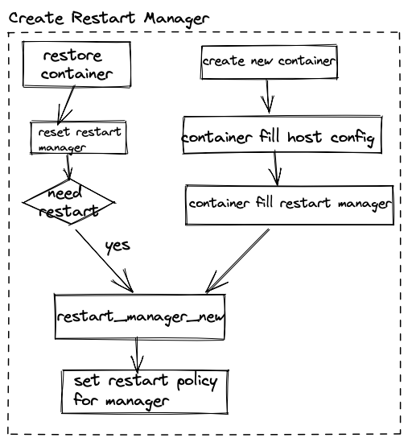
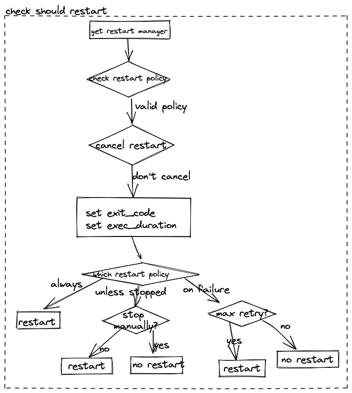

|Author | 王润泽      |
|------ | ---------- |
| Date  | 2022-09-19 |
| Emial | wangrunze13@huawei.com|

# 1.方案目标
有时候我们希望容器退出的时候可以自动重启，restart manager是isulad实现该功能的模块，通过该模块，isulad管理的所有容器都可以根据配置的重启策略来完成重启动作。

# 2.总体设计
使用isula命令启动容器的时候可以指定`--restart`参数并指定合适的重启策略后，一共有五种重启策略:
* no 
* always 
* on-failure 
* unless-stopped 
* on-reboot 

isulad根据这些重启策略来执行重启动作。

create容器的时候会给创建一个新的restart manager，所以一个容器对应一个属于自己的restart manager。 在整个容器的生命周期内，每当到了可能重启的时机， 都会使用绑定在容器上面的restart manager来完成操作, 所有具体的操作可见**接口描述**。

执行重启动作一共有三个时机：
* 重启isulad之后restore的阶段，对于成功恢复的容器对象会尝试重启容器进程。
* 容器成功停止之后，这时会尝试重启该容器。
* 容器停止失败之后，被加入gc， gc完成之后会尝试重启该容器。

restore, container, gc这三个模块都会调用restart manager的接口来判断是否应该重启一个容器和重启容器。


# 3.接口描述
```c
// 1.释放restart_policy对象
void restart_policy_free(host_config_restart_policy *policy);

// 2.创建restar_manager对象
restart_manager_t *restart_manager_new(const host_config_restart_policy *policy, int failure_count);

// 3.增加restart_manager引用计数
void restart_manager_refinc(restart_manager_t *rm);

// 4.减少restart_manager引用计数
void restart_manager_unref(restart_manager_t *rm);

// 5.释放restart_manager对象
void restart_manager_free(restart_manager_t *rm);

// 6.给restart_manager设置restart_policy
int restart_manager_set_policy(restart_manager_t *rm, const host_config_restart_policy *policy);

// 7.判断restart_manager是否应该执行restart
bool restart_manager_should_restart(const char *id, uint32_t exit_code, bool has_been_manually_stopped,
                                    int64_t exec_duration, uint64_t *timeout);

// 8.通知restart_manager取消restart动作
int restart_manager_cancel(restart_manager_t *rm);

// 9.restart_manger等待cancel通知， 最长等待timeout的时间
int restart_manager_wait_cancel(restart_manager_t *rm, uint64_t timeout);

// 10.启动一个新的线程， 在这个线程中执行容器重启操作
int container_restart_in_thread(const char *id, uint64_t timeout, int exit_code);

```
# 4.详细设计
详细设计一共分成两部分：
* restart manager创建流程
* restart manager判断是否应该重启流程

## 4.1 restart manager创建
restart manager的创建



## 4.2 restart manager判断是否restart
restat manager判断是否需要重启的流程



这一部分通过匹配不同的重启策略字符串来判断是否需要重启。此外，isulad还提供一个特殊的重启策略`on-reboot`供系统容器使用，系统容器中可以使用reboot命令，导致容器以特殊的退出码退出，这时候restart manager会识别这个特殊的退出码并重启容器，所以说系统容器的reboot命令的实现也是基于restart manager的。

