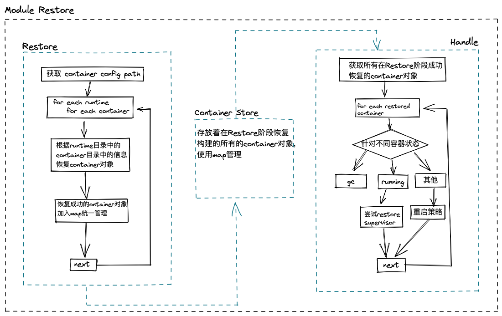
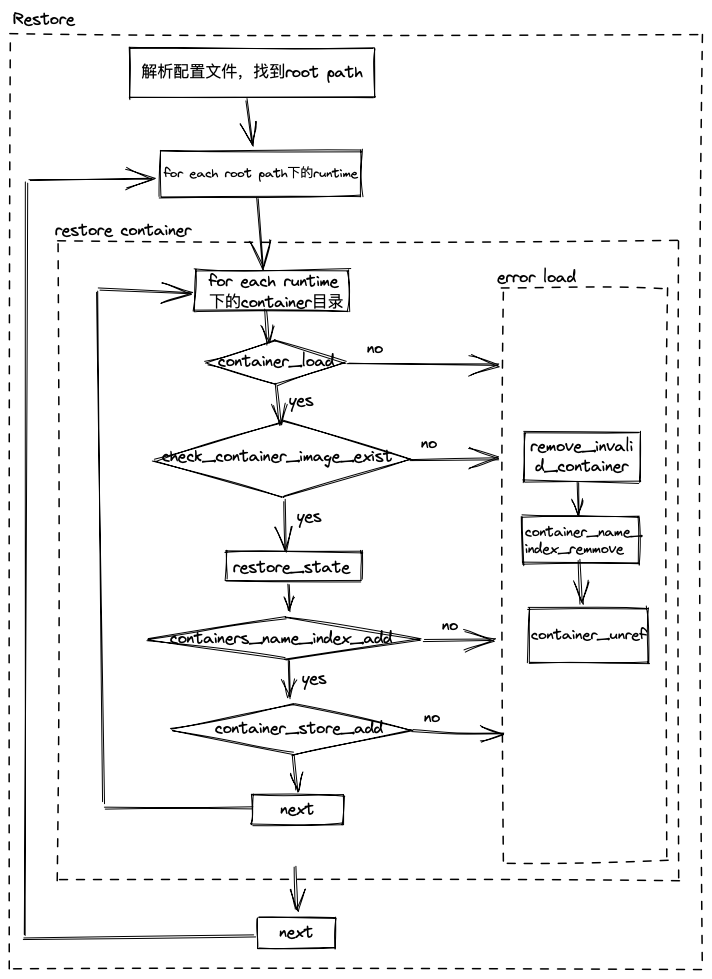
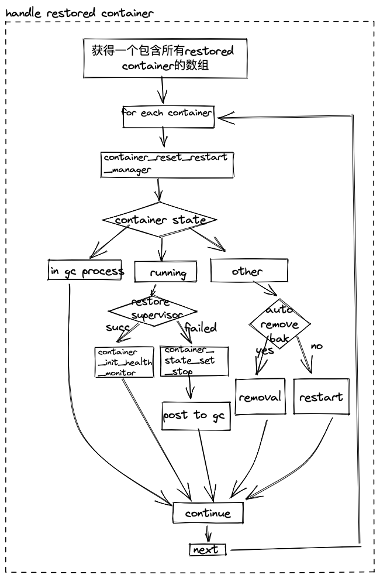

|Author | 王润泽      |
|------ | ---------- |
| Date  | 2022-09-19 |
| Emial | wangrunze13@huawei.com|


# 1.方案目标
isulad进程和它管理的容器进程可以独立运行， 当isulad退出的时候， 容器进程可以不受影响继续运行； restore模块是为了让isulad重启的时候， restore模块可以把所有容器的状态恢复到isulad进程中去， 让isulad进程重新管理这些容器。

# 2.总体设计
restore模块的整体流程图如下：

restore模块向外提供唯一接口，一般在isulad启动的时候调用这个接口来完成所有restore的工作。

总体来说， 整个restore阶段会做两件事：
* restore：首先， 通过持久化存储的数据来构建出一个container对象，这是isulad定义的一个结构体， 它的类型是`container_t `, 而这些持久化的数据存储在一个以容器ID命名的目录中， 这个反序列化的过程由函数`container_load`完成。之后， 恢复成功的container对象会被放入一个map中统一管理。
* handle：在恢复了所有的container对象之后，剩下的要做的就是根据host上实际容器进程的状态来同步处理container对象。 一个container对象应该对应着host上一个具体的容器进程， 如果isulad要管理这个具体的容器进程光恢复一个container对象是不够的，还需要进行一些额外的操作。


# 3.接口描述
```c
// 1. 容器状态恢复接口；
extern void containers_restore(void);
```

# 4.详细设计
## 4.1 restore container详细流程


这里有一些关键流程：
* container_load: 这里使用的是container module提供的一个接口，通过解析以container id命名的目录里的各种配置文件来构建一个container对象。
* check_container_image_exist: 这里是检查容器的镜像层是否还存在，如果已经删除，则该容器restore失败。
* restore_state: 持久化存储的container status可能已经过期，这里尝试利用runtime接口来获得runtime container status, 用真实的status来修改container status。
* container_store_add: 这里使用container store sub module提供的map数据结构和接口来管理成功restore的container对象。 

## 4.2 handle restored container详细流程


这里主要的流程就是根据不同的container state来完成一些操作：
* gc状态， 这时不需要额外处理，gc线程会完成该container的资源回收。
* running状态， 这时候尝试恢复supervisor和init health checker。isulad需要这两个组件来管理真实的容器进程，当这两个步骤完成了，才算是成功的restore了一个正在运行的container。
* 其他状态，举个例子，如果容器处于stopped状态，这时检查是否设置了退出后自动remove，如果设置了则执行remove操作， 否则执行restart操作。

关于重启操作，这里简单描述，详细的文档请参考restart manager 设计文档：由于容器有重启策略而重启操作只能由isulad完成，所以当isulad退出的这段时间，需要重启的容器都无法完成重启操作。因此需要在重启isulad完成restore操作后，根据容器的自定义的重启策略来完成重启。