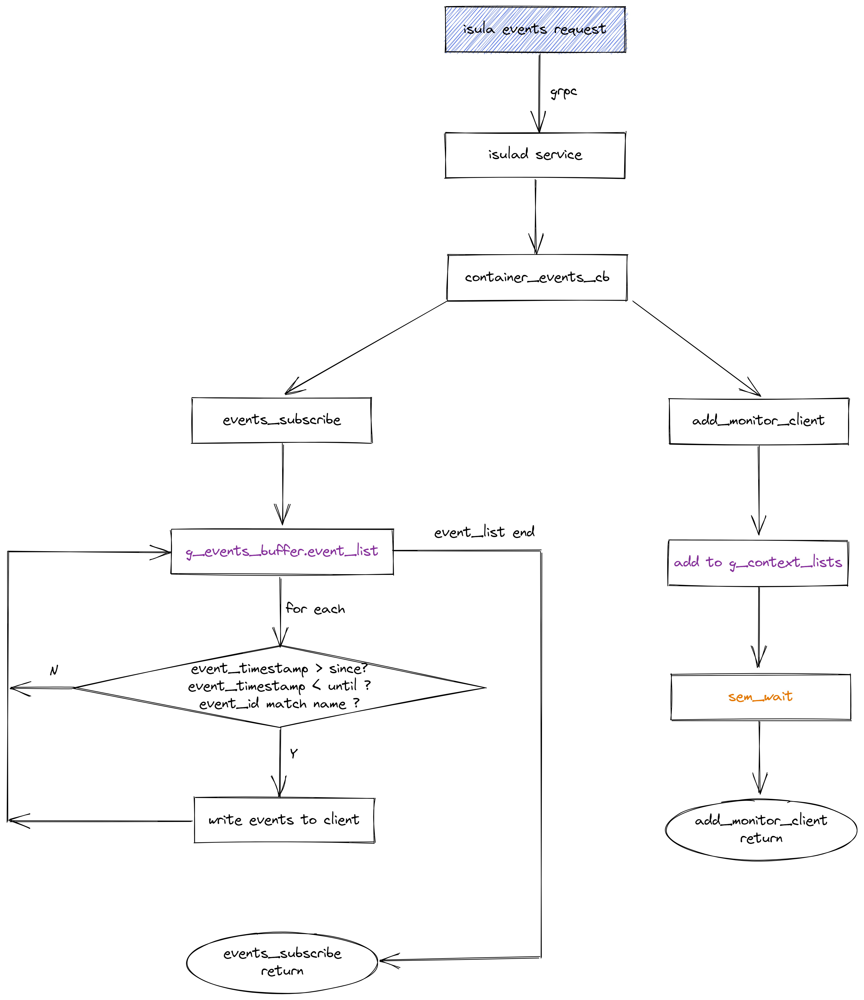
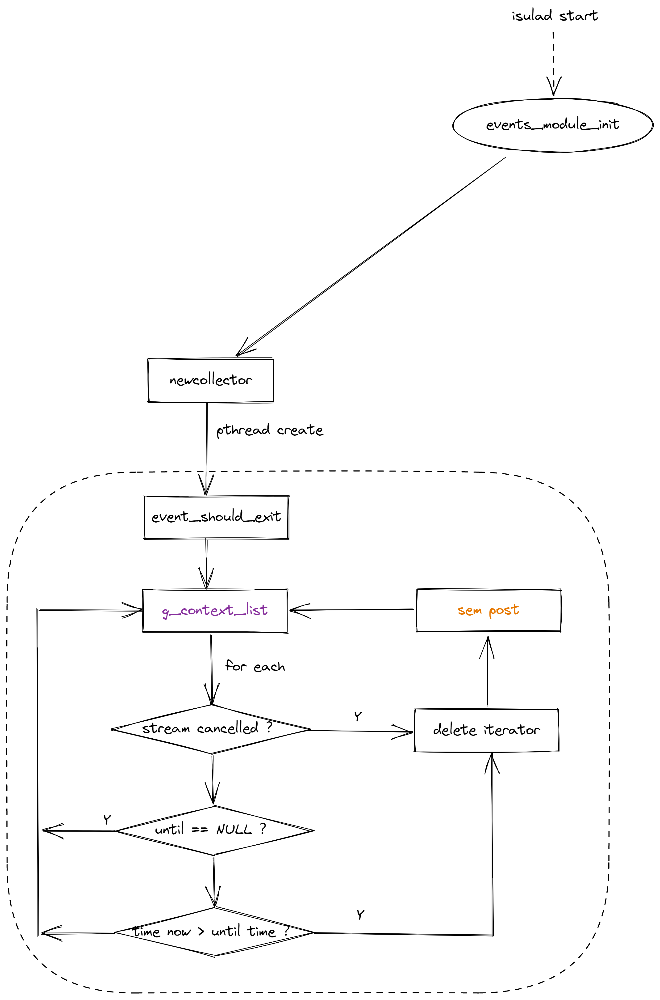
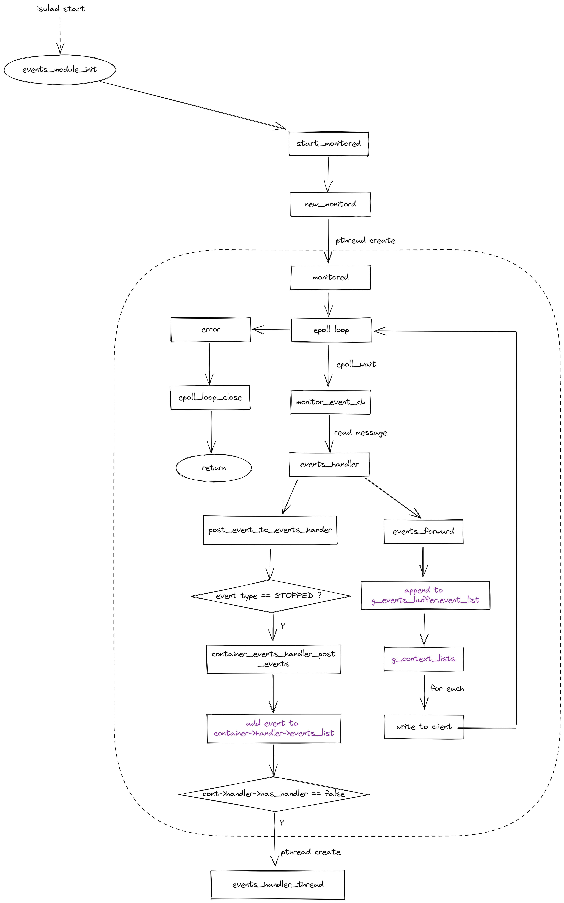
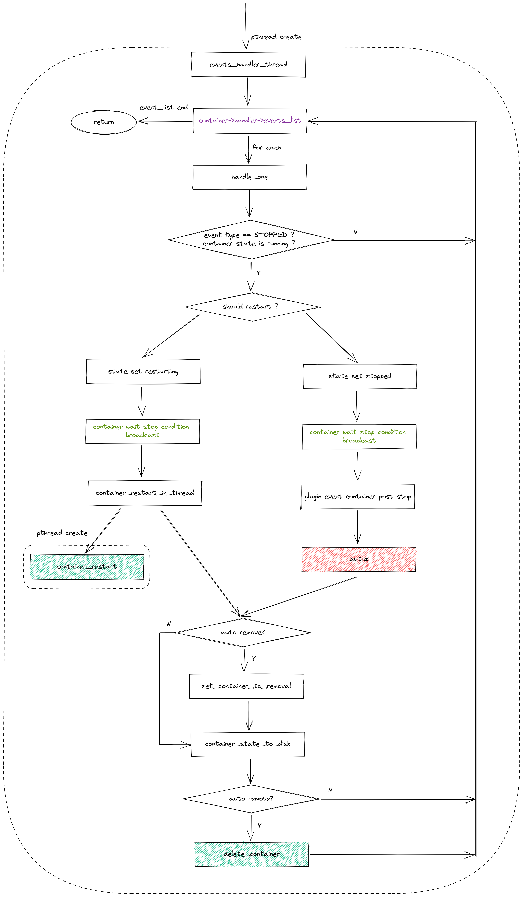

| Author | zhangxiaoyu |
| ------ | ---- |
| Date    |  2022-09-17     |
| Email       |     zhangxiaoyu58@huawei.com       |

# Program Objectives

The events module mainly records the relevant operation events of the container or image. Users can view events through the isula events client, or view events for a container in a certain period of time through parameters. E.g
```bash
$ isula events --help

Usage: isula events [OPTIONS]

Get real time events from the server

  -n, --name Name of the container
  -S, --since Show all events created since this timestamp
  -U, --until Show all events created until this timestamp

$ isula events
2022-05-10T17:20:34.661862100+08:00 container start 3277ec2e57cde72cbd20a1fea4bb4444e29df67f6fc27e60f8532b733b7ef400 (image=busybox, name=3277ec2e57cde72cbd20a1fea4bb4444e29df67f6fc27e60f8532b733b7ef400, pid=9007)
````

# Overall Design

## timing diagram

````mermaid
sequenceDiagram
  participant client
  participant container_events_cb
  participant clients_checker
  participant g_context_list
  participant monitored
  participant g_events_buffer
    
  client->>container_events_cb: events request
  container_events_cb->>g_events_buffer: traverse
  container_events_cb->>client: write events to client
  container_events_cb->>g_context_list: add
  container_events_cb->>container_events_cb: sem wait
  
  [events]->>monitored: add event
  loop epoll
    monitored->>g_events_buffer: add
    monitored->>g_context_list: traverse
    monitored->>client: write event to client
  end
  
  loop
    clients_checker->>g_context_list: traverse
    alt cancelled or now > until
      clients_checker->>g_context_list: delete
      clients_checker->>container_events_cb: sem post
    end
  end
  
  container_events_cb->>client: return
````

# Interface Description

## events sending module
````c
// Send container event to monitor fifo
int isulad_monitor_send_container_event(const char *name, runtime_state_t state, int pid, int exit_code,
                                        const char *args, const char *extra_annations);

// Send mirror event to monitor fifo
int isulad_monitor_send_image_event(const char *name, image_state_t state);
````

## events subscription module

````c
// Process the newly generated event, including stopped event processing, and forward the event to the client in the context list of the subscription list
void events_handler(struct monitord_msg *msg);

// Add the client to the events subscription list: context list
int add_monitor_client(char *name, const types_timestamp_t *since, const types_timestamp_t *until,
                       const stream_func_wrapper *stream);

// Write the eligible events in the events lists back to the client
int events_subscribe(const char *name, const types_timestamp_t *since, const types_timestamp_t *until,
                     const stream_func_wrapper *stream);

// copy event
struct isulad_events_format *dup_event(const struct isulad_events_format *event);

// Create collector thread and monitored thread
int events_module_init(char **msg);
````

# Detailed Design

## Flowchart

### events service flow chart



### events collector flow chart



### events monitor flow chart



