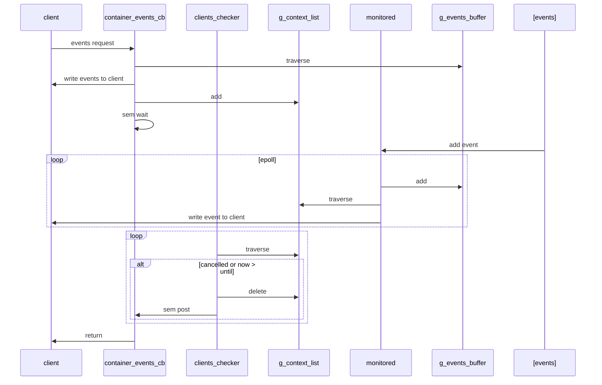

| Author | zhangxiaoyu |
| ------ | ---- |
| Date    |  2022-09-17     |
| Email       |     zhangxiaoyu58@huawei.com       |

# 方案目标

events模块，主要记录了容器或镜像的相关操作事件。用户可以通过isula events客户端查看事件，也可以通过参数查看针对某容器在某时间段的事件。例如
```bash
$ isula events --help

Usage:  isula events [command options]

Get real time events from the server

  -n, --name         Name of the container
  -S, --since        Show all events created since this timestamp
  -U, --until        Show all events created until this timestamp

$ isula events
2022-05-10T17:20:34.661862100+08:00 container start 3277ec2e57cde72cbd20a1fea4bb4444e29df67f6fc27e60f8532b733b7ef400 (image=busybox, name=3277ec2e57cde72cbd20a1fea4bb4444e29df67f6fc27e60f8532b733b7ef400, pid=9007)
```

# 总体设计

## 时序图



# 接口描述 

## events 发送模块
```c
// 发送容器event到monitor fifo
int isulad_monitor_send_container_event(const char *name, runtime_state_t state, int pid, int exit_code,
                                        const char *args, const char *extra_annations);

// 发送镜像event到monitor fifo
int isulad_monitor_send_image_event(const char *name, image_state_t state);
```

## events 订阅模块

```c
// 对新产生的event处理，包括stopped event处理，以及将event转发至订阅列表context list中的客户端
void events_handler(struct monitord_msg *msg);

// 将客户端加入到events订阅列表context list中
int add_monitor_client(char *name, const types_timestamp_t *since, const types_timestamp_t *until,
                       const stream_func_wrapper *stream);

// 将events lists中符合条件的events写回给客户端
int events_subscribe(const char *name, const types_timestamp_t *since, const types_timestamp_t *until,
                     const stream_func_wrapper *stream);

// copy event
struct isulad_events_format *dup_event(const struct isulad_events_format *event);

// 创建collector线程及monitored线程
int events_module_init(char **msg);
```

# 详细设计

## 流程图

### events service 流程图


### events collector 流程图


### events monitor 流程图


