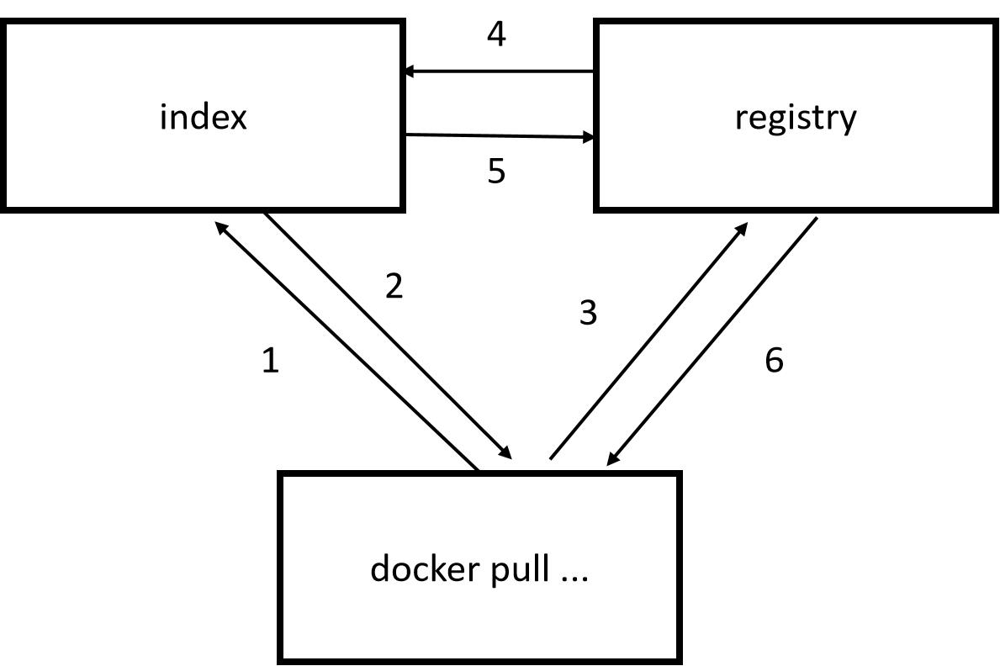
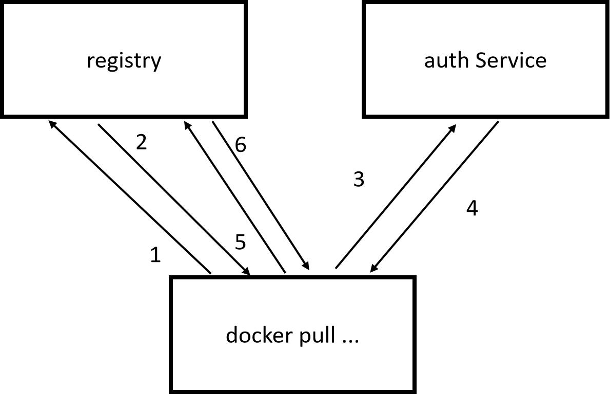
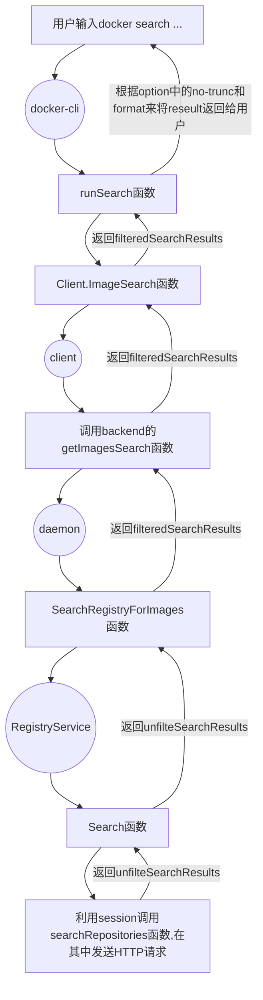

# Docker Registry API

相关概念：

- **Registry**：注册服务器，用于管理镜像仓库，起到的是服务器的作用。
- **Repository**：镜像仓库，用于存储具体的docker镜像，起到的是仓库存储作用。
- **index**： 顾名思义“索引”，index服务主要提供镜像索引以及用户认证的功能。

Docker Registry API 是Docker Registry的REST API，用于自由的自动化、程序化的管理镜像仓库。

Docker Registry API规范涵盖了docker registry和docker核心之间通信的URL布局和协议。

## Docker Registry HTTP API V1

Docker Registry HTTP API V1使用python实现，存在以下缺陷：

### **layer id** 

1. Docker build镜像时，客户端会为每个layer都生成随机的id字符串，layer的id与layer的内容无关，若重新build则会为其生成与之前不一样的id，通过随机生成的layer id判断镜像是否存在，需不需要重新push，不能实现layer的复用，浪费存储空间；
2. 需要文件记录layer id与layer的内容的对应关系，记录保存麻烦，也浪费存储空间。
3. layer id由32个字节组成，但是仍存在id碰撞的可能，碰撞情况下无法push layer，会导致数据丢失；
4. 若程序恶意伪造大量layer push到registry中占位，则会导致新的layer无法push到registry中。

### **安全性**

Docker Registry HTTP API V1中鉴定client端有没有registry的操作权限的方式如下：

<div align="center">
    
</div>

当下载一个镜像的时候，如上图所示，首先会去index服务上做认证，然后查找镜像所在的registry的地址并放回给docker客户端，最终docker客户端再从registry下载镜像，当然在下载过程中 registry会去index校验客户端token的合法性。每次 client 端和 registry 的交互都要通过 index ，流程复杂。

并且在Docker Registry HTTP API V1， registry 对 layer 没有任何权限控制，所有的权限相关内容都要通过 index ，registry中layer的安全性低。

### **pull速度**

Docker Registry HTTP API V1的 registry 中镜像的每个 layer 都只包含父亲 layer 的信息，因此当 pull 镜像时需要**串行**下载，下载完一个 layer 后才知道下一个 layer 的 id 是多少再去下载。

## Docker Registry HTTP API V2

docker1.6版本开始支持registry 2.0。Docker Registry HTTP API V2使用go语言实现，在安全性和性能上做了很多优化，并且重新设计了镜像的存储格式，实现了内容可寻址的镜像，同时设计了记录镜像详细信息的manifest文件，文件中列出了addressable id ,history,runtime configuration和signatures。

daemon在一个镜像被published时初始化manifest文件，镜像被构建或提交时也更新manifest文件，每个manifest都要记录构建镜像的client签名，签名用来区分构建镜像的人并且验证镜像是否符合安装者的预期。

### V2相较于V1的优点

#### **layer id** 

Docker Registry HTTP API V2中会在服务端对镜像的内容进行哈希（一般采用sha256），通过内容的哈希值被称为digest，是每个layer唯一的标识，用于判断layer在registry中是否存在，是否需要重新传输，通过将id与内容对应可以减少存储空间的浪费，且由于digest是由服务端生成的，用户无法伪造digest，很大程度上保证了registry内容的安全性。

#### **安全性**

Docker Registry HTTP API V2中鉴定client端有没有registry的操作权限只需要 registry 和 auth service 在部署时分别配置好彼此的信息，并将对方信息作为生成 token 的字符串，就可以减少后续的交互操作。client端只需要和 auth service 进行一次交互获得对应 token 即可和 registry 进行交互，减少了复杂的流程。同时 registry 和 auth service 一一对应的方式也降低了被攻击的可能。

<div align="center">
    
</div>

且在V2的 registry 中加入了对 layer 的权限控制，每个 layer 都有一个 manifest 来标识该 layer 由哪些 repository 共享，安全性提升。

#### **pull速度**

Docker Registry HTTP API V2 的 registry 在 image 的 manifest 中包含了所有 layer 的信息，client端可以**并行**下载所有的 layer 。

### V2中的endpoint

所有的endpoint都以API 版本和仓库的名称为前缀：利用URL结构能够包含更丰富的身份验证以及授权模式。

```txt
/v2/<name>/
```

通常而言，仓库名称通常都由两个部分路径组件，每个部分都小于30个字符。但是在Docker Registry HTTP API V2中并不一定要遵循这种格式，只要将仓库名称分解为路径组件，并且每一个路径组件都符合正则表达式[a-z0-9]+(?:[._-][a-z0-9]+)*即可，若存在两个和两个以上的路径组件，则需要使用/分隔，仓库名称的总长度需小于256字符。

### API list

| method | path                             | Entity               | Description                                                  |
| ------ | -------------------------------- | -------------------- | ------------------------------------------------------------ |
| GET    | /v2/                             | Base                 | 检查endpoint是否实现了 Docker Registry API V2。              |
| GET    | /v2/<name>/tags/list             | Tags                 | 获取指定名称仓库下的标签。                                   |
| GET    | /v2/<name>/manifests/<reference> | Manifest             | get由 name 和 reference 标识的manifests，其中 reference 可以是tag或digest。也可以向该endpoint发出 HEADrequest 以获取资源信息，而无需接收所有数据。 |
| PUT    | /v2/<name>/manifests/<reference> | Manifest             | 上传由name 和 reference 标识的manifests，其中 reference 可以是tag或digest。 |
| DELETE | /v2/<name>/manifests/<reference> | Manifest             | 删除由name 和 reference 标识的manifests。请注意，manifests只能通过digest删除。 |
| GET    | /v2/<name>/blobs/<digest>        | Blob                 | 从由digest 标识的registry中检索blob。也可以向该endpoint发出 HEADrequest 以获取资源信息，而无需接收所有数据。 |
| DELETE | /v2/<name>/blobs/<digest>        | Blob                 | 删除由name和digest标识的blob。                               |
| POST   | /v2/<name>/blobs/uploads/        | Initiate Blob Upload | 初始化一个可恢复的 Blob upload。如果成功，将提供upload位置以完成上传。如果存在digest 参数，则请求正文将用于在单个请求中完成上传。 |
| GET    | /v2/<name>/blobs/uploads/<uuid>  | Blob Upload          | 检索由 uuid 标识的upload状态。此endpoint的主要目的是解决可恢复upload的当前状态。 |
| PATCH  | /v2/<name>/blobs/uploads/<uuid>  | Blob Upload          | 为指定的upload上传一块数据。                                 |
| PUT    | /v2/<name>/blobs/uploads/<uuid>  | Blob Upload          | 完成 uuid 指定的上传，可选择将正文附加为最终块。             |
| DELETE | /v2/<name>/blobs/uploads/<uuid>  | Blob Upload          | 取消未完成的上传进程，释放相关资源。如果不调用，未完成的上传最终会超时。 |
| GET    | /v2/_catalog                     | Catalog              | 检索registry中可用的仓库的排序 json 列表。                   |

**blob（Binary Large Object）：表示二进制的大对象**

# Docker search的关键实现流程分析

## docker search 用法

```shell
#语法
docker search [OPTIONS] TERM

#OPTIONS说明：

--limit :max number of search results(default 25)

--no-trunc :Dont't truncate output

-f,--filter filter :Filter output base oncondition provided(e.g. --filter is-automated=true --filter stars=3 --is-official=true)

--format :pretty-prints search output using Go template
```

## 实现流程



## 关键实现分析

### 重要的数据结构

**RepositoryInfo**：用于描述一个仓库

```go
// RepositoryInfo Examples:
//
//	{
//	  "Index" : {
//	    "Name" : "docker.io",
//	    "Mirrors" : ["https://registry-2.docker.io/v1/", "https://registry-3.docker.io/v1/"],
//	    "Secure" : true,
//	    "Official" : true,
//	  },
//	  "RemoteName" : "library/debian",
//	  "LocalName" : "debian",
//	  "CanonicalName" : "docker.io/debian"
//	  "Official" : true,
//	}
//

// RepositoryInfo describes a repository
type RepositoryInfo struct {
	Name reference.Named
	// Index points to registry information
	Index *registry.IndexInfo
	// Official indicates whether the repository is considered official.
	// If the registry is official, and the normalized name does not
	// contain a '/' (e.g. "foo"), then it is considered an official repo.
	Official bool
	// Class represents the class of the repository, such as "plugin"
	// or "image".
	Class string
}

// IndexInfo contains information about a registry
type IndexInfo struct {
	// Name is the name of the registry, such as "docker.io"
	Name string
	// Mirrors is a list of mirrors, expressed as URIs
	Mirrors []string
	// Secure is set to false if the registry is part of the list of
	// insecure registries. Insecure registries accept HTTP and/or accept
	// HTTPS with certificates from unknown CAs.
	Secure bool
	// Official indicates whether this is an official registry
	Official bool
}

```

**AuthConfig**：认证配置

```go
// AuthConfig contains authorization information for connecting to a Registry
type AuthConfig struct {
	Username string `json:"username,omitempty"`
	Password string `json:"password,omitempty"`
	Auth     string `json:"auth,omitempty"`

	// Email is an optional value associated with the username.
	// This field is deprecated and will be removed in a later
	// version of docker.
	Email string `json:"email,omitempty"`

	ServerAddress string `json:"serveraddress,omitempty"`

	// IdentityToken is used to authenticate the user and get
	// an access token for the registry.
	IdentityToken string `json:"identitytoken,omitempty"`

	// RegistryToken is a bearer token to be sent to a registry
	RegistryToken string `json:"registrytoken,omitempty"`
}
```

**searchOptions**  ：search的命令行的选项

```go
type searchOptions struct {
	format  string
	term    string
	noTrunc bool
	limit   int
	filter  opts.FilterOpt
}

// FilterOpt is a flag type for validating filters
type FilterOpt struct {
	filter filters.Args
}

// Args stores a mapping of keys to a set of multiple values.
type Args struct {
	fields map[string]map[string]bool
}
```

**ImageSearchOptions** ：发送到client端的search选项

```go
// ImageSearchOptions holds parameters to search images with.
type ImageSearchOptions struct {
	RegistryAuth  string
	PrivilegeFunc RequestPrivilegeFunc
	Filters       filters.Args
	Limit         int
}
```

### docker-cli

**runSearch函数**

```go
func runSearch(dockerCli command.Cli, options searchOptions) error {
    //利用option中的indexName创建一个indexInfo，若option中无，则用默认的docker.io
	indexInfo, err := registry.ParseSearchIndexInfo(options.term)
	if err != nil {
		return err
	}

	ctx := context.Background()
    //查看search的indexName是否已经获得了认证
	authConfig := command.ResolveAuthConfig(ctx, dockerCli, indexInfo)
	requestPrivilege := command.RegistryAuthenticationPrivilegedFunc(dockerCli, indexInfo, "search")

	encodedAuth, err := command.EncodeAuthToBase64(authConfig)
	if err != nil {
		return err
	}
    //初始化发送至client端的option，其中包含命令行输入的limit和Filter，还包含Registry认证和特权函数
	searchOptions := types.ImageSearchOptions{
		RegistryAuth:  encodedAuth,
		PrivilegeFunc: requestPrivilege,
		Filters:       options.filter.Value(),
		Limit:         options.limit,
	}
    //获得dockerCli的客户端
	clnt := dockerCli.Client()
	//调用客户端的ImageSearch函数来进行镜像的查找
	results, err := clnt.ImageSearch(ctx, options.term, searchOptions)
	if err != nil {
		return err
	}
	//得到结果之后根据用户输入的format以及noTrunc来写结果信息至命令行
	searchCtx := formatter.Context{
		Output: dockerCli.Out(),
		Format: NewSearchFormat(options.format),
		Trunc:  !options.noTrunc,
	}
	return SearchWrite(searchCtx, results)
}

```

### client

**ImageSearch函数**

```go
// ImageSearch makes the docker host search by a term in a remote registry.
// The list of results is not sorted in any fashion.
func (cli *Client) ImageSearch(ctx context.Context, term string, options types.ImageSearchOptions) ([]registry.SearchResult, error) {
	var results []registry.SearchResult
	query := url.Values{}
	query.Set("term", term)
	if options.Limit > 0 {
		query.Set("limit", strconv.Itoa(options.Limit))
	}

	if options.Filters.Len() > 0 {
		filterJSON, err := filters.ToJSON(options.Filters)
		if err != nil {
			return results, err
		}
		query.Set("filters", filterJSON)
	}
	//将封装好的query和认证信息
	resp, err := cli.tryImageSearch(ctx, query, options.RegistryAuth)
	defer ensureReaderClosed(resp)
	if errdefs.IsUnauthorized(err) && options.PrivilegeFunc != nil {
		newAuthHeader, privilegeErr := options.PrivilegeFunc()
		if privilegeErr != nil {
			return results, privilegeErr
		}
		resp, err = cli.tryImageSearch(ctx, query, newAuthHeader)
	}
	if err != nil {
		return results, err
	}

	err = json.NewDecoder(resp.body).Decode(&results)
	return results, err
}
```

**tryImageSearch函数**

```go
func (cli *Client) tryImageSearch(ctx context.Context, query url.Values, registryAuth string) (serverResponse, error) {
    //设置headers的registry.AuthHeader为registryAuth
	headers := map[string][]string{registry.AuthHeader: {registryAuth}}
    //利用get的方式请求Service端的/images/search路径绑定的方法
	return cli.get(ctx, "/images/search", query, headers)
}
```

### Service

**getImagesSearch函数**

```go
func (ir *imageRouter) getImagesSearch(ctx context.Context, w http.ResponseWriter, r *http.Request, vars map[string]string) error {
    //解析http.Request中的query信息到r.Form中
	if err := httputils.ParseForm(r); err != nil {
		return err
	}

	var headers = map[string][]string{}
	for k, v := range r.Header {
		if strings.HasPrefix(k, "X-Meta-") {
			headers[k] = v
		}
	}

	var limit int
	if r.Form.Get("limit") != "" {
		var err error
		limit, err = strconv.Atoi(r.Form.Get("limit"))
		if err != nil || limit < 0 {
			return errdefs.InvalidParameter(errors.Wrap(err, "invalid limit specified"))
		}
	}
	searchFilters, err := filters.FromJSON(r.Form.Get("filters"))
	if err != nil {
		return err
	}

	// For a search it is not an error if no auth was given. Ignore invalid
	// AuthConfig to increase compatibility with the existing API.
	authConfig, _ := registry.DecodeAuthConfig(r.Header.Get(registry.AuthHeader))
    //利用imageRouter中定义的backend函数调用daemon中的SearchRegistryForImages函数，将解析出来的信息一起传递
	query, err := ir.backend.SearchRegistryForImages(ctx, searchFilters, r.Form.Get("term"), limit, authConfig, headers)
	if err != nil {
		return err
	}
	return httputils.WriteJSON(w, http.StatusOK, query.Results)
}
```

### daemon

**SearchRegistryForImages函数**

```go
// SearchRegistryForImages queries the registry for images matching
// term. authConfig is used to login.
//
// TODO: this could be implemented in a registry service instead of the image
// service.
func (i *ImageService) SearchRegistryForImages(ctx context.Context, searchFilters filters.Args, term string, limit int,
	authConfig *registry.AuthConfig,
	headers map[string][]string) (*registry.SearchResults, error) {

	if err := searchFilters.Validate(acceptedSearchFilterTags); err != nil {
		return nil, err
	}
	//解析searchFilters的内容
	var isAutomated, isOfficial bool
	var hasStarFilter = 0
	if searchFilters.Contains("is-automated") {
		if searchFilters.UniqueExactMatch("is-automated", "true") {
			isAutomated = true
		} else if !searchFilters.UniqueExactMatch("is-automated", "false") {
			return nil, invalidFilter{"is-automated", searchFilters.Get("is-automated")}
		}
	}
	if searchFilters.Contains("is-official") {
		if searchFilters.UniqueExactMatch("is-official", "true") {
			isOfficial = true
		} else if !searchFilters.UniqueExactMatch("is-official", "false") {
			return nil, invalidFilter{"is-official", searchFilters.Get("is-official")}
		}
	}
	if searchFilters.Contains("stars") {
		hasStars := searchFilters.Get("stars")
		for _, hasStar := range hasStars {
			iHasStar, err := strconv.Atoi(hasStar)
			if err != nil {
				return nil, invalidFilter{"stars", hasStar}
			}
			if iHasStar > hasStarFilter {
				hasStarFilter = iHasStar
			}
		}
	}
	//调用registryService的Search方法，将term、limit、authConfig和headers传递
    //DockerUserAgent 是一个User-Agent， Docker client利用其来标识自己
	unfilteredResult, err := i.registryService.Search(ctx, term, limit, authConfig, dockerversion.DockerUserAgent(ctx), headers)
	if err != nil {
		return nil, err
	}
	//利用解析searchFilters得到的Filter对结果返回的结果进行筛选
	filteredResults := []registry.SearchResult{}
	for _, result := range unfilteredResult.Results {
		if searchFilters.Contains("is-automated") {
			if isAutomated != result.IsAutomated {
				continue
			}
		}
		if searchFilters.Contains("is-official") {
			if isOfficial != result.IsOfficial {
				continue
			}
		}
		if searchFilters.Contains("stars") {
			if result.StarCount < hasStarFilter {
				continue
			}
		}
		filteredResults = append(filteredResults, result)
	}

	return &registry.SearchResults{
		Query:      unfilteredResult.Query,
		NumResults: len(filteredResults),
		Results:    filteredResults,
	}, nil
}
```

### registryService

**Search函数**

```go
// Search queries the public registry for images matching the specified
// search terms, and returns the results.
func (s *defaultService) Search(ctx context.Context, term string, limit int, authConfig *registry.AuthConfig, userAgent string, headers map[string][]string) (*registry.SearchResults, error) {
	// TODO Use ctx when searching for repositories
	if hasScheme(term) {
		return nil, invalidParamf("invalid repository name: repository name (%s) should not have a scheme", term)
	}
	//解析term是包含的indexName和remoteName，indexName是查询的仓库地址，remoteName是查询的镜像名称
	indexName, remoteName := splitReposSearchTerm(term)

	// Search is a long-running operation, just lock s.config to avoid block others.
	s.mu.RLock()
	index, err := newIndexInfo(s.config, indexName)
	s.mu.RUnlock()

	if err != nil {
		return nil, err
	}
	if index.Official {
		// If pull "library/foo", it's stored locally under "foo"
		remoteName = strings.TrimPrefix(remoteName, "library/")
	}
	//利用userAgent、head和index创建一个 registry V1 的Endpoint
	endpoint, err := newV1Endpoint(index, userAgent, headers)
	if err != nil {
		return nil, err
	}

	var client *http.Client
    //若存在验证的设置，则采用registry V2 的带有认证功能的client端，否则使用V1
	if authConfig != nil && authConfig.IdentityToken != "" && authConfig.Username != "" {
		//创建一个用于身份验证的creds
        creds := NewStaticCredentialStore(authConfig)
		scopes := []auth.Scope{
			auth.RegistryScope{
				Name:    "catalog",
				Actions: []string{"search"},
			},
		}

		modifiers := Headers(userAgent, nil)
        //创建一个 registry V2 的带有认证功能的client端
		v2Client, err := v2AuthHTTPClient(endpoint.URL, endpoint.client.Transport, modifiers, creds, scopes)
		if err != nil {
			return nil, err
		}
		// Copy non transport http client features
		v2Client.Timeout = endpoint.client.Timeout
		v2Client.CheckRedirect = endpoint.client.CheckRedirect
		v2Client.Jar = endpoint.client.Jar

		logrus.Debugf("using v2 client for search to %s", endpoint.URL)
		client = v2Client
	} else {
		client = endpoint.client
		if err := authorizeClient(client, authConfig, endpoint); err != nil {
			return nil, err
		}
	}
	//创建一个searchRepositories的会话
	return newSession(client, endpoint).searchRepositories(remoteName, limit)
}
```

**searchRepositories函数**

```go
// searchRepositories performs a search against the remote repository
func (r *session) searchRepositories(term string, limit int) (*registry.SearchResults, error) {
	if limit == 0 {
		limit = defaultSearchLimit
	}
    //限制limit的范围  
	if limit < 1 || limit > 100 {
		return nil, invalidParamf("limit %d is outside the range of [1, 100]", limit)
	}
	logrus.Debugf("Index server: %s", r.indexEndpoint)
    //拼接请求的url：V2时：https://index.docker.io/v2/search?q=remoteName/&n=limit
	u := r.indexEndpoint.String() + "search?q=" + url.QueryEscape(term) + "&n=" + url.QueryEscape(fmt.Sprintf("%d", limit))
	//创建新的Request
	req, err := http.NewRequest(http.MethodGet, u, nil)
	if err != nil {
		return nil, invalidParamWrapf(err, "error building request")
	}
	// Have the AuthTransport send authentication, when logged in.
	req.Header.Set("X-Docker-Token", "true")
    //执行search操作，向镜像仓库地址发送req请求
	res, err := r.client.Do(req)
	if err != nil {
		return nil, errdefs.System(err)
	}
	defer res.Body.Close()
	if res.StatusCode != http.StatusOK {
		return nil, &jsonmessage.JSONError{
			Message: fmt.Sprintf("Unexpected status code %d", res.StatusCode),
			Code:    res.StatusCode,
		}
	}
	result := new(registry.SearchResults)
	return result, errors.Wrap(json.NewDecoder(res.Body).Decode(result), "error decoding registry search results")
}
```

# isula search设计建议

## isula search实现的功能

isula search的使用方式如下：

```shell
#语法
isula search [OPTIONS] TERM

#OPTIONS说明：

--limit :Max number of search results(default 25)

--no-trunc :Dont't truncate output

-f,--filter filter :Filter output base oncondition provided

--format :Output search results according to the input format
```

## isula search 支持的registry版本

docker1.6版本开始支持registry 2.0，而docker 1.6版本发布时间为2015-04-07，距今已经7年多，由于V1版本存在的缺陷，现在的registry大多都使用registry 2.0。

同时，由于现有iSulad中的registry模块只实现了registry 2.0部分的代码，若需要isula search兼容V1版本，则会增加很多处理成本，因此，isula search功能初步只支持registry  2.0。