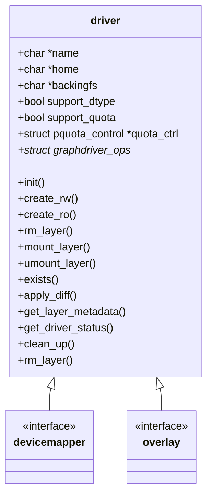

| Author | 李峰                                    |
| ------ | ------------------------------------------ |
| Date   | 2020-08-28                                 |
| Email  | [lifeng68@huawei.com](lifeng68@huawei.com) |

# 1.方案目标

Driver模块计划支持overlay2和devicemapper两种驱动，实现如下功能：

初始化驱动、返回驱动状态、返回驱动的metadata信息、Cleanup驱动、创建只读层、创建读写层、删除层、获取层rootfs路径、释放层。

对于overlay2驱动还需要实现quota功能。

# 2.总体设计



# 3.接口描述

## 3.1 Driver 初始化

```c
int graphdriver_init(const char *name, const char *isulad_root, char **storage_opts,
                     size_t storage_opts_len);
```

## 3.2 创建读写层 

```c
int graphdriver_create_rw(const char *id, const char *parent, struct driver_create_opts *create_opts);
```

## 3.3 创建只读层

```c
int graphdriver_create_ro(const char *id, const char *parent, const struct driver_create_opts *create_opts);
```

## 3.4 删除层

```c
int graphdriver_rm_layer(const char *id)
```

## 3.5 挂载层

```c
char *graphdriver_mount_layer(const char *id, const struct driver_mount_opts *mount_opts)
```

## 3.6 卸载层

```c
int graphdriver_umount_layer(const char *id)
```

## 3.7 查看层是否存在

```c
bool graphdriver_layer_exists(const char *id)
```

## 3.8 解压层数据

```c
int graphdriver_apply_diff(const char *id, const struct io_read_wrapper *content, int64_t *layer_size)
```

## 3.9 获取层meta数据

```c
int graphdriver_get_layer_metadata(const char *id, json_map_string_string *map_info)
```

## 3.10 查看驱动状态

```c
struct graphdriver_status *graphdriver_get_status(void)
```

## 3.11清理驱动

```c
int graphdriver_cleanup(void)
```

# 4.详细设计

## 3.1 Driver 初始化

Driver 初始化初始化流程：


Overlay 模块初始化流程：


Devicemapper模块初始化流程：


## 3.2 创建读写层

```c
struct driver_create_opts {
    char *mount_label;
    json_map_string_string *storage_opt;
};
```

1. 根据传入的ID、父层ID以及配置的创建选项，调用实际的驱动create_rw接口，实现创建layer层功能
2. 创建读写层时，需要判断是否设置了quota选项，若没有设置quota选项，则会添加daemon默认配置的quota值，作为容器读写层的quota限制
3. 如果设置了quota选项，并且当前文件系统不支持设置quota，则报错。
4. 当前overlay仅支持quota选项，若存在其他创建选项，则会报错。

## 3.3 创建只读层

```c
struct driver_create_opts {
    char *mount_label;
    json_map_string_string *storage_opt;
};
```

1. 根据传入的ID、父层ID以及配置的创建选项，调用实际的驱动create_ro接口，实现创建layer只读层
2. 创建只读时，需要判断是否设置了quota选项，若设置了quota选项，则报错。
3. 若存在其他创建选项，则报错。

## 3.4 删除层

根据传入的ID调用实际的驱动rm_layer接口，实现删除对应layer

## 3.5 挂载层

```c
struct driver_mount_opts {
    char *mount_label;
    char **options;
    size_t options_len;
};
```

1. 根据传入的ID调用实际的驱动mount_layer接口，实现挂载对应layer，并返回挂载后的文件系统路径

## 3.6 卸载层

根据传入的ID调用实际的驱动umount_layer接口，实现卸载对应layer

## 3.7 查看层是否存在

根据传入的ID调用实际的驱动exists接口，实现查询对应的层是否存在

## 3.8 解压层数据

```c
struct io_read_wrapper {
    void *context;
    io_read_func_t read;
    io_close_func_t close;
};
```

1. 根据传入的ID调用实际的驱动apply_diff接口，实现解压数据

2. overlay驱动 解压数据时，需要对overlay .whout 文件进行特殊处理

   - 如果是.wh.开头的文件，标识为该文件被删除，需要转换为char字符串数据，后续解压需要跳过该文件，比如删除home目录后，对应层数据解压到本地，home对应的需要创建同名的字符设备

     ```c
     drwxr-xr-x   4 root root     55 Mar 16 15:52 .
     drwxrwxrwt. 26 root root   4096 Mar 26 12:02 ..
     drwxr-xr-x   2 root root     38 Mar 16 12:49 etc
     c---------   1 root root   0, 0 Mar 16 15:52 home
     -rw-r--r--   1 root root 140543 Mar 13 12:12 index.html
     dr-xr-x---   2 root root     26 Mar 13 12:13 root
     ```

3. 解压数据应当chroot到对应目录下，防止软连接攻击

## 3.9 获取层meta数据

1. 根据传入的ID调用实际的驱动get_layer_metadata接口，实现查询对应的层的元数据

2. overlay支持查询的元数据如下

   | key       | value                                          |
   | :-------- | ---------------------------------------------- |
   | WorkDir   | overlay层的work路径                            |
   | MergedDir | overlay层的work路径                            |
   | UpperDir  | overlay层的diff路径                            |
   | LowerDir  | overlay层底层路径，包含所有的底层路径，以:分割 |

## 3.10 查看驱动状态

```c
struct graphdriver_status {
    char *driver_name;
    char *backing_fs;
    char *status;
};
```

1. 查询驱动的状态

2. 支持查询的驱动状态如下

   | key         | value                                                        |
   | :---------- | ------------------------------------------------------------ |
   | driver_name | 驱动名称                                                     |
   | backing_fs  | storage 所在的文件系统名称                                   |
   | status      | 对应底层驱动的状态字符串<br />overlay 支持的状态返回信息有：<br />Backing Filesystem<br /> Supports d_type: true |

## 3.11清理驱动

1. 根据调用底层驱动的clean_up接口清理对应驱动的资源
2. overlay驱动实现卸载storage home目录