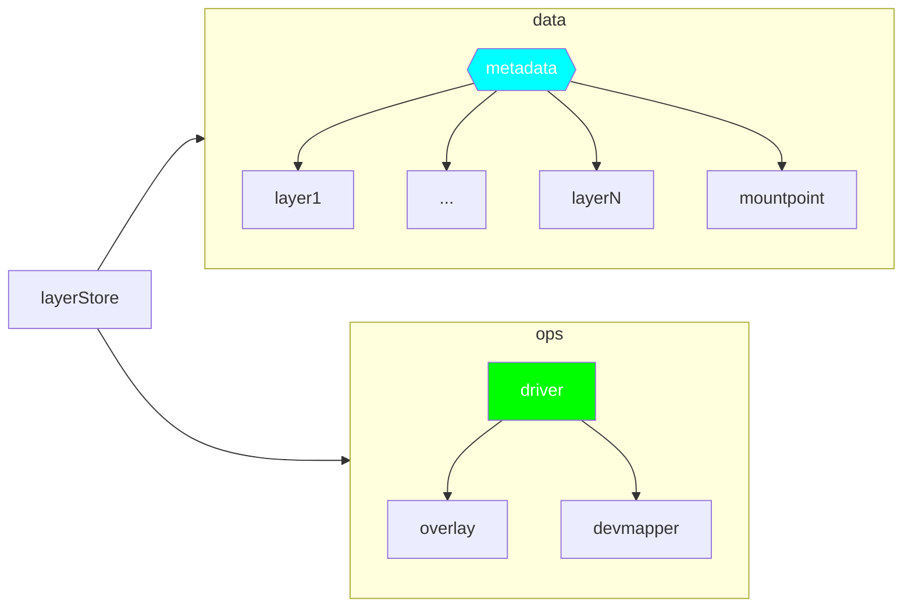
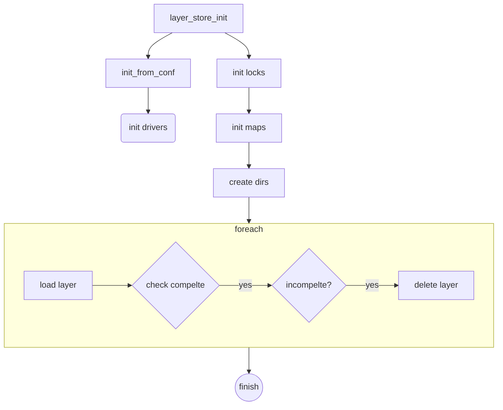
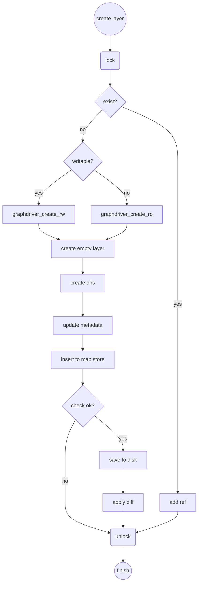
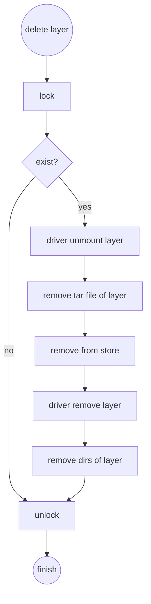

| Author | 刘昊                                       |
| ------ | ------------------------------------------ |
| Date   | 2020-03-27                                 |
| Email  | [liuhao27@huawei.com](liuhao27@huawei.com) |


# 1. 方案目标

  `OCI` 镜像在结构上是由一层或者多层组成的，然后通过联合挂载的方式使用。因此，容器引擎必须具备层的管理能力，包括创建、删除、挂载、卸载等。

# 2. 总体设计

`layerStore` 模块包括：
- 数据部分：用于管理层的数据信息，例如层的内容、层与层的关系数据以及挂载点信息等等；
- 操作部分：主要是依赖底层 `driver` 实现，例如层的数据如何存储、如何挂载、卸载、删除操作等等；



# 3. 接口描述

  `layer store` 模块对外提供了一套接口，本章节主要针对该接口进行说明，而使用的 `driver` 接口由 [驱动文档](./image_storage_driver_design_zh.md) 说明。

## 3.1 模块初始化

```c
int layer_store_init(const struct storage_module_init_options *conf);
```

## 3.2 模块退出

```c
void layer_store_exit();
```

## 3.3 创建层

```c
int layer_store_create(const char *id, const struct layer_opts *opts, const struct io_read_wrapper *content, char **new_id);
```

## 3.4 层的引用计数管理

```c
// 使用层，引用计数+1
int layer_inc_hold_refs(const char *layer_id);

// 释放层，引用计数-1
int layer_dec_hold_refs(const char *layer_id);

// 获取引用计数大小
int layer_get_hold_refs(const char *layer_id, int *ref_num);
```

## 3.5 删除层

```c
int layer_store_delete(const char *id);
```

## 3.6 层的占用检查

```c
bool layer_store_exists(const char *id);
```

## 3.7 列出层列表

```c
int layer_store_list(struct layer_list *resp);
```

## 3.8 搜索层

```c
// 使用层压缩数据的digest信息，获取层
int layer_store_by_compress_digest(const char *digest, struct layer_list *resp);

// 使用层解压数据的digest信息，获取层
int layer_store_by_uncompress_digest(const char *digest, struct layer_list *resp);

// 使用层的ID，获取层
struct layer *layer_store_lookup(const char *name);
```

## 3.9 挂载卸载接口

```c
// 挂载ID指定的层
char *layer_store_mount(const char *id);

// 卸载ID指定的层，force标识是否强制卸载
int layer_store_umount(const char *id, bool force);
```

## 3.10 辅助接口

```c
// 获取层的文件系统统计信息，
int layer_store_get_layer_fs_info(const char *layer_id, imagetool_fs_info *fs_info);

// 获取层对应驱动的元数据信息
container_inspect_graph_driver *layer_store_get_metadata_by_layer_id(const char *id);
```

# 4. 详细设计

## 4.1 模块初始化




## 4.2 层创建



## 4.3 层删除

