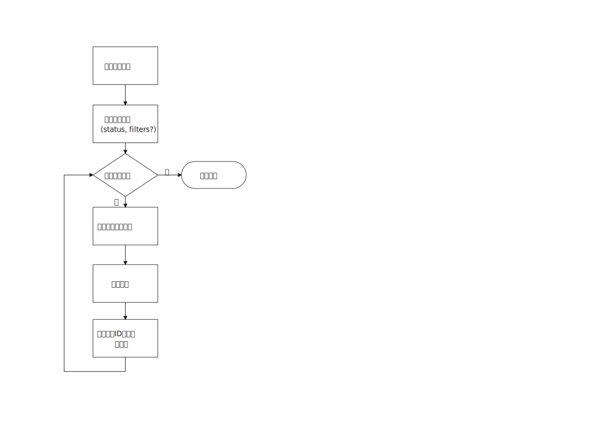
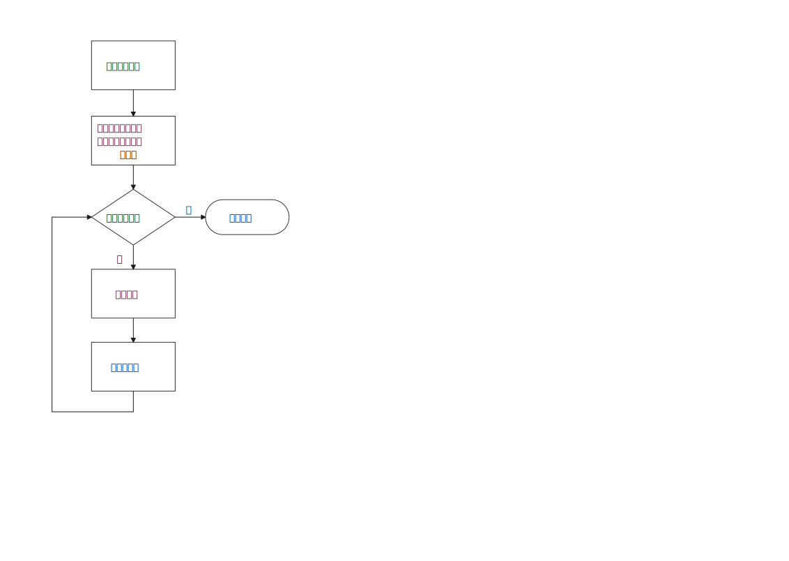
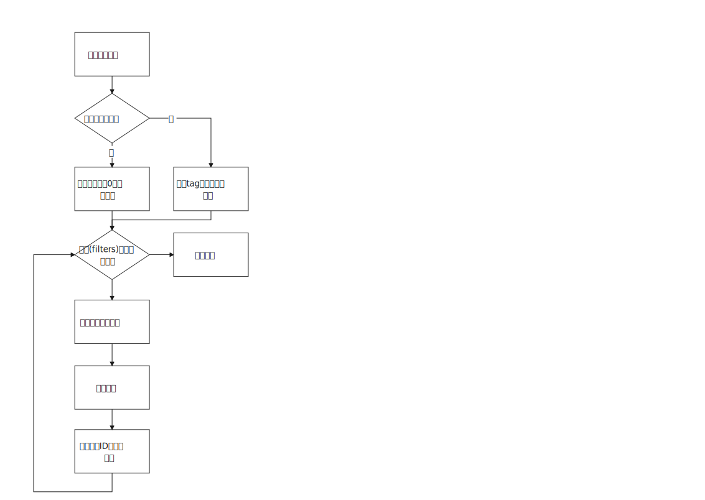

# 方案目标 #
当使用isula时，用户可能累计大量的镜像，容器，网络和存储卷，这些会占用用户的系统空间。增加 `isula system prune`命令允许用户从isula系统中删除不需要的数据，包括已停止运行的容器、无用的镜像、无用的网络和存储卷。这能帮助用户释放系统空间，保持isula系统整洁。

# 总体设计 #

## 增加命令`isula system prune` ##
删除不需要的数据。默认的命令将删除停止运行的容器，无效的镜像和不用的网络。
如果带有标记--all,则除上述删除项外,也会删除不用的存储卷。

一旦数据删除后，将不会恢复。在执行命令时，提示用户该命令在确认数据不再需要时才能执行。
数据包括：

* 已停止运行的容器
* 无用的镜像
* 无用的网络
* 无用的存储卷 

## 增加单项命令 ##

和`isula system prune`不同，用户可以只删除特定的对象。新增的命令包括：

* `isula container prune`: 删除所有停止的容器.
* `isula image prune --dangling`: 删除所有悬空镜像.
* `isula image prune --all`: 删除所有不和任何容器关联的镜像.
* `isula network prune`: 删除不和任何容器关联的网络.

> Dangling images are untagged images that aren't used by a container or depended on by a descendant. They usually serve no purpose but still consume disk space.

## 条件过滤 ##

条件过滤可以有选择的删除对象。条件包括：

* --until: 对象创建日期在某个具体时间之前，时间格式是标准unix时间戳如2006-01-02T15:04:05，2006-01-02。

# 详细设计 #
## 主要流程 ##
### container prune ###

### network prune ###

### image prune ###

