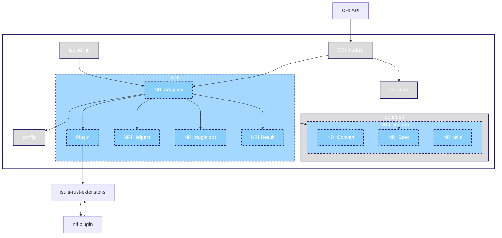
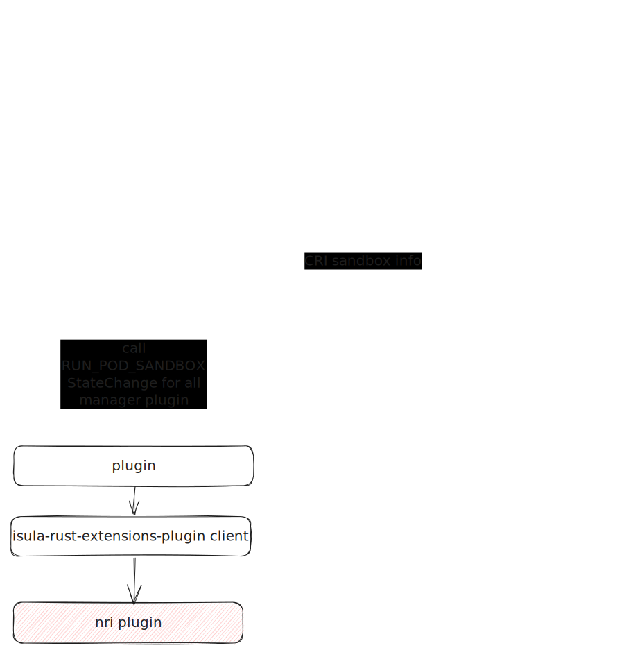

| Author | zhongtao              |
| ------ | --------------------- |
| Date   | 2024-07-21            |
| Email  | zhongtao17@huawei.com |
# 方案目标
## NRI介绍

[NRI](https://github.com/containerd/nri) (Node Resource Interface), 是用于控制节点资源的公共接口, 是CRI兼容的容器运行时插件扩展的通用框架。它为扩展插件提供了跟踪容器状态，并对其配置进行有限修改的基本机制。允许将用户某些自定的逻辑插入到OCI兼容的运行时中，此逻辑可以对容器进行受控更改，或在容器生命周期的某些时间点执行 OCI 范围之外的额外操作。例如，用于改进设备和其他容器资源的分配和管理。

NRI 定义了插件的api：https://github.com/containerd/nri/blob/main/pkg/api/api.proto,目前支持的api 版本为0.6.1

NRI 插件能够订阅Pod和容器生命周期事件：

### 订阅Pod生命周期事件

NRI能够订阅Pod生命周期事件，包括：
- creation
- stopping
- removal

相关的API如下：
```go
// 当有pod在节点上创建时，NRI插件将收到该事件
func (p *plugin) RunPodSandbox(pod *api.PodSandbox) error {
	return nil
}
// 当有pod在节点上停止时，NRI插件将收到该事件
func (p *plugin) StopPodSandbox(pod *api.PodSandbox) error {
	return nil
}

// 当有pod在节点上移除时，NRI插件将收到该事件
func (p *plugin) RemovePodSandbox(pod *api.PodSandbox) error {
	return nil
}
```

### 订阅容器生命周期事件

NRI能够订阅容器生命周期事件，包括：

- creation ( * )
- post-creation
- starting
- post-start
- updating ( * )
- post-update
- stopping ( * )
- removal

( * )后缀的表示可以根据插件的返回信息更新容器的oci spec。相关的API如下：

```go
// 创建容器
func (p *plugin) CreateContainer(pod *api.PodSandbox, container *api.Container) (*api.ContainerAdjustment, []*api.ContainerUpdate, error) {
	return nil, nil, nil
}
// 容器创建以后
func (p *plugin) PostCreateContainer(pod *api.PodSandbox, container *api.Container) error {
  return nil
}
// 容器启动之前
func (p *plugin) StartContainer(pod *api.PodSandbox, container *api.Container) error {
	return nil
}
// 容器启动之后
func (p *plugin) PostStartContainer(pod *api.PodSandbox, container *api.Container) error {
	return nil
}
// 容器更新时
func (p *plugin) UpdateContainer(pod *api.PodSandbox, container *api.Container) ([]*api.ContainerUpdate, error) {
	return nil, nil
}
// 容器更新后
func (p *plugin) PostUpdateContainer(pod *api.PodSandbox, container *api.Container) error {
	return nil
}
// 容器停止时
func (p *plugin) StopContainer(pod *api.PodSandbox, container *api.Container) ([]*api.ContainerUpdate, error) {
	return nil, nil
}
// 容器移除时
func (p *plugin) RemoveContainer(pod *api.PodSandbox, container *api.Container) error {
	return nil
}
```

### NRI插件可获得的信息

```proto
// Pod metadata that is considered relevant for a plugin.
message PodSandbox {
  string id = 1;
  string name = 2;
  string uid = 3;
  string namespace = 4;
  map<string, string> labels = 5;
  map<string, string> annotations = 6;
  string runtime_handler = 7;
  LinuxPodSandbox linux = 8;
  uint32 pid = 9; // for NRI v1 emulation
}

// Container metadata that is considered relevant for a plugin.
message Container {
  string id = 1;
  string pod_sandbox_id = 2;
  string name = 3;
  ContainerState state = 4;
  map<string, string> labels = 5;
  map<string, string> annotations = 6;
  repeated string args = 7;
  repeated string env = 8;
  repeated Mount mounts = 9;
  Hooks hooks = 10;
  LinuxContainer linux = 11;
  uint32 pid = 12; // for NRI v1 emulation
  repeated POSIXRlimit rlimits = 13;
}
```

### NRI 插件可更新资源

#### 可更新的pod资源

```proto
// PodSandbox linux-specific metadata
message LinuxPodSandbox {
  LinuxResources pod_overhead = 1;
  LinuxResources pod_resources = 2;
  string cgroup_parent = 3;
  string cgroups_path = 4; // for NRI v1 emulation
  repeated LinuxNamespace namespaces = 5; // for NRI v1 emulation
  LinuxResources resources = 6; // for NRI v1 emulation
}

// Container (linux) resources.
message LinuxResources {
  LinuxMemory memory = 1;
  LinuxCPU cpu = 2;
  repeated HugepageLimit hugepage_limits = 3;
  OptionalString blockio_class = 4;
  OptionalString rdt_class = 5;
  map<string, string> unified = 6;
  repeated LinuxDeviceCgroup devices = 7; // for NRI v1 emulation
}

// Memory-related parts of (linux) resources.
message LinuxMemory {
  OptionalInt64 limit = 1;
  OptionalInt64 reservation = 2;
  OptionalInt64 swap = 3;
  OptionalInt64 kernel = 4;
  OptionalInt64 kernel_tcp = 5;
  OptionalUInt64 swappiness = 6;
  OptionalBool disable_oom_killer = 7;
  OptionalBool use_hierarchy = 8;
}

// CPU-related parts of (linux) resources.
message LinuxCPU {
  OptionalUInt64 shares = 1;
  OptionalInt64 quota = 2;
  OptionalUInt64 period = 3;
  OptionalInt64 realtime_runtime = 4;
  OptionalUInt64 realtime_period = 5;
  string cpus = 6;
  string mems = 7;
}

// Container huge page limit.
message HugepageLimit {
  string page_size = 1;
  uint64 limit = 2;
}

// Container rlimits
message POSIXRlimit {
  string type = 1;
  uint64 hard = 2;
  uint64 soft = 3;
}

// A linux namespace.
message LinuxNamespace {
  string type = 1;
  string path = 2;
}
```

#### 可更新的container资源

```proto
// Requested adjustments to a container being created.
message ContainerAdjustment {
  map<string, string> annotations = 2;
  repeated Mount mounts = 3;
  repeated KeyValue env = 4;
  Hooks hooks = 5;
  LinuxContainerAdjustment linux = 6;
  repeated POSIXRlimit rlimits = 7;
}

// A container mount.
message Mount {
  string destination = 1;
  string type = 2;
  string source = 3;
  repeated string options = 4;
}

// Adjustments to (linux) resources.
message LinuxContainerAdjustment {
  repeated LinuxDevice devices = 1;
  LinuxResources resources = 2;
  string cgroups_path = 3;
}

```

## NRI 优势
NRI(Node Resource Interface), 是用于控制节点资源的公共接口, 是CRI兼容的容器运行时插件扩展的通用框架。它为扩展插件提供了跟踪容器状态，并对其配置进行有限修改的基本机制。

在NRI规范之前，k8s场景下资源管理的流程与CRI管理流程是相互独立的，在管理面上的存在一些一致性的问题，NRI的推出则解决了这些问题：  
- NRI利用容器引擎来捕获生命周期，无需额外组件监控  
- Pod资源管理流程与CRI原有流程归一化，减少管理及维护成本  
- 在Pod管理流程中直接插入调度策略，不存在延迟  
- Kubernetes获取的资源信息与底层信息保持一致

简单来说，NRI的出现减少了管理维护成本，消除了调度延迟，规范了信息一致性

## 需求目标

实现iSulad对符合NRI 规范的nri插件的支持，使得对于iSulad管理的sandbox与容器，用户可以在不修改容器运行时源代码的情况下添加自定义逻辑，减少对容器资源的管理成本，且保证插件获取信息与容器引擎信息一致。

# 总体设计


模块简要介绍：
1. NRI Adaption: （1）管理所有NRI插件；（2）与isula-rust-extension进行交互，调用isula-rust-extension的注册callback函数，告知isula-rust-extension接收到plugin注册与update请求时调用的函数
2. NRI Helpers： C++实现的nri帮助函数
3. NRI plugin ops： 提供转换后的adaption init函数以及提供需要注册到isula-rust-extension的callback函数
4. NRI Result：处理所有插件的adjust与update，得到一个合并后的结果，若插件修改冲突则报错
5. Plugin：定义plugin 类，用于定义plugin支持的相关操作以及存储的信息, 根据插件是否关注event来决定是否调用此plugin，需调用isula-rust-extension中plugin相关函数实现
6. NRI convert module:实现 CRI 结构体与 NRI结构体之间的转换、实现iSulad内部存储container的结构体与NRI结构体之间的转换
7. NRI Spec：实现nri修改oci spec的函数
8. NRI utils： 提供处理init与copy nri相关结构体的工具函数

# 接口描述 

## 配置
```json
# add support for NRI plugin.
"nri-support": true,
# Allow connections from externally launched NRI plugins.
"disable_connections": true,
# plugin_config_path is the directory to search for plugin-specific configuration.
"plugin_config_path": "/etc/nri/conf.d"
# plugin_path is the directory to search for plugins to launch on startup.
"plugin_path": "/opt/nri/plugins"
# plugin_registration_timeout is the timeout for a plugin to register after connection.
"plugin_registration_timeout": "5s"
# plugin_requst_timeout is the timeout for a plugin to handle an event/request.
"plugin_request_timeout": "2s"
# socket_path is the path of the NRI socket to create for plugins to connect to. 
"socket_path" = "/var/run/nri/nri.sock"
```
# 详细设计


## 初始化流程


## 响应RunPodSandbox事件流程


StopPodSandbox/RemovePodSandbox/PostCreateContainer/StartContainer/PostStartContainer/PostUpdateContainer/RemoveContainer 与RunPodSandbox处理流程相同，仅event种类变化

## 响应CreateContainer事件流程


# 约束限制
## 接口参数限制
暂不支持修改以下参数：
```proto
// Container to evict(IOW unsolicitedly stop).
ContainerEviction evict;

// ref:https://github.com/containerd/containerd/pull/5490
// - User defines blockio classes, for example: ThrottledIO and LowLatency. Class names are not restricted, and the number of classes is not limited.
// iSulad not support
OptionalString blockio_class;

// iSulad now not support the following hook types
message Hooks {
  repeated Hook create_runtime = 2;
  repeated Hook create_container = 3;
  repeated Hook start_container = 4;
}
```
tips:
以下参数iSulad支持，containerd暂不支持
```proto
// POSIX rlimits can be used control the resources a process can consume.
POSIXRlimit rlimits
```

## 使用限制
1. 对于插件异常退出场景，iSulad目前仅在下次调用出错时打印日志（
2. 对于external 注册的plugin，若iSulad退出，iSulad不对其进行强制kill，生命周期与iSulad无关。

# 测试点

1.对于订阅不同生命周期事件的nri插件支持

2.稳定性：某个插件异常退出时，iSulad中插件的行为是否存在异常残留以及是否影响其他插件功能。

3.稳定性：iSulad退出后，iSulad自己拉取的nri插件是否正常被kill退出。

4.注册方式：测试iSulad启动时拉取注册nri插件与external 注册nri插件
