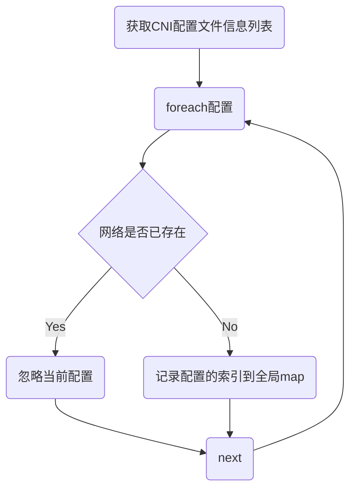
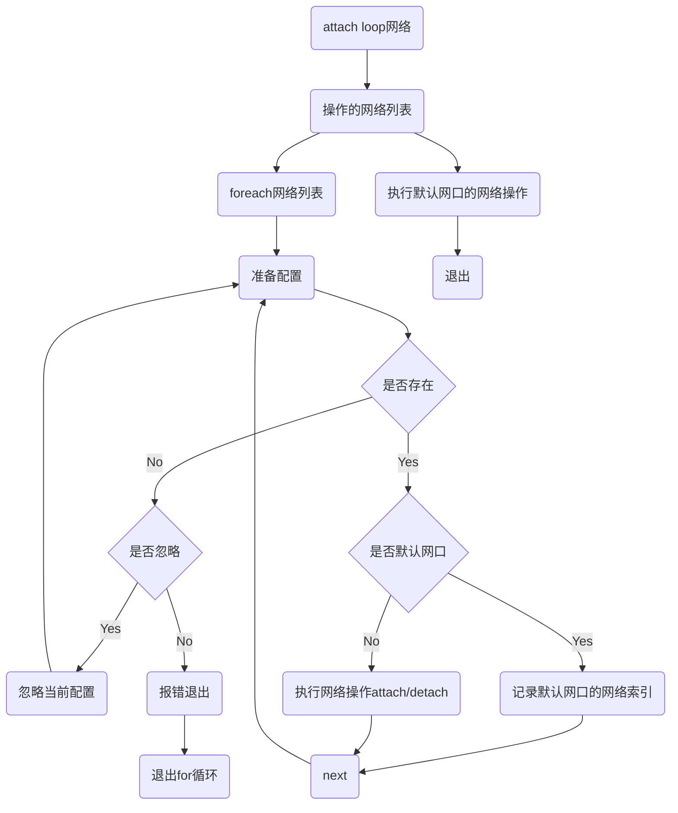

| Author | 刘昊                                    |
| ------ | ------------------------------------------ |
| Date   | 2021-03-30                                 |
| Email  | [liuhao27@huawei.com](liuhao27@huawei.com) |

# 1. Program Objectives

The CRI adapter is used to implement CRI's network functions for Pod joining, exiting, and network information acquisition; and management of network configuration files.

# 2. Overall Design

# 3. Interface Description

````c
##

​````
/*
* Description: adapter initialization, set the directory where the cni configuration file is located, and the directory list where the cni plugin is located;
* conf_dir: cni configuration file storage directory;
* bin_paths: cni plugin storage directory list;
* bin_paths_len: directory listing length;
* Return value: return 0 on success, non-zero on failure
*/
int adaptor_cni_init_confs(const char *conf_dir, const char **bin_paths, const size_t bin_paths_len);

/*
* Description: Update the cni configuration file collection;
* Return value: return 0 on success, non-zero on failure
*/
int adaptor_cni_update_confs();

/*
* Description: Check whether the adapter initialization is successful;
* Return value: return true on success, false on failure;
*/
bool adaptor_cni_check_inited();

/*
* Description: Add the pod to the network plane;
* conf: configuration parameters, including the list of added network plane names, pod id and other information;
* result: The return information of adding network operation, including network information such as ip, mac;
* Return value: return 0 on success, non-zero on failure
*/
int adaptor_cni_setup(const network_api_conf *conf, network_api_result_list *result);

/*
* Description: Exit the pod from the network plane;
* conf: configuration parameters, including the list of exited network plane names, pod id and other information;
* result: The return information of adding network operation, including network information such as ip, mac;
* Return value: return 0 on success, non-zero on failure
*/
int adaptor_cni_teardown(const network_api_conf *conf, network_api_result_list *result);

/*
* Description: Check the network plane of the pod;
* conf: configuration parameters, including check network plane name list, pod id and other information;
* result: The return information of the check network operation, including network information such as ip and mac;
* Return value: return 0 on success, non-zero on failure
*/
int adaptor_cni_check(const network_api_conf *conf, network_api_result_list *result);
​````

##
````

# 4. Detailed Design

## 4.1 update process



## 4.2 network operation process

