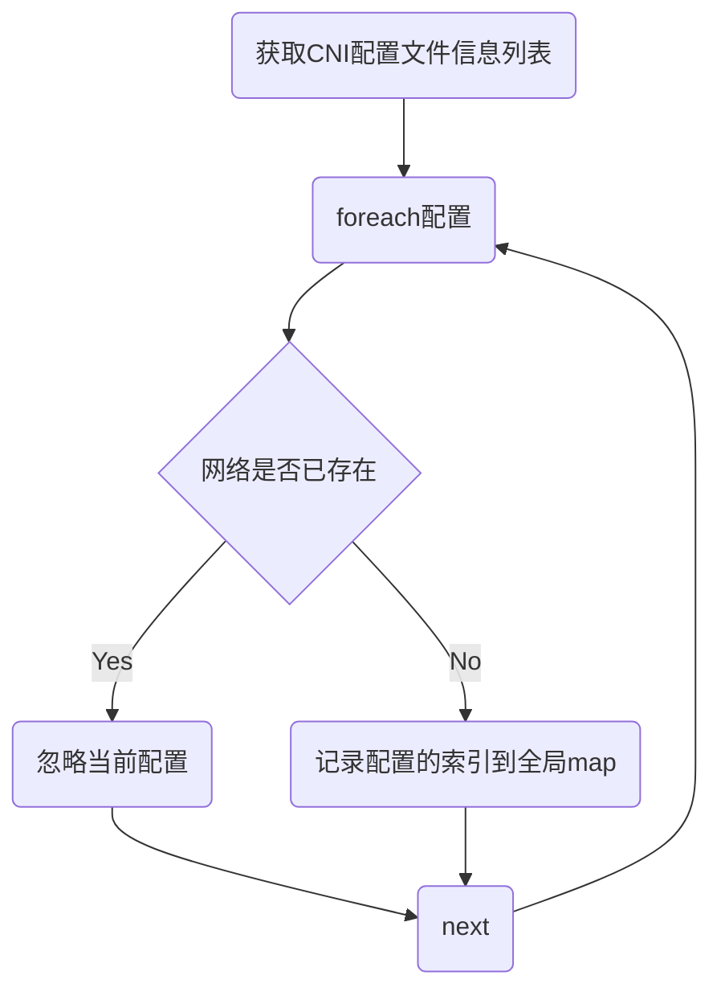
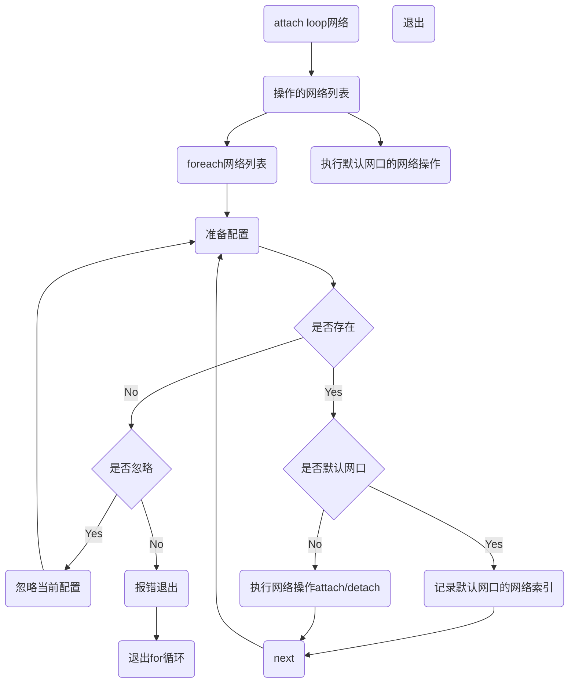

| Author | 刘昊                                    |
| ------ | ------------------------------------------ |
| Date   | 2021-03-30                                 |
| Email  | [liuhao27@huawei.com](liuhao27@huawei.com) |

# 1.方案目标

CRI适配器用于实现CRI的网络功能，用于Pod加入、退出和网络信息获取；以及对网络配置文件的管理。

# 2.总体设计

# 3.接口描述

```c
## 

​```
/*
* 说明：适配器初始化，设置cni配置文件所在目录，cni插件所在目录列表；
* conf_dir: cni配置文件存储目录；
* bin_paths: cni插件存储目录列表；
* bin_paths_len: 目录列表长度；
* 返回值：成功返回0，失败返回非0
*/
int adaptor_cni_init_confs(const char *conf_dir, const char **bin_paths, const size_t bin_paths_len);

/*
* 说明：更新cni配置文件集合；
* 返回值：成功返回0，失败返回非0
*/
int adaptor_cni_update_confs();

/*
* 说明：适配器初始化是否成功检查；
* 返回值：成功返回true，失败返回false；
*/
bool adaptor_cni_check_inited();

/*
* 说明：把pod加入到网络平面中；
* conf: 配置参数，包括加入的网络平面名列表，pod的id等信息；
* result: 加入网络操作的返回信息，包括ip，mac等网络信息；
* 返回值：成功返回0，失败返回非0
*/
int adaptor_cni_setup(const network_api_conf *conf, network_api_result_list *result);

/*
* 说明：把pod从网络平面中退出；
* conf: 配置参数，包括退出的网络平面名列表，pod的id等信息；
* result: 加入网络操作的返回信息，包括ip，mac等网络信息；
* 返回值：成功返回0，失败返回非0
*/
int adaptor_cni_teardown(const network_api_conf *conf, network_api_result_list *result);

/*
* 说明：check pod的网络平面；
* conf: 配置参数，包括check的网络平面名列表，pod的id等信息；
* result: check网络操作的返回信息，包括ip，mac等网络信息；
* 返回值：成功返回0，失败返回非0
*/
int adaptor_cni_check(const network_api_conf *conf, network_api_result_list *result);
​```

## 
```

# 4.详细设计

## 4.1 更新流程



## 4.2 网络操作流程

