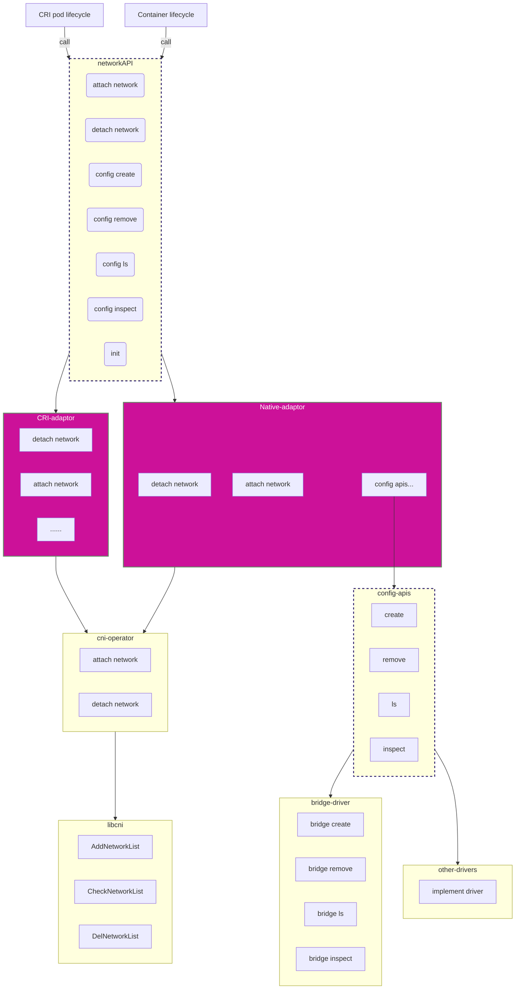
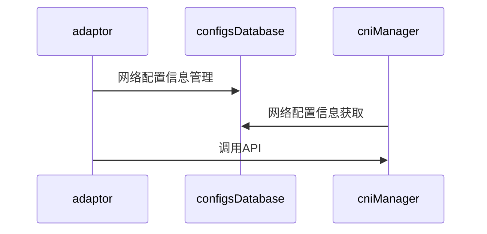
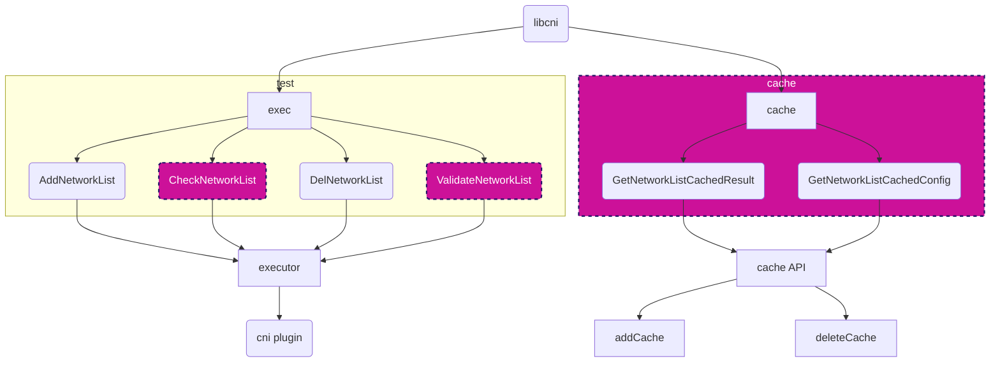

| Autho | 刘昊                                       |
| ----- | ------------------------------------------ |
| Date  | 2021-02-19                                 |
| Email | [liuhao27@huawei.com](liuhao27@huawei.com) |

# 1. Program Objectives

In order to improve the function of iSulad, it is necessary to support the Native network. Usually, testing and development scenarios basically start containers through the client. Therefore, this article details iSulad's Native network design.

The CRI interface implements the container network capability flexibly and extensibly by encapsulating the CNI. So, can the native network of isulad also be implemented based on the capabilities of CNI? certainly! This design idea has many advantages:

- High flexibility and scalability;
- Relying on open source network plug-ins, greatly reducing the workload;
- Minimal impact on current iSulad architecture;
- In line with current industry standards, it can better expand the ecology of iSulad;

# 2. Overall Design

We divide the network design of iSulad into four modules:

1. network api module: provides the API interface of the entire network component, provides network capabilities for the container (the ability to create, delete the network, join the container, exit the network, etc.), and determine the network type through the `type` parameter.
2. Adaptor module: provides different network type implementations. Currently, it supports two network types: `CRI` and `native`, which correspond to the network implementation of the CRI interface and the local network capabilities of the client respectively.
3. cni-operator module: encapsulates the libcni module, provides a more reasonable and friendly network management interface for the upper layer, and is responsible for the combined adaptation of user configuration and network configuration;
4. libcni module: Based on the existing clibcni self-developed project, it is upgraded and adapted to the latest cni 0.4.0 version, and provides new mechanisms and functions such as check and cache;

The overall structure is as follows:



The sequence diagram is as follows:




# 3. Interface Description

## 3.1 code structure directory structure

```bash
# api header file location:
src/daemon/modules/api/network_api.h

# The network module code structure is as follows:
src/daemon/modules/network/
├── CMakeLists.txt
├── cni_operator
│ ├── CMakeLists.txt
│ ├── cni_operate.c
│ ├── cni_operate.h
│ └── libcni
│ ├── CMakeLists.txt
│ ├── invoke
│ │ ├── CMakeLists.txt
│ │ ├── libcni_errno.c
│ │ ├── libcni_errno.h
│ │ ├── libcni_exec.c
│ │ ├── libcni_exec.h
│ │ ├── libcni_result_parse.c
│ │ └── libcni_result_parse.h
│ ├── libcni_api.c
│ ├── libcni_api.h
│ ├── libcni_cached.c
│ ├── libcni_cached.h
│ ├── libcni_conf.c
│ ├── libcni_conf.h
│ ├── libcni_result_type.c
│ └── libcni_result_type.h
├── cri
│ ├── adaptor_cri.c
│ ├── adaptor_cri.h
│ └── CMakeLists.txt
├── native
│ ├── adaptor_native.c
│ ├── adaptor_native.h
│ └── CMakeLists.txt
├── network.c
└── network_tools.h
````

## 3.2 structure and constant description

````c
#define MAX_CONFIG_FILE_COUNT 1024

// support network type
#define NETWOKR_API_TYPE_NATIVE "native"
#define NETWOKR_API_TYPE_CRI "cri"

struct attach_net_conf {
    char *name;
    char *interface;
};

typedef struct network_api_conf_t {
    char *name;
    char *ns;
    char *pod_id;
    char *netns_path;
    char *default_interface;

    // attach network panes config
    struct {
        struct attach_net_conf **extral_nets;
        size_t extral_nets_len;
    };

    // external args;
    json_map_string_string *args;

    // extention configs: map<string, string>
    map_t *annotations;
} network_api_conf;

struct network_api_result {
    char *name;
    char *interface;

    char **ips;
    size_t ips_len;
    char *mac;
};

typedef struct network_api_result_list_t {
    struct network_api_result **items;
    size_t len;
    size_t cap;
} network_api_result_list;
````

+ Support up to 1024 CNI profiles;
+ Supports two network types: `native` and `cri`;
+ Interface input parameter type: `network_api_conf`;
+ Network operation result types: `network_api_result_list` and `network_api_result`;

## 3.3 interface description

````c
// 1. Network module initialization interface;
bool network_module_init(const char *network_plugin, const char *cache_dir, const char *conf_dir, const char* bin_path);

// 2. The container is connected to the network plane interface;
int network_module_attach(const network_api_conf *conf, const char *type, network_api_result_list **result);

// 3. Network check operation, which can be used to obtain the network configuration information of the container;
int network_module_check(const network_api_conf *conf, const char *type, network_api_result_list **result);

// 4. The container exits the interface from the network plane;
int network_module_detach(const network_api_conf *conf, const char *type);

// 5. Network configuration generation interface;
int network_module_conf_create(const char *type, const network_create_request *request,
                               network_create_response **response);

// 6. Network configuration view interface;
int network_module_conf_inspect(const char *type, const char *name, char **network_json);

// 7. List interfaces for network profiles;
int network_module_conf_list(const char *type, const struct filters_args *filters, network_network_info ***networks,
                             size_t *networks_len);

// 8. Network configuration file delete interface;
int network_module_conf_rm(const char *type, const char *name, char **res_name);

// 9. Interface to check if the network module is ready;
bool network_module_ready(const char *type);

// 10. Network module configuration update interface;
int network_module_update(const char *type);

// 11. Interface for resource cleanup when network module exits;
void network_module_exit();

// 12. Set the portmapping settings of annotations;
int network_module_insert_portmapping(const char *val, network_api_conf *conf);

// 13. Set the bandwidth setting of annotations;
int network_module_insert_bandwidth(const char *val, network_api_conf *conf);

// 14. Set the iprange setting of annotations;
int network_module_insert_iprange(const char *val, network_api_conf *conf);

// 15. Check whether the network module network exists or not;
int network_module_exist(const char *type, const char *name);
````

# 4. Detailed Design

## 4.1 libcni module

Provides the upper layer with the basic capabilities of CNI, and completes functions such as building, deleting, and checking the CNI network according to the incoming CNI network configuration information. The current libcni module has provided the capability of the `v0.3.0` version, it needs to be upgraded to `v0.4.0` after iteration, and `v0.4.0` needs to support the `check` and `cache` mechanisms. The part marked by the red part in the figure below.




## 4.2 adaptor module

- You can see how the CRI adapter modules are designed in [CRI_adapter_design](CRI_adapter_design.md).

- You can see how the native network adapter modules are designed in [native_network_adapter_design](./native_network_adapter_design.md).


##  4.3 cni-operator module

- You can see how the cni operator modules are designed in [cni_operator_design](./cni_operator_design.md).