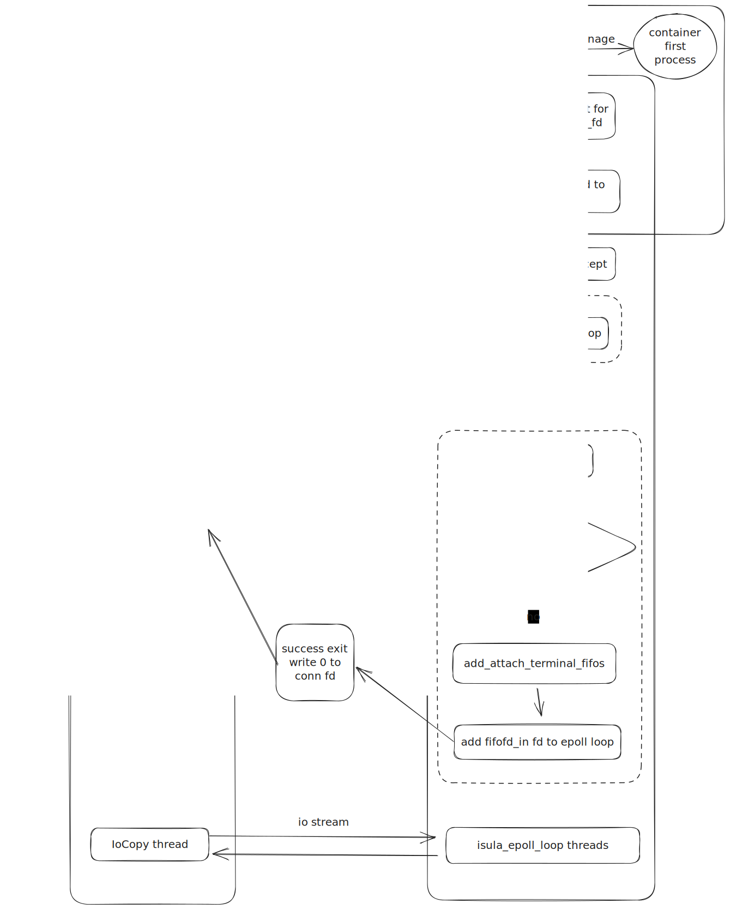

| Author | zhongtao              |
| ------ | --------------------- |
| Date   | 2023-10-19            |
| Email  | zhongtao17@huawei.com |

# 方案目标

isulad当前默认的runtime为lcr + lxc，具有高性能的特点。但是该runtime是通过oci规范转换为lxc规范实现的，而且在lxc中进行了较多适配修改。

随着oci 规范的日益成熟，oci规范实现的runtime能满足各种场景需求。因此iSulad实现基于oci 规范的runtime对接，具有底噪更低的优势。

需求目标分为以下5点：

1. 对于isula 命令行支持 oci runtime 容器的功能进行全量排查，识别缺失功能。
2. 补齐缺失功能，保证切换默认runtime为runc之后功能的完整性，并针对新增功能补充对应的单元测试与门禁测试。
3. 梳理isulad-shim依赖情况，解耦isulad-shim依赖，减少runc容器底噪，并且提高稳定性（静态编译isulad-shim，从而使得isulad-shim不依赖isulad版本，支持isulad热升级）
4. 重构社区门禁CI框架，支持多 runtime 测试。

# 总体设计

由于isulad与runc之间的交互存在gap，且将容器创建成功之后，容器进程的生命周期与isulad进程的生命周期没有必然联系，因此isulad设计了一个isulad-shim进程，用于isulad与runc的交互并将isulad与容器实例解耦。

isulad 与 isulad-shim的关系以及整体结构请参照：[runc_design](./runc_design_zh.md) 。

由于isula attach 涉及到attach中新建的fifo fd与容器首进程io进行数据交换，因此需要isulad与容器首进程对应的isulad-shim进行通信，完成建立io 连接并进行io copy操作。

isula top 命令仅需要在isulad中直接调用runc二进制。
# 接口描述 

## isula_rt_ops模块

```c

int rt_isula_attach(const char *id, const char *runtime, const rt_attach_params_t *params);

int rt_isula_listpids(const char *name, const char *runtime, const rt_listpids_params_t *params,
                      rt_listpids_out_t *out);
```
# 详细设计

## attach 实现流程

### 流程图



### 详细流程

isulad端：

1. 创建容器时（rt_isula_create），传递给isulad-shim attach socket path；
2. 进行attach操作时（rt_isula_attach），先根据 attach socket path与isulad-shim的socket server端建立连接，获得通信的socket fd。
3. 将attach 的stdin stdout与stderr fifo路径写入到socket fd中。
4. 从socket fd中读取isulad-shim是否成功将attach的fd加入到epoll中成功连接，若成功则直接成功返回，若失败则获取attach-log.json文件中的报错信息后报错返回。

isulad-shim端：

1. create isulad-shim进程时，若传递的process 中包含 attach socket path， 则创建一个本地unix socket文件，用于isulad与isulad-shim之间通信。本地unix socket文件打开获得attach_isulad_fd，将attach_isulad_fd加入到epoll需要监听的fd中。
2. 收到attach_isulad_fd的事件后，调用do_attach_socket_accept函数，accept到通信的conn_fd后，将conn_fd加入到epoll需要监听的fd中。
3. 在收到conn_fd事件后，调用attach_fd函数。attach_fd函数中从attach_isulad_fd中读出stdin stdout与stderr路径，之后在shim中打开fd。将stdin对应的fd加入epoll监听列表中，有事件时调用stdin_cb。若容器有输入与输出，则除了写入到初始isulad fd中之外，还需要写入到attach的fd list中。

### 新增文件
1. /run/isulad/runc/{container_id}/attach_socket.sock 用于isulad与isulad-shim attach通信
2. /run/isulad/runc/{container_id}/attach-log.json 用于记录isulad-shim中attach的报错信息。目前所有的attach操作共用一个attach文件

### 未来规划
1. runc容器的attach支持魔术符退出（CTRL + Q），退出后不影响容器首进程的运行，也不影响其他并发的attach操作。
2. 由于支持魔术符退出，在GRPC版本中，可设置了ISULAD_INFO_DETACH错误码，用于标识用户输入魔术符退出，而rest版本中由于实现差异，无法识别exit退出与魔术符退出的差异，因此在魔术符退出时，会存在一条INFO级别的报错信息：`INFO("Wait container stopped status timeout.");`

## top 实现流程

isulad端：

1. 直接调用runc二进制ps容器：runtime_call_simple(), 设置选项" --format json"；
2. 直接解析调用返回的stdout中的容器进程pid，将其写入到rt_listpids_out_t结构体中；