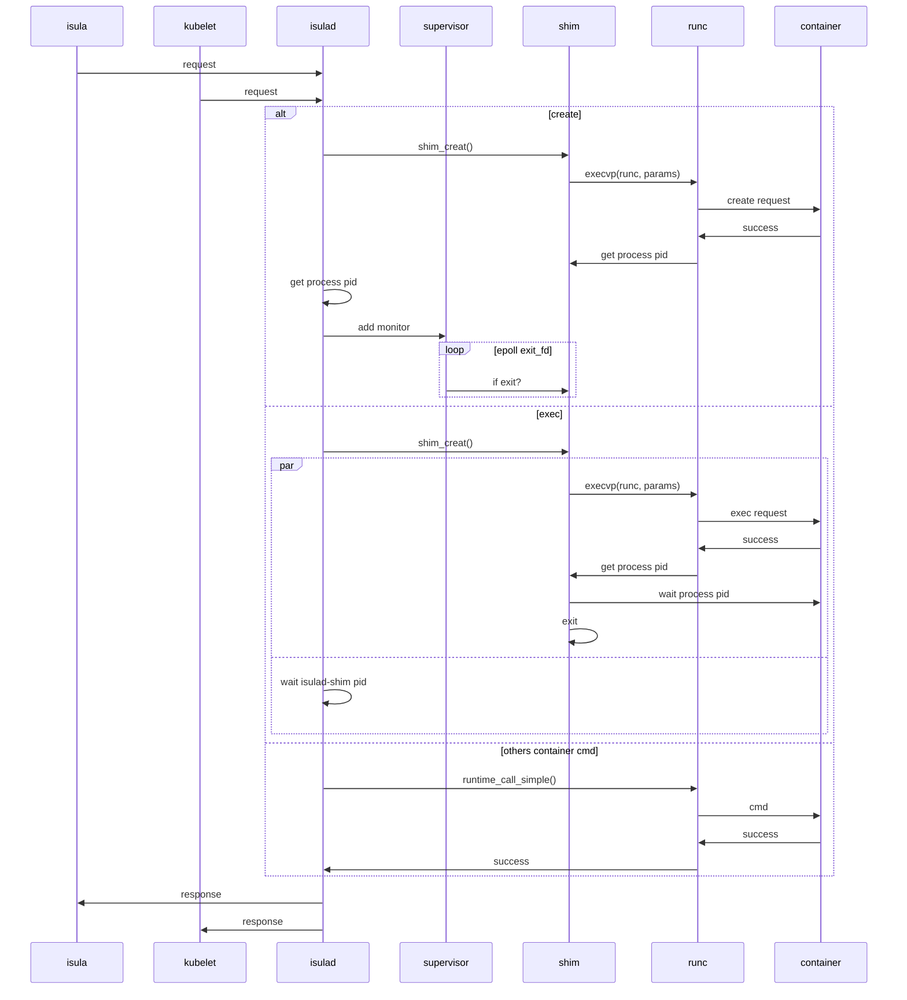

| Author | zhongtao              |
| ------ | --------------------- |
| Date   | 2023-03-21            |
| Email  | zhongtao17@huawei.com |

# 方案目标

isulad 支持使用runc作为容器runtime。用户可以在启动容器时配置`--runtime=runc`创建runtime为runc的容器：
```bash
$ isula run -tid -n test --runtime=runc busybox sh
eb77c672a148cc4cefa0d6e7c5847f5a87d0c5353e245461b68820bd9af90c67
$ isula inspect eb77 | grep -i runc
        "ResolvConfPath": "/var/lib/isulad/engines/runc/eb77c672a148cc4cefa0d6e7c5847f5a87d0c5353e245461b68820bd9af90c67/resolv.conf",
        "HostsPath": "/var/lib/isulad/engines/runc/eb77c672a148cc4cefa0d6e7c5847f5a87d0c5353e245461b68820bd9af90c67/hosts",
        "LogPath": "/var/lib/isulad/engines/runc/eb77c672a148cc4cefa0d6e7c5847f5a87d0c5353e245461b68820bd9af90c67/console.log",
            "Runtime": "runc",
                "log.console.file": "/var/lib/isulad/engines/runc/eb77c672a148cc4cefa0d6e7c5847f5a87d0c5353e245461b68820bd9af90c67/console.log",
```

同时，也可以在`/etc/isulad/daemon.json`中配置`default-runtime`为runc并重启isulad，修改isulad创建容器时默认使用的runtime。
```sh
$ vim /etc/isulad/daemon.json
	...
   "default-runtime": "runc"
    ...
$ sudo isulad
```

# 总体设计

由于isulad与runc之间的交互存在gap，且将容器创建成功之后，容器进程的生命周期与isulad进程的生命周期没有必然联系，因此我们设计了一个isulad-shim进程，用于isulad与runc的交互并将isulad与容器实例解耦。同时，由于只有create以及exec涉及到在容器中新建进程，因此只有这两个子命令需要创建isulad-shim。其他的子命令直接通过调用runc二进制实现。

## 时序图



# 接口描述 

## cri接口

### PodSandboxManagerService

```h
auto RunPodSandbox(const runtime::v1alpha2::PodSandboxConfig &config, const std::string &runtimeHandler,Errors &error) -> std::string;

void StopPodSandbox(const std::string &podSandboxID, Errors &error);

void RemovePodSandbox(const std::string &podSandboxID, Errors &error);

auto PodSandboxStatus(const std::string &podSandboxID, Errors &error)
    -> std::unique_ptr<runtime::v1alpha2::PodSandboxStatus>;

void ListPodSandbox(const runtime::v1alpha2::PodSandboxFilter *filter,std::vector<std::unique_ptr<runtime::v1alpha2::PodSandbox>> *pods, Errors &error);

// This feature is temporarily not supported
void PortForward(const runtime::v1alpha2::PortForwardRequest &req,runtime::v1alpha2::PortForwardResponse *resp,Errors &error);
    ... ...
};
} // namespace CRI
```

### ContainerManagerService

```c
auto CreateContainer(const std::string &podSandboxID, const runtime::v1alpha2::ContainerConfig &containerConfig,const runtime::v1alpha2::PodSandboxConfig &podSandboxConfig, Errors &error)-> std::string override;

void StartContainer(const std::string &containerID, Errors &error) override;

void StopContainer(const std::string &containerID, int64_t timeout, Errors &error) override;

void RemoveContainer(const std::string &containerID, Errors &error) override;

void ListContainers(const runtime::v1alpha2::ContainerFilter *filter,
                        std::vector<std::unique_ptr<runtime::v1alpha2::Container>> *containers, Errors &error) override;

void ListContainerStats(const runtime::v1alpha2::ContainerStatsFilter *filter,std::vector<std::unique_ptr<runtime::v1alpha2::ContainerStats>> *containerstats,Errors &error) override;

auto ContainerStats(const std::string &containerID, Errors &error)
    -> std::unique_ptr<runtime::v1alpha2::ContainerStats> override;

auto ContainerStatus(const std::string &containerID, Errors &error) -> std::unique_ptr<runtime::v1alpha2::ContainerStatus> override;

void ExecSync(const std::string &containerID, const google::protobuf::RepeatedPtrField<std::string> &cmd, int64_t timeout, runtime::v1alpha2::ExecSyncResponse *reply, Errors &error) override;

void Exec(const runtime::v1alpha2::ExecRequest &req, runtime::v1alpha2::ExecResponse *resp, Errors &error) override;

void Attach(const runtime::v1alpha2::AttachRequest &req, runtime::v1alpha2::AttachResponse *resp, Errors &error) override;

void UpdateContainerResources(const std::string &containerID,
                                  const runtime::v1alpha2::LinuxContainerResources &resources, Errors &error) override;
```

### RuntimeManagerService

```c
void UpdateRuntimeConfig(const runtime::v1alpha2::RuntimeConfig &config, Errors &error) override;

// 对应crictl info
auto Status(Errors &error) -> std::unique_ptr<runtime::v1alpha2::RuntimeStatus> override;
```

### ImageManagerService

```c
void ListImages(const runtime::v1alpha2::ImageFilter &filter, std::vector<std::unique_ptr<runtime::v1alpha2::Image>> *images, Errors &error) override; std::unique_ptr<runtime::v1alpha2::Image> ImageStatus(const runtime::v1alpha2::ImageSpec &image, Errors &error) override;

std::string PullImage(const runtime::v1alpha2::ImageSpec &image, const runtime::v1alpha2::AuthConfig &auth, Errors &error) override;

void RemoveImage(const runtime::v1alpha2::ImageSpec &image, Errors &error) override;

void ImageFsInfo(std::vector<std::unique_ptr<runtime::v1alpha2::FilesystemUsage>> *usages, Errors &error) override
```


## isula_rt_ops模块

```c
// 检测runtime是否为isula_rt_ops模块处理的目标runtime
bool rt_isula_detect(const char *runtime);

int rt_isula_create(const char *name, const char *runtime, const rt_create_params_t *params);

int rt_isula_start(const char *name, const char *runtime, const rt_start_params_t *params, pid_ppid_info_t *pid_info);

// restart not implemented
int rt_isula_restart(const char *name, const char *runtime, const rt_restart_params_t *params);

int rt_isula_clean_resource(const char *name, const char *runtime, const rt_clean_params_t *params);

int rt_isula_rm(const char *name, const char *runtime, const rt_rm_params_t *params);

int rt_isula_exec(const char *id, const char *runtime, const rt_exec_params_t *params, int *exit_code);

int rt_isula_status(const char *name, const char *runtime, const rt_status_params_t *params,
                    struct runtime_container_status_info *status);

// isula attach not support on isulad-shim
int rt_isula_attach(const char *id, const char *runtime, const rt_attach_params_t *params);

int rt_isula_update(const char *id, const char *runtime, const rt_update_params_t *params);

int rt_isula_pause(const char *id, const char *runtime, const rt_pause_params_t *params);

int rt_isula_resume(const char *id, const char *runtime, const rt_resume_params_t *params);

// isula top/listpids not support on isulad-shim
int rt_isula_listpids(const char *name, const char *runtime, const rt_listpids_params_t *params,
                      rt_listpids_out_t *out);

int rt_isula_resources_stats(const char *name, const char *runtime, const rt_stats_params_t *params,
                             struct runtime_container_resources_stats_info *rs_stats);
// rt_isula_resize not impl
int rt_isula_resize(const char *id, const char *runtime, const rt_resize_params_t *params);

int rt_isula_exec_resize(const char *id, const char *runtime, const rt_exec_resize_params_t *params);

int rt_isula_kill(const char *id, const char *runtime, const rt_kill_params_t *params);

```


# 详细设计

## create 实现流程

isulad端：

1. 创建process文件：create_process_json_file();
2. 获得runtime二进制：get_runtime_cmd(runtime, &cmd);
3. 利用两次fork()创建isulad-shim进程， 此时的isulad-shim进程是1号进程的子进程，与isulad无父子关系:shim_create();
4. 若shim创建成功则直接返回成功，若失败则调用runtime_call_delete_force()将容器进程都force delete。

isulad-shim端：

1. 根据解析process文件新建一个process，new_process()；
2. 开启exit_fifo：open_no_inherit("exit_fifo", O_WRONLY, -1);
3. 为io_copy创建io_epoll_loop线程：process_io_init();
4. 创建进行io copy的线程，并将isulad的console与runtime的console连接起来:open_io();
5. 创建运行runtime的子进程，获得容器中进程的pid，create_process();
6. 循环wait子进程，直到wait到的子进程为容器进程pid则退出shim进程，process_signal_handle_routine();

## exec 实现流程

isulad端：

1. 创建process文件：create_process_json_file();
2. 获得runtime二进制：get_runtime_cmd(runtime, &cmd);
3. 若`--detach=false`，直接fork()创建isulad-shim进程，此时的isulad-shim进程是isulad进程的子进程，isulad进程wait等待isulad-shim进程退出；若-`-detach=true`，则与create一样，创建独立的isulad-shim进程:shim_create();
4. 循环读取pid文件获得容器进程id说明exec命令成功，get_container_process_pid。

isulad-shim端：

1. 根据解析process文件新建一个process，new_process()；
2. 为io_copy创建io_epoll_loop线程：process_io_init();
3. 创建进行io copy的线程，并将isulad的console与runtime的console连接起来:open_io();
4. 创建运行runtime的子进程，获得容器中进程的pid，create_process();
5. 循环wait子进程，直到wait到的子进程为容器进程pid则退出shim进程，process_signal_handle_routine();


## start 实现流程

isulad端：

1. 分别读取pid以及shim-pid文件获得容器进程pid以及isulad-shim pid；
2. 依次获得容器进程以及isulad-shim进程的proc信息：util_get_process_proc_info();
3. 根据proc信息为pid_ppid_info_t结构体赋值；
4. 直接调用runc二进制start容器：runtime_call_simple();
5. 之后isulad根据监听exit_fifo_fd，感知容器是否退出，从而更新容器状态。

其他子命令与satrt类似，均是调用runtime_call_simple()函数直接调用runc二进制，此处不再赘述。


## 流程图

### isulad与isulad-shim交互流程图


