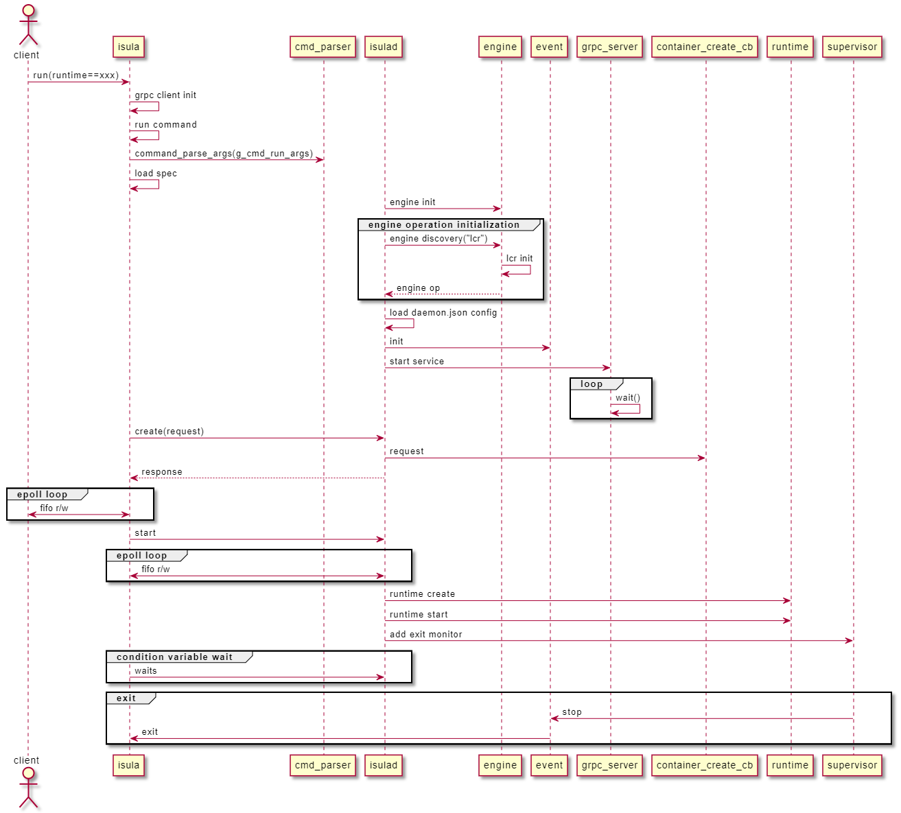
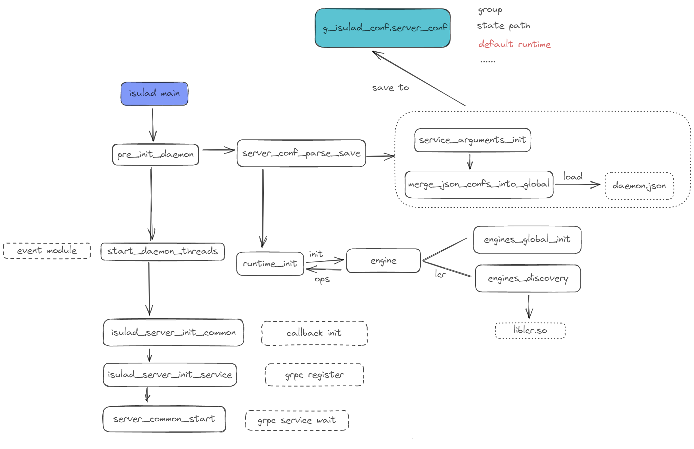

|Author | 程泽睿志    |
|------ | ---------- |
| Date  | 2022-09-19 |
| Email | chengzeruizhi@huawei.com|

# 1. Program Objectives

iSulad is compatible with various OCI-compliant container runtimes, including runc, kata, and lxc, through a unified operation interface. In addition, iSulad also supports user-defined runtime.


# 2. Overall Design

The overall flow chart of the runtime is as follows:


In isula, different runtimes have different fields in the request. After the request reaches iSulad through gRPC, the container engine will find the corresponding operation in the global variable according to the name of the runtime and execute it.

# 3. Interface Description

1. The various container operations of iSulad are defined in the runtime api, and the specific implementation of connecting to the lower-level runtime is isolated:

    ````c
    int runtime_create(const char *name, const char *runtime, const rt_create_params_t *params);

    int runtime_clean_resource(const char *name, const char *runtime, const rt_clean_params_t *params);

    int runtime_start(const char *name, const char *runtime, const rt_start_params_t *params, pid_ppid_info_t *pid_info);

    int runtime_kill(const char *name, const char *runtime, const rt_kill_params_t *params);

    int runtime_restart(const char *name, const char *runtime, const rt_restart_params_t *params);
    ......
    ````
    There will be *rt_ops_query* in these functions. The query function will query in a global jump table according to the runtime name and call the specific implementation of the corresponding runtime.

2. The interface of the runtime is rt_ops, and the structure specifies various container-related operations that the runtime should support, such as life cycle management, resource query, update restart, and so on.

    ````c
    struct rt_ops {
        /* detect whether runtime is of this runtime type */
        bool (*detect)(const char *runtime);

        /* runtime ops */
        int (*rt_create)(const char *name, const char *runtime, const rt_create_params_t *params);

        int (*rt_start)(const char *name, const char *runtime, const rt_start_params_t *params, pid_ppid_info_t *pid_info);

        int (*rt_restart)(const char *name, const char *runtime, const rt_restart_params_t *params);

        int (*rt_kill)(const char *name, const char *runtime, const rt_kill_params_t *params);

        int (*rt_clean_resource)(const char *name, const char *runtime, const rt_clean_params_t *params);

        int (*rt_rm)(const char *name, const char *runtime, const rt_rm_params_t *params);
    ......
    }
    ````

3. At present, iSulad encapsulates three types of runtimes. They are lcr, shim v2 and isula shim (shim v1).
    ````c
    static const struct rt_ops *g_rt_ops[] = {
    &g_lcr_rt_ops,
    #ifdef ENABLE_SHIM_V2
    &g_shim_rt_ops,
    #endif
    &g_isula_rt_ops,
    };
    ````

# 4. Detailed Design
## 4.1 initialization during iSulad startup


Now iSulad has the abstraction layer of engine, which is to read the dynamic link library of lcr and encapsulate it to provide the runtime interface.

## 4.2 runtime name source and validity check

The runtime has three sources, with priority from high to low:

- grpc request - that is, command line parsing, or remote
- daemon.json
- default value -- lcr

Reflected in the code:
````C
static int prepare_runtime_environment(const container_create_request *request, const char *id, char **runtime,
                                         char **runtime_root, uint32_t *cc)
{
    bool runtime_res = false;

    if (util_valid_str(request->runtime)) {
        *runtime = get_runtime_from_request(request); // from grpc
    } else {
        *runtime = conf_get_default_runtime(); // from daemon.json
    }

    if (*runtime == NULL) {
        *runtime = util_strdup_s(DEFAULT_RUNTIME_NAME); // lcr
    }

    if (runtime_check(*runtime, &runtime_res) != 0) {
        ERROR("Runtimes param check failed");
        *cc = ISULAD_ERR_EXEC;
        return -1;
    }
}
````

The value of runtime has a whitelist check, the whitelist is: lcr, runc, kata-runtime, io.containerd.x.x or user-defined runtime
````c
static int runtime_check(const char *name, bool *runtime_res)
{
    ......
       if (args->json_confs != NULL) {
        runtimes = args->json_confs->runtimes;
    }
    if (runtimes == NULL) {
        goto unlock_out;
    }

    size_t runtime_nums = runtimes->len;
    size_t i;
    for (i = 0; i < runtime_nums; i++) {
        if (strcmp(name, runtimes->keys[i]) == 0) {
            *runtime_res = true;
            goto unlock_out;
        }
    }
unlock_out:
    if (isulad_server_conf_unlock()) {
        ERROR("Failed to unlock isulad server config");
        ret = -1;
    }
out:
    if (strcmp(name, "runc") == 0 || strcmp(name, "lcr") == 0 || strcmp(name, "kata-runtime") == 0) {
        *runtime_res = true;
        return ret;
    }

#ifdef ENABLE_GVISOR
    if (strcmp(name, "runsc") == 0) {
        *runtime_res = true;
        return ret;
    }
#endif
    if (convert_v2_runtime(name, NULL) == 0) {
        *runtime_res = true;
    }

    return ret;
}
````

## 4.3 conversion of runtime values
It can also be understood as the specific use of the runtime value or the conversion of the binary name corresponding to the runtime. For example, if the user specifies --runtime=xxx when running, then the runtime=xxx here is configured as xxx:/usr/bin/runc in the runtime in daemon.json, then the mapping relationship at this time is xxx-> /usr/bin/runc. This mapping conversion currently only exists in isula_rt_ops.c, which is only for shim v1 scenarios.

There are currently three processing logics of runtime. The value of runtime is used to judge which one to enter, and the order of lcr->shimv2->shimv1 is used to judge. If the conditions are met, it will jump out of the judgment and enter the corresponding module processing flow.
````c
bool rt_lcr_detect(const char *runtime)
{
    /* now we just support lcr engine */
    if (runtime != NULL && strcasecmp(runtime, "lcr") == 0) {
        return true;
    }

    return false;
}

bool rt_shim_detect(const char *runtime)
{
    if (runtime != NULL && (convert_v2_runtime(runtime, NULL) == 0)) {
        return true;
    }
    return false;
}

bool rt_isula_detect(const char *runtime)
{
    if (runtime != NULL && (strcasecmp(runtime, "lcr") != 0)) {
        return true;
    }

    return false;
}
````