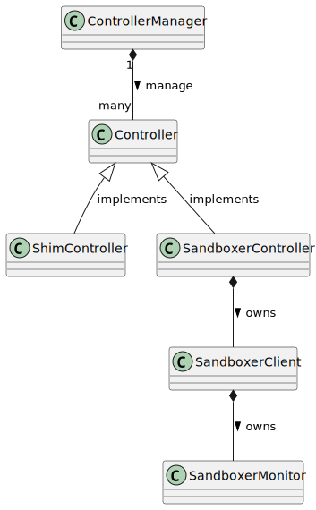
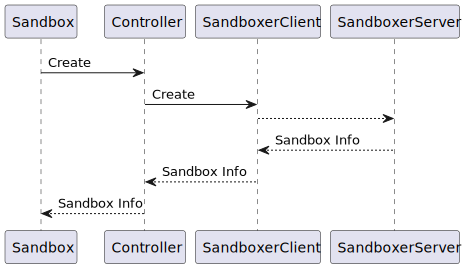
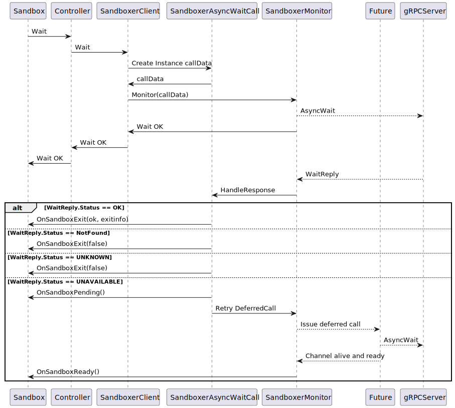
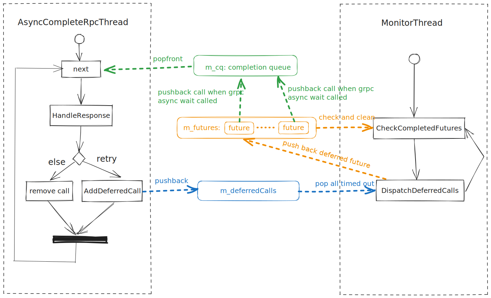

| Author | 徐学鹏                                     |
| ------ | ------------------------------------------ |
| Date   | 2023-08-02                                 |
| Email  | xuxuepeng1@huawei.com |

# 1. 方案目标
**Controller模块**负责为Sandbox模块提供底层接口，执行Sandbox模块对沙箱的生命周期的具体操作。
# 2. 总体设计
Controller根据类型可以分为两类，Sandboxer Controller 和Shim Controller。Sandboxer Controller将用户对沙箱的管理通过gRPC接口转发给Sandboxer进程，从而让Sandboxer执行底层的沙箱管理逻辑。Shim Controller兼容原有的基于Pause容器的接口，将对Sandbox的管理请求转发给Exectuor模块，从而创建并管理基于Pause容器的沙箱。

Controller模块提供两种接口，一种是Create, Start等生命周期管理的同步接口，该类接口调用即返回结果。另一类是用于沙箱生命周期监控的异步接口，主要就是Wait接口。Sandbox对Wait的调用将开始对该沙箱的生命周期监控，如遇沙箱状态变化，Controller将通过Callback的形式异步通知Sandbox模块。

以下为Controller模块整体类图:



Controller manager负责根据用户配置初始化并管理Controller实例。在整个进程中每一个配置对应的Controller实例都是单一的，创建Sandbox时可以根据Sandboxer的类型，在Controller manager中找到对应的Controller用于管理沙箱。
# 3. 接口描述
Controller接口
```C++
class Controller {
public:
    virtual ~Controller() {};
    virtual bool Init(Errors &error) = 0;
    virtual void Destroy() = 0;
    virtual bool Create(const std::string &sandboxId,
                        const ControllerCreateParams &params,
                        Errors &error) = 0;
    virtual std::unique_ptr<ControllerSandboxInfo> Start(const std::string &sandboxId, Errors &error) = 0 ;
    virtual std::unique_ptr<ControllerPlatformInfo> Platform(const std::string &sandboxId, Errors &error) = 0;
    virtual std::string Prepare(const std::string &sandboxId,
                                const ControllerPrepareParams &params,
                                Errors &error) = 0;
    virtual bool Purge(const std::string &sandboxId, const std::string &containerId,
                       const std::string &execId, Errors &error) = 0;
    virtual bool UpdateResources(const std::string &sandboxId,
                                 const ControllerUpdateResourcesParams &params,
                                 Errors &error) = 0;
    virtual bool Stop(const std::string &sandboxId, uint32_t timeoutSecs, Errors &error) = 0;
    virtual bool Wait(std::shared_ptr<SandboxStatusCallback> cb, const std::string &sandboxId, Errors &error) = 0;
    virtual std::unique_ptr<ControllerSandboxStatus> Status(const std::string &sandboxId, bool verbose, Errors &error) = 0;
    virtual bool Shutdown(const std::string &sandboxId, Errors &error) = 0;
    virtual bool UpdateNetworkSettings(const std::string &sandboxId, const std::string &networkSettings, Errors &error) = 0;
};
```

gRPCSandboxerClient接口
```C++
class SandboxerClient {
public:
    SandboxerClient(const std::string &sandboxer, const std::string &address);
    ~SandboxerClient() = default;
    auto Init(Errors &error) -> bool;
    void Destroy();
    auto Create(const std::string &sandboxId, const ControllerCreateParams &params, Errors &error) -> bool;
    auto Start(const std::string &sandboxId, ControllerSandboxInfo &sandboxInfo, Errors &error) -> bool;
    auto Platform(const std::string &sandboxId, ControllerPlatformInfo &platformInfo, Errors &error) -> bool;
    auto Prepare(const std::string &sandboxId, const ControllerPrepareParams &params, std::string &bundle, Errors &error) -> bool;
    auto Purge(const std::string &sandboxId, const std::string &containerId,
               const std::string &execId, Errors &error) -> bool;
    auto UpdateResources(const std::string &sandboxId, const ControllerUpdateResourcesParams &params, Errors &error) -> bool;
    auto Stop(const std::string &sandboxId, uint32_t timeoutSecs, Errors &error) -> bool;
    auto Wait(std::shared_ptr<SandboxStatusCallback> cb, const std::string &sandboxId, Errors &error) -> bool;
    auto Status(const std::string &sandboxId, bool verbose, ControllerSandboxStatus &sandboxStatus, Errors &error) -> bool;
    auto Shutdown(const std::string &sandboxId, Errors &error) -> bool;
};
```

SandboxerClientMonitor接口
```C++
class SandboxerClientMonitor {
public:
    SandboxerClientMonitor(std::shared_ptr<grpc::Channel> channel, const std::string &sandboxer);
    ~SandboxerClientMonitor() = default;
    auto Monitor(SandboxerAsyncWaitCall *call) -> bool;
    void Start();
    void Stop();
};
```

ControllerManager接口
```C++
class ControllerManager {
public:
    static auto GetInstance() -> ControllerManager*;
    auto Init(Errors &error) -> bool;
    auto Cleanup(Errors &error) -> bool;
    auto GetController(const std::string &name) -> std::shared_ptr<Controller>;
};
```

# 4. 详细设计
## 4.1 Sandboxer Controller详细设计
### 4.1.1 同步Controller API调用
在Controller的API中，只有Wait是通过异步的方式调用的，其余的接口都是同步调用的，即调用后，等待该功能执行完毕，再返回。该类型接口包括Create, Start, Platform, Prepare, Purge, UpdateResources, Stop, Status以及Shutdown。下图以Create为例，描述同步API调用的流程。



### 4.1.2 异步Wait API调用
Wati机制用于监控沙箱的生命周期。Controller的Wait在被调用以后，会发送异步gRPC请求至Sandboxer进程，从而开始监控对应的沙箱。Sandboxer进程如果检测到对应的沙箱退出，会发送异步的Wait回复给iSulad，Controller在收到Wait的回复后，会通过Callback机制通知Sandbox模块，从而更新Sandbox实例的状态。



上图是Wait异步调用的流程图，其中SandboxerAsyncWaitCall是用于承载Wait异步调用的数据以及相关方法的。每一个沙箱调用Wait的时候都会生成一个该对象，用于保存必要的上下文。SandboxerMonitor根据这个Call中的数据，调用Call对应的方法发送异步Wait请求给gRPC的Server， 比如说Sandboxer进程。

当gRPC的Server返回异步回复的时候，Monitor会调用Call的HandleResponse函数去处理返回值。
- 如果返回状态是OK，表示监控流程结束，沙箱已结束，这个时候通知Sandbox模块沙箱已退出了。
- 如果返回的状态是Not Found，表示沙箱根本就不存在，这个时候也通知Sandbox模块沙箱退出了。
- 如果返回的状态是其他错误，默认沙箱不存在，通知Sandbox模块退出。
- 如果返回的错误是Unavailable，说明这个时候有可能是gRPC Server出现了问题，或者通讯出现了问题，这个时候可以通知Sandbox模块进入pending状态，并且创建一个Future对象，将这个Wait Call重试。重试的流程采用指数退避算法。

### 4.1.3 Monitor的线程
在SandboxerMonitor中有两个常驻线程AsyncCompleteRpcThread和MonitorThread，三个队列，m_cq，m_deferredCalls和m_futures。

m_cq是gRPC的completion queue，用于承载异步请求的回复(Response)。在收到Wait异步Response后，Response会与对应的Call对象一起进入该队列，等待被处理。

m_deferredCalls是用于存放需要Retry的Call。每个Call进入该队列时，都会设置一个m_retryCounter，该值是根据这个Call重试的次数采用指数退避算法计算出来的。每隔200ms，这个数值会-1，当该值变为0时，则表示该Call对象Retry的时间到了，即timeout，Call对象会被分发开始重试。

m_futures是用于异步执行Call的队列。timeout的Call对象会通过Future机制异步执行。在C++中每个Future对象可以异步执行一个函数，将函数执行的结果保存在Future对象中，等待其他线程获取。Call对象会被包装成Future，进行异步的Wait gRPC调用，该Future对象会被放入m_futures，等待Monitor thread检查执行结果。

AsyncCompleteRpcThread用于处理m_cq队列，即gRPC的completion queue。整体流程如下：
1. 当收到来自Sandboxer进程的Response后， Response会被放入m_cq队列中。
2. AsyncCompleteRpcThread从m_cq中取出Response以及对应的Call，并通过Call的HandleResponse函数来处理。
3. 在处理函数中，如果发现Response的状态为Unavailable，则需要Retry，这时对应的Call会被放入m_deferredCalls队列中，等待处理。在加入Retry队列之前，Call会根据自己已经Retry过的次数，利用指数退避算法计算下一次被调用的时间，设置retry_counter。

MonitorThread主要负责分发m_deferredCalls队列中的Calls，同时清理已完成的Call。MonitorThread每隔200ms会检查一下m_deferredCalls队列中的Calls有没有超时，如果超时了，则下发执行重试。具体的执行方式是生成一个async的Future对象，将这个超时的Call异步执行，Call的执行结果会保存在future对象中。这个新建的Future会被加入到m_futures中。MonitorThread会在下一轮检查中检查m_futures中Future的完成状况，将已完成的future清除。

以下活动图展示了线程与队列之间的关系。



## 4.2 Shim Controller详细设计

### 4.2.1 同步Controller API调用

与Sandboxer Controller类似，Shim Controller的API中，只有Wait是通过异步的方式调用的，其余的接口包括Create, Start, Platform, Prepare, Purge, UpdateResources, Stop, Status以及Shutdown都是同步调用的。它们通过调用iSulad底层executor模块中的相应接口，管理基于Pause容器的沙箱，等待底层executor执行完毕，再返回。

### 4.2.2 异步Wait API调用

在executor中实现了wait机制，可以通过阻塞的方式直到容器状态发生变化后返回。因此在Shim Controller中，wait的实现直接通过新建线程调用executor的wait接口，该线程阻塞等待executor返回的结果，直至容器状态发生变化返回后进一步更新Sandbox实例的状态。
