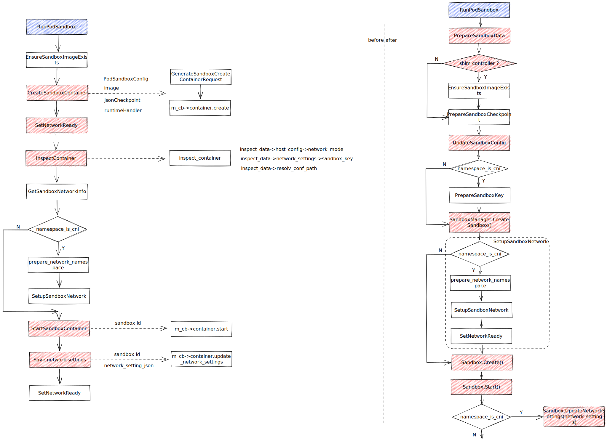
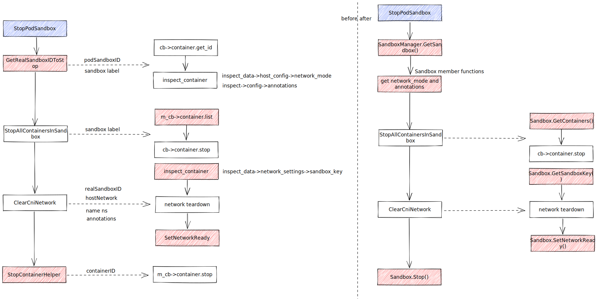
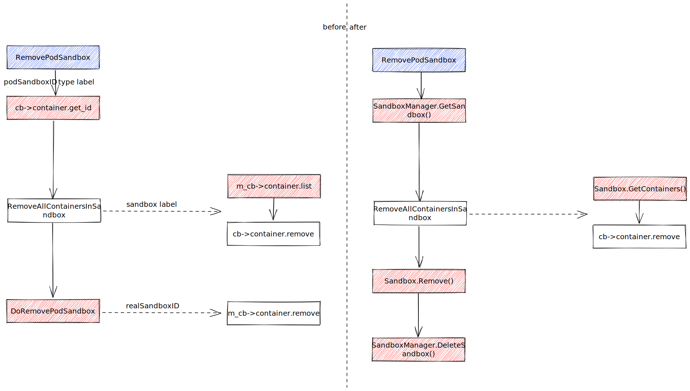
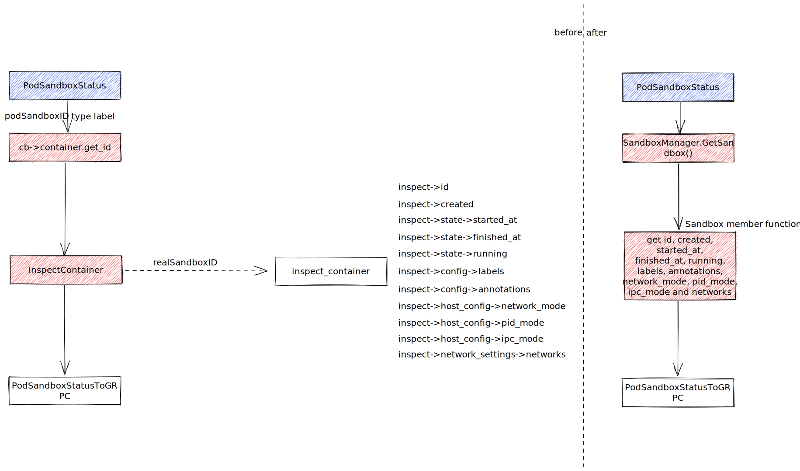
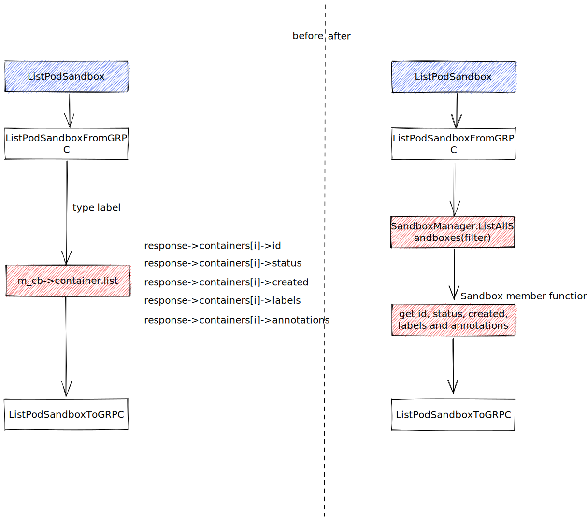
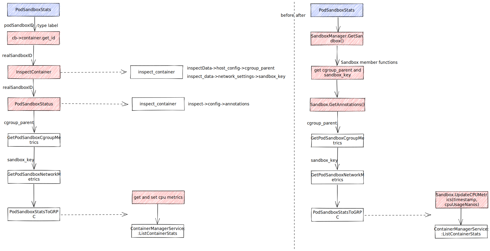
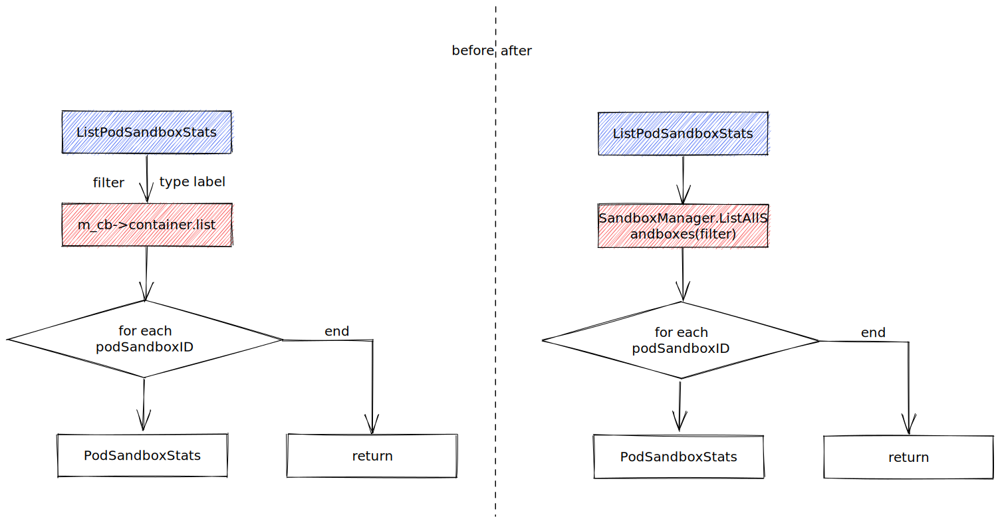

| Author | 张晓雨                   |
| ------ | ------------------------ |
| Date   | 2023-06-30               |
| Email  | zhangxiaoyu58@huawei.com |

## RunPodSandbox

#### How to modify
- EnsureSandboxImageExists: add runtime check, only pull image if runtime is not kuasar
- CreateSandboxContainer: create Sandbox by *SandboxManager.CreateSandbox()*, and execute *Sandbox.Create()*. *Setup sandboxkey* in Sandbox.Create()
- SetNetworkReady: is replaced by *Sandbox.SetNetworkReady*
- InspectContainer: use member functions of Sandbox to get *network_mode*, *sandbox_key* and *resolv_conf_path*
- m_cb->container.start: is replaced by *Sandbox.Start()*
- m_cb->container.update_network_settings: update sandbox network settings by *Sandbox.UpdateNetworkSettings(network_settings)*. Add update network settings in controller to save network settings in container data?

## StopPodSandbox

#### How to modify
- GetRealSandboxIDToStop: *SandboxManager.GetSandbox()*, and use member functions of Sandbox to get *network_mode* and *annotations*
- StopAllContainersInSandbox: call *Sandbox.GetContainers()* to get all containers of sandbox, and then stop containers
- ClearCniNetwork: call *Sandbox.GetSandboxKey()*, network teardown and use *Sandbox.SetNetworkReady()* to set network_ready false
- StopContainerHelper: is replaced by *Sandbox.Stop()*

## RemovePodSandbox

#### How to modify
- cb->container.get_id:  is replaced by *SandboxManager.GetSandbox()*
- RemoveAllContainersInSandbox: call *Sandbox.GetContainers()* to get all containers of sandbox, and then remove containers
- DoRemovePodSandbox: call *Sandbox.Remove()* and *SandboxManager.DeleteSandbox()*

## PodSandboxStatus

#### How to modify
- cb->container.get_id: is replaced by *SandboxManager.GetSandbox()*
- inspect_container: use member functions of Sandbox to get *id*, *created*, *started_at*, *finished_at*, *running*, *labels*, *annotations*, *network_mode*, *pid_mode*, *ipc_mode* and *networks*.

## ListPodSandbox

#### How to modify
- m_cb->container.list: *SandboxManager.ListAllSandboxes(filter)*, and use member functions of Sandbox to get *id*, *status*, *created*, *labels* and *annotations*

## PodSandboxStats

#### How to modify
- cb->container.get_id: is replaced by *SandboxManager.GetSandbox()*
- inspect_container: use member functions of Sandbox to get *cgroup_parent* and *sandbox_key*
- PodSandboxStatus: is replaced by *Sandbox.GetAnnotations()*
- PodSandboxStatsToGRPC: *Sandbox.UpdateCPUMetrics(timestamp, cpuUsageNanos)*? It's unnecessary to save metrics data. 

## ListPodSandboxStats

#### How to modify
- m_cb->container.list: is replaced by *SandboxManager.ListAllSandboxes(filter)*
