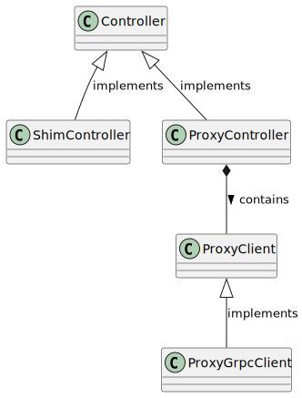
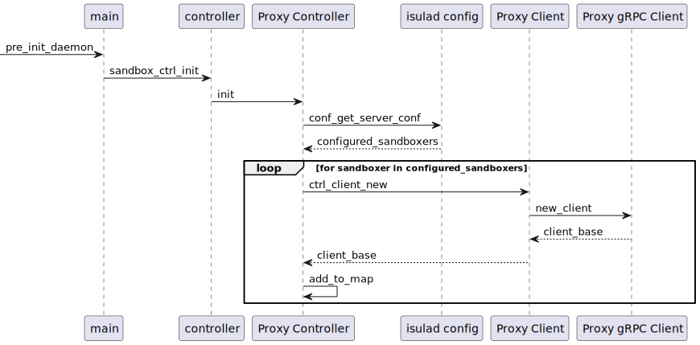

|Author | 徐学鹏    |
|------ | ---------- |
| Date  | 2023-04-11 |
| Email | xuxuepeng1@huawei.com|

# 1. 方案目标
Sandbox controller的设计方案目标是在Sandbox API的实现中将iSulad对沙箱的管理请求转发给Sandboxer，同时能够兼容基于原有Runtime API的沙箱管理。

# 2. 总体设计
Controller是Sandbox API中的一个重要概念，其作用就是处理iSulad对沙箱管理的请求。具体接口已定义在[Sandbox设计文档中](sandbox_design_zh.md#33-sandbox-controller模块)。

目前，对沙箱管理请求的处理有两种方式，第一种就是利用传统的Runtime API，将对沙箱的处理请求转换成对容器的处理请求，可以称之为shim controller，第二种就是通过Sandbox API中的controller service将请求转发至Sandboxer，可以称之为proxy controller。

在Controller API中定义一套回调函数接口，shim controller和proxy controller都实现这些接口，分别以各自的方式处理沙箱的管理请求。由Sandbox Controller的API来决定使用哪一种实现。

## 2.1 proxy controller
iSulad初始化时，proxy controller会去加载配置文件中的sandboxers配置项，根据每一个sandboxer配置的address创建一个controller client，去连接指定的sandboxer的服务端。由于proxy controller支持用户配置多个sandboxer，因此proxy controller模块需要维护一个controller clients的map，用于保存sandboxer和controller client之间的映射关系。在处理用户沙箱生命周期管理请求时，proxy controller通过用户指定的sandboxer找到对应的controller client，转发管理请求。



## 2.2 shim controller
shim controller的实现是为了兼容原有的基于Runtime API的沙箱生命周期管理模式。shim controller在Controller的回调函数接口实现中需要将沙箱的参数转换为对容器管理的参数。例如，在创建沙箱时，沙箱的config信息需要转换成容器的OCI Runtime Spec，再由shim controller传递给指定的runtime去处理。

# 3. 接口描述
Sandbox Controller回调函数接口定义

```c
struct sb_ctrl_ops {
    /* controller模块的初始化 */
    bool (*init)();
    /* 检查controller是否支持指定的sandboxer */
    bool (*detect)(const char *sandboxer);
    /* 使用指定的sandboxer创建沙箱 */
    int (*create)(const char *sandboxer, const char *sandbox_id, const ctrl_create_params_t *params);
    /* 使用指定的sandboxer启动沙箱 */
    int (*start)(const char *sandboxer, const char *sandbox_id);
    /* 使用指定的sandboxer获取沙箱平台信息 */
    int (*platform)(const char *sandboxer, const char *sandbox_id, ctrl_platform_response_t *response);
    /* 使用指定的sandboxer为沙箱内的容器创建准备资源 */
    int (*prepare)(const char *sandboxer, const char *sandbox_id, const ctrl_prepare_params_t *params, ctrl_prepare_response_t *response);
    /* 使用指定的sandboxer清理沙箱中对应容器的资源 */
    int (*purge)(const char *sandboxer, const char *sandbox_id, const ctrl_purge_params_t *params);
    /* 使用指定的sandboxer更新容器资源 */
    int (*update_resources)(const char *sandboxer, const char *sandbox_id, const ctrl_update_resources_params_t *params);
    /* 使用指定的sandboxer停止沙箱 */
    int (*stop)(const char *sandboxer, const char *sandbox_id, uint32_t timeout);
    /* 使用指定的sandboxer等待沙箱停止 */
    int (*wait)(const char *sandboxer, const char *sandbox_id, uint32_t *exit_status, uint64_t *exited_at);
    /* 使用指定的sandboxer查看沙箱状态 */
    int (*status)(const char *sandboxer, const char *sandbox_id, bool verbose, ctrl_status_response_t *response);
    /* 使用指定的sandboxer关闭并除沙箱 */
    int (*shutdown)(const char *sandboxer, const char *sandbox_id);
};
```

proxy client结构体以及接口定义
```c
typedef struct _ctrl_client_ops_t ctrl_client_ops_t;

typedef struct _ctrl_client_base_t {
    char *sandboxer;
    char *client_address;
    ctrl_client_ops_t *ops;
} ctrl_client_base_t;

struct _ctrl_client_ops_t {
    int (*create)(const ctrl_client_base_t *client, const char *sandbox_id, const ctrl_create_params_t *params);

    int (*start)(const ctrl_client_base_t *client, const char *sandbox_id);

    int (*platform)(const ctrl_client_base_t *client, const char *sandbox_id, ctrl_platform_response_t *response);

    int (*prepare)(const ctrl_client_base_t *client, const char *sandbox_id, const ctrl_prepare_params_t *params, ctrl_prepare_response_t *response);

    int (*purge)(const ctrl_client_base_t *client, const char *sandbox_id, const ctrl_purge_params_t *params);

    int (*update_resources)(const ctrl_client_base_t *client, const char *sandbox_id, const ctrl_update_resources_params_t *params);

    int (*stop)(const ctrl_client_base_t *client, const char *sandbox_id, uint32_t timeout);

    int (*wait)(const ctrl_client_base_t *client, const char *sandbox_id, uint32_t *exit_status, uint64_t *exited_at);

    int (*status)(const ctrl_client_base_t *client, const char *sandbox_id, bool verbose, ctrl_status_response_t *response);

    int (*shutdown)(const ctrl_client_base_t *client, const char *sandbox_id);

    ctrl_client_base_t *(*new_client)(const char *sandboxer, const ctrl_client_config_t *config);

    void (*cleanup_client)(ctrl_client_base_t* client);
};
```

proxy grpc client结构体定义
```c++
class ControllerClient;

typedef struct _ctrl_client_grpc_t {
    ctrl_client_base_t base;
    std::unique_ptr<ControllerClient> controller_client;
} ctrl_client_grpc_t;
```

# 4. 详细设计
Sandbox Controller初始化序列图




