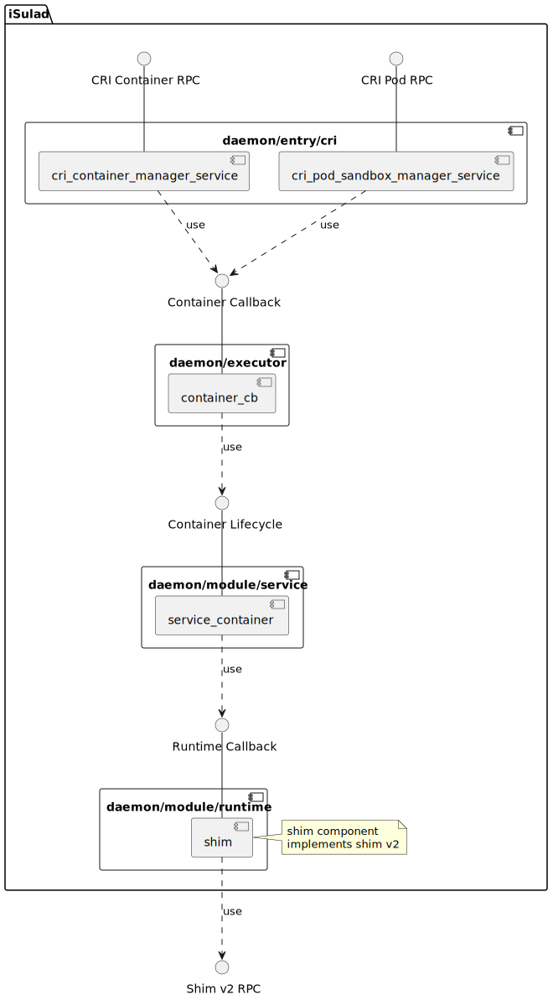
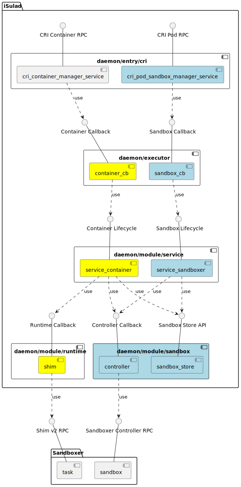
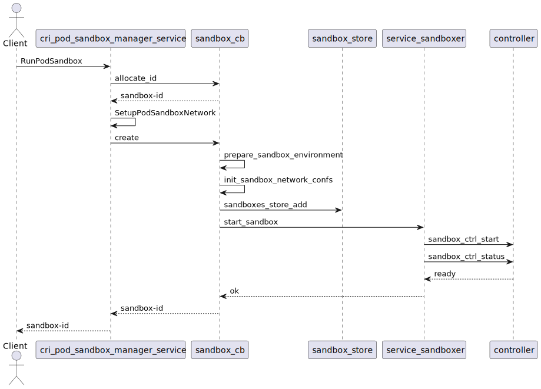
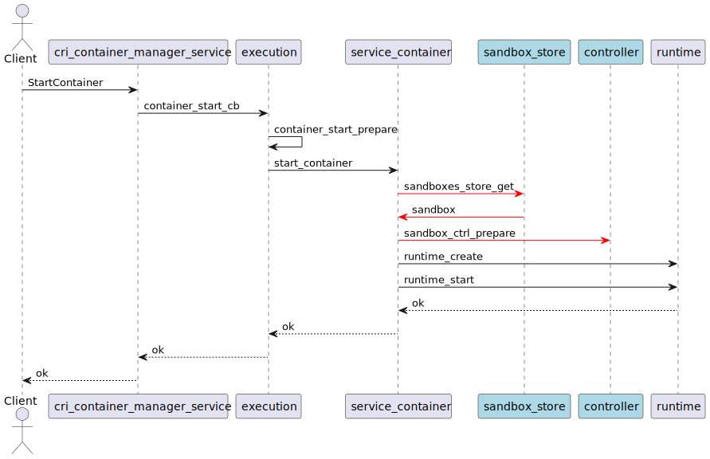
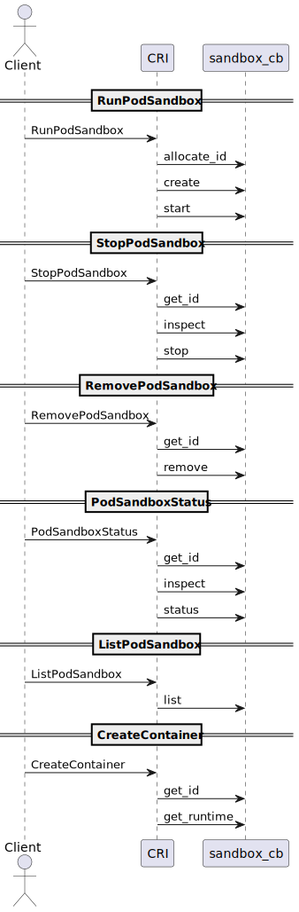
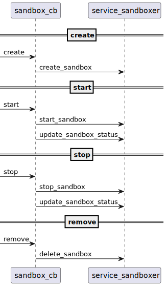
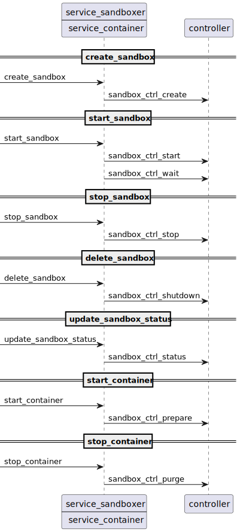
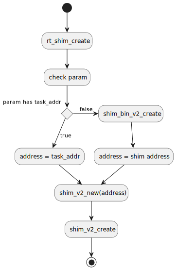

|Author | 徐学鹏    |
|------ | ---------- |
| Date  | 2023-04-08 |
| Email | xuxuepeng1@huawei.com|

# 1. 方案目标
沙箱(Sandbox)的设计方案目标是将Sandbox API引入iSulad。iSulad可以通过Sandbox API中的Controller接口对沙箱的生命周期进行管理，同时iSulad可以通过Shim V2的标准运行时接口对沙箱内的容器进行生命周期管理。

# 2. 总体设计
由于历史原因，大部分容器引擎是没有沙箱这一概念的，但是在CRI的定义中，Pod/Sandbox却一直是一个非常重要的角色。为了弥补这一差距，大部分容器引擎（包括iSulad）对于沙箱和安全容器的生命周期管理是通过shim/shim v2标准容器接口实现的。

下图为iSulad原有的基于Runtime的安全容器生命周期管理的组件图：



在引入了沙箱概念后，iSulad可以通过Sandbox API对沙箱进行标准化管理，从而使安全容器的生命周期管理更为合理和高效。同时通过Sandbox API，iSulad可以利用多种Sandboxer的实现，使用多种沙箱隔离技术。

下图为基于Sandbox API的容器以及沙箱生命周期管理的组建图：



在整体设计上，iSulad将沙箱的生命周期管理和容器的生命周期管理彻底分开。沙箱管理的实现不再依赖于容器的管理流程。在代码结构层面，与原有容器的结构类似，iSulad增加了sandbox_cb，service_sandboxer，sandbox controller，sandbox_store等模块，并重新实现了cri_pod_sandbox_manager_service。同时，沙箱模块也为容器提供了容器生命周期管理时涉及到的沙箱资源管理的相关接口。

在iSulad的整体架构中，daemon/entry/cri是作为CRI请求的服务端入口，其作用是用户的CRI请求转化为iSulad内部对executor的请求。因此cri_pod_sandbox_manager_service是一个请求转换的模块，而executor中的sandbox_cb模块才是沙箱生命周期管理的真正入口，其主要工作包括环境的配置、sandbox store的管理，以及调用service_sandoxer完成最终沙箱的创建、停止、销毁等生命周期管理操作。service_sandoxer向sandbox_cb提供Sandbox服务，其中最主要的功能就是调用Sandbox Controller向Sandboxer发送请求。Sandbox Controller从某种程度上来说也是一个请求转换的模块，将iSulad中对Sandbox的管理转换为对Sandboxer的请求。对Sandboxer的请求可以是一个gRPC的Sandbox Controller标准请求，也可以是对shim/shimv2的标准容器的操作(用于适配原有的Runtime API)。

下图以RunPodSandbox接口为例，梳理了沙箱生命周期管理流程中模块之间的调用关系。



下图以StartContainer为例，梳理了容器生命周期管理流程中涉及到的沙箱相关的操作。



相比于原有的容器启动流程，service_container需要获取沙箱信息，并通过Controller的prepare接口通知Sandboxer为容器启动配置相关的资源。

# 3. 接口描述
## 3.1. sandbox_cb模块

沙箱设计方案在executor中新增了sandbox_cb模块，向cri_pod_sandbox_manager_service提供sandbox生命周期管理的流程入口。

```c
/* 为新创建的Sandbox分配ID */
int (*allocate_id)(const sandbox_allocate_id_request *request, sandbox_allocate_id_response **response);
/* 创建新的Sandbox */
int (*create)(const sandbox_create_request *request, sandbox_create_response **response);
/* 启动已创建的Sandbox */
int (*start)(const sandbox_start_request *request, sandbox_start_response **response);
/* 查询Sandbox的静态配置信息 */
int (*inspect)(const sandbox_inspect_request *request, sandbox_inspect_response **response);
/* 停止已启动的Sandbox */
int (*stop)(const sandbox_stop_request *request, sandbox_stop_response **response);
/* 删除已停止的Sandbox或者强制删除正在运行的Sandbox */
int (*remove)(const sandbox_remove_request *request, sandbox_remove_response **response);
/* 查询Sandbox的动态配置信息 */
int (*status)(const sandbox_status_request *request, sandbox_status_response **response);
/* 查询Sandbox的度量统计信息 */
int (*stats)(const sandbox_stats_request *request, sandbox_stats_response **response);
/* 根据过滤请求，列出系统中的所有符合条件的Sandbox的基本信息 */
int (*list)(const sandbox_list_request *request, sandbox_list_response **response);
/* 根据Sandbox的名字或者ID前缀，获取sandbox完整的ID */
int (*get_id)(const sandbox_get_id_request *request, sandbox_get_id_response **response);
/* 为Sandbox中Container的创建获取对应的Runtime名字 */
int (*get_runtime)(const char *sandbox_id, sandbox_get_runtime_response **response);
```

下图为CRI模块与executor中的sandbox_cb模块之间的调用关系:



## 3.2. service_sandboxer模块

service_sandboxer为executor的sandbox_cb提供生命周期管理操作。

```c
/* 创建Sandbox */
int create_sandbox(sandbox_t *sandbox);
/* 启动Sandbox */
int start_sandbox(sandbox_t *sandbox);
/* 停止Sandbox */
int stop_sandbox(sandbox_t *sandbox);
/* 删除Sandbox */
int delete_sandbox(sandbox_t *sandbox, bool force);
/* 更新Sandbox状态 */
int update_sandbox_status(sandbox_t *sandbox);
```

下图为executor中的sandbox_cb模块与service_sandboxer之间的调用关系:



## 3.3. Sandbox Controller模块

Sandbox Controller将iSulad对沙箱的管理请求下发给Sandboxer。

```c
/* 初始化Sandbox controller */
int sandbox_ctrl_init();
/* 使用指定的Sandboxer来创建Sandbox */
int sandbox_ctrl_create(const char *sandboxer, const char *sandbox_id, const ctrl_create_params_t *params);
/* 使用指定的Sandboxer来启动Sandbox */
int sandbox_ctrl_start(const char *sandboxer, const char *sandbox_id);
/* 使用指定的Sandboxer获取平台信息 */
int sandbox_ctrl_platform(const char *sandboxer, const char *sandbox_id, ctrl_platform_response_t *response);
/* 使用指定的Sandboxer为Sandbox中的容器准备资源环境 */
int sandbox_ctrl_prepare(const char *sandboxer, const char *sandbox_id, const ctrl_prepare_params_t *params, ctrl_prepare_response_t *response);
/* 使用指定的Sandboxer为Sandbox中的容器清除资源 */
int sandbox_ctrl_purge(const char *sandboxer, const char *sandbox_id, const ctrl_purge_params_t *params);
/* 使用指定的Sandboxer为Sandbox中的容器更新资源 */
int sandbox_ctrl_update_resources(const char *sandboxer, const char *sandbox_id, const ctrl_update_resources_params_t *params);
/* 使用指定的Sandboxer停止Sandbox */
int sandbox_ctrl_stop(const char *sandboxer, const char *sandbox_id, uint32_t timeout);
/* 使用指定的Sandboxer监控Sandbox的退出 */
int sandbox_ctrl_wait(const char *sandboxer, const char *sandbox_id, uint32_t *exit_status, uint64_t *exited_at);
/* 使用指定的Sandboxer获取Sandbox的状态 */
int sandbox_ctrl_status(const char *sandboxer, const char *sandbox_id, bool verbose, ctrl_status_response_t *response);
/* 使用指定的Sandboxer关闭删除Sandbox */
int sandbox_ctrl_shutdown(const char *sandboxer, const char *sandbox_id);
```

Sandbox Controller的详细设计可参考[Sandbox Controller设计文档](sandbox_controller_design_zh.md)。

下图为service_sandboxer以及service_container和Sandbox Controller之间的调用关系:



# 4. 详细设计
## 4.1. Sandbox配置以及初始化

Sandbox作为iSulad中新增概念，用户对Sandbox的配置也需要通过配置文件传递给iSulad。

下面是iSulad新增的与Sandbox相关的配置
```json
{
    "$schema": "http://json-schema.org/draft-04/schema#",
    "type": "object",
    "properties": {
        ...
        "default-sandboxer": {
            "type": "string"
        },
        "cri-runtimes": {
            "$ref": "defs.json#/definitions/mapStringString"
        },
        "sandboxers": {
            "$ref": "defs.json#/definitions/mapStringObjectSandboxers"
        },
        ...
    }
}
```
### sandboxers
用户可以通过sandboxers配置项来配置多个sandboxer，可用于管理不同的类型的沙箱，比如microVM, wasm, app kernel等。sandboxer有三个子项，分别是address，controller，protocol。

controller是用于指定这个sandboxer controller的类型，其值可以为shim或者是proxy。shim表示这种sandboxer不使用sandbox API来创建沙箱，而是使用传统的Runtime API来创建沙箱。proxy表示这种sandboxer使用address指定的路径来转发沙箱生命周期管理的请求。

address是一个unix socket的路径，用于指定这个sandboxer提供的服务端入口，iSulad可以通过这个路径，向sandboxer发送沙箱生命周期管理的请求。

protocol表示沙箱管理请求的协议类型，比如grpc。

```json
{
    "sandboxers" : {
        "vmm" : {
            "address" : "/run/vmm-sandboxer.sock",
            "controller" : "proxy",
            "protocol" : "grpc"
        },
        "wasm" : {
            "address" : "/run/wasm-sandboxer.sock",
            "controller" : "proxy",
            "protocol" : "grpc"
        }
    }
}
```

上面的例子中，用户指定了两种sandboxer，vmm和wasm。用户可以通过CRI RunPodSandboxRequest请求中的runtime_handler参数来指定需要使用的sandboxer。

```sh
crictl runp --runtime=vmm pod.json
```
上面的例子中，用户通过crictl工具指定了通过vmm sandboxer来创建沙箱。

### cri-runtimes
cri-runtimes不是一个新增的配置项。原有的作用就是将CRI传入的runtime_handler做一个映射，转换为一个iSulad可识别的runtime。对于Sandbox API来说，用户使用Sandboxer，即CRI中的runtime_handler，来创建沙箱，然后使用cri-runtimes里面对应的runtime来创建沙箱中的容器。因此，在cri-runtimes的配置项中，用户需要定义sandboxer和runtime之间映射关系。根据Sandbox API的设计，sandboxer对应的runtime需要使用shim v2的格式。例如：
```json
{
    "cri-runtimes" : {
        "vmm": "io.containerd.vmm.v1",
        "wasm": "io.containerd.wasm.v1"
    }
}
```

### default-sandboxer
default-sandboxer指定了默认的sandboxer，即当用户不指定任何sandboxer时，default-sandboxer就会被使用。

### 初始化
Sandbox API的使用需要在iSulad启动时做一些初始化。具体包括Sandbox store的初始化，以及controller模块的初始化。

```c
...
#ifdef ENABLE_SANDBOX
    if (sandboxes_store_init()) {
        ERROR("Failed to init sandbox store");
        goto out;
    }
 
    if (sandbox_name_index_init()) {
        ERROR("Failed to init sandbox name index");
        goto out;
    }
#endif
...
#ifdef ENABLE_SANDBOX
    if (sandbox_ctrl_init() != 0) {
        ERROR("Failed to init sandboxer controller");
        goto out;
    }
#endif
```
在sandbox_ctrl_init的初始化过程中，配置项sandboxers中的配置信息会被加载用于初始化controller。具体的请参考[Sandbox Controller设计文档](sandbox_controller_design_zh.md)

## 4.2. sandbox对象
```c
typedef struct _sandbox_t {
    ...
    char *name;
    uint32_t pid;
    sandbox_status_t status;
    char *sandboxer;
    uint64_t created_at;
    uint64_t exited_at;
    char *rootpath;
    char *statepath;
    char *task_address;
    char *config_option;
    host_config *hostconfig;
    sandbox_config *sandboxconfig;
    ...
} sandbox_t;
```
上面是sandbox_t结构体的关键成员属性的定义，下面对这些属性做一些解释：

| 属性 | 描述 |
| --- | ---------- |
| name | Sandbox的名字，这个name是由CRI RunPodSandbox请求的metadata生成的，与metadata中的name不同，metadata中的name只是这个属性的一部分。|
| pid | 一般来说，沙箱 是host上的一个进程，因此这个pid记录的是沙箱在host上的pid信息。|
| sandboxer | CRI传入的runtime_handler参数 |
| created_at | 沙箱的创建时间，即Sandboxer启动沙箱的时间 |
| exited_at | 沙箱的退出时间，即Sandboxer停止沙箱的时间 |
| rootpath | iSulad保存沙箱配置信息等静态信息的根目录路径 |
| statepath | iSulad保存沙箱状态信息等动态信息的根目录路径 |
| task_address | 沙箱启动后返回的用于该沙箱内容器生命周期管理的服务端地址，一般为vsock或者是unix domain socket |
| config_option | CRI传入的PodSandboxConfig参数 |
| hostconfig | iSulad中与host相关的配置信息 |
| sandboxconfig | iSulad中与sandbox相关的配置信息 |

## 4.3. container_t结构体
在iSulad对容器的处理流程中，为了适配CRI中有关Pod的概念，需要使用Sandbox相关的信息，尤其是Sandbox ID，它是用于找到pause container的唯一标识。事实上，在引入Sandbox API之前，Sandbox的ID一直以annotation的方式保存在container的common_config中。这种做法某种程度上是由于原先的架构中缺乏Sandbox的概念而采取的一种规避方案。

在引入Sandbox API后，container_t的结构体增加了以下两个属性：

| 属性 | 描述 |
| --- | ------ |
| sandbox_id | 沙箱的唯一标识 |
| sandbox_task_address | shim v2 runtime的服务端地址，具体请参见[4.5. shim v2的适配](#45-shim-v2的适配) |

## 4.4. sandbox_store模块
sandbox_store是用于维护iSulad中已创建、正在运行或者已经停止的sandbox对象的。整体设计与container_store类似。

## 4.5. shim v2的适配
Sandbox API中容器的runtime采用了shim v2的协议标准，但是在设计上又有了进一步的优化。在shim v2中，每个沙箱都需要启动一个shim进程，用于桥接容器引擎和Sandbox内部的task service agent。这种做法导致节点上的内存资源与CPU资源的浪费。Sandbox API中，容器引擎通过Sandboxer进程管理所有同类的沙箱，并将task service agent和shim合二为一，运行在沙箱内，同时通过vsock或者unix domain socket提供服务的入口，即sandbox的task address。容器引擎可以直接通过这个task address管理沙箱内的容器生命周期，不再需要创建新的shim进程，从而节约了大量的计算资源。
下图为runtime/shim模块中rt_shim_create需要适配的流程。


