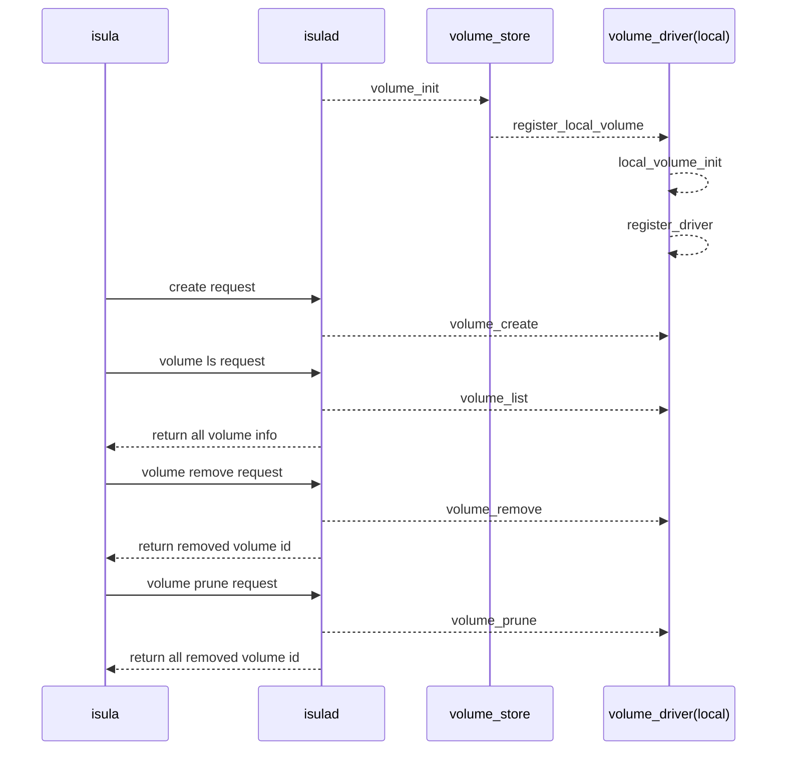

| Author | 王丰土                                     |
| ------ | ---------------------------------------------- |
| Date   | 2020-10-21                                     |
| Email  | [wangfengtu@huawei.com](wangfengtu@huawei.com) |

# 1. 方案目标

在镜像制作过程中，有个volume命令，可以指定容器运行时创建一个匿名卷用于存放容器运行过程中需要持久保持的数据，对应如下配置项：

```bash
$ isula inspect -f "{{.image.Spec.config.Volumes}}" vol
{
	"/vol":{}
}
```

volume模块需要支持该项的配置，实现对匿名卷的支持。由于匿名卷在容器销毁后会一直保留，因此volume模块还需要提供一种手段来删除卷来防止不用的卷残留。

volume模块同时也需要提供列出本地卷以及进行卷删除的命令。

另外，volume模块对于-v和--mount参数，也要支持卷管理。

# 2. 总体设计

## 2.1 时序图


# 3. 接口描述

## 3.1 对外接口

```c
typedef struct {
    struct volume *(*create)(char *name);

    struct volume *(*get)(char *name);

    int (*mount)(char *name);

    int (*umount)(char *name);

    struct volumes *(*list)(void);

    int (*remove)(char *name);
} volume_driver;

struct volume {
    char *driver;
    char *name;
    char *path;
    // volume mount point, valid only when mounted
    char *mount_point;
};

struct volumes {
    struct volume **vols;
    size_t vols_len;
};

struct volume_names {
    char **names;
    size_t names_len;
};

struct volume_options {
    char *ref;
};

// volume的初始化
int volume_init(char *root_dir);

// 在volume_store中登记volume_driver
int register_driver(char *name, volume_driver *driver);

// 在指定driver_name的volume_driver中创建名称为name的新volume，
// volume_options中存放使用volume的容器id
struct volume *volume_create(char *driver_name, char *name, struct volume_options *opts);

int volume_mount(char *name);

int volume_umount(char *name);

// 列出所有的volume
struct volumes *volume_list(void);

// 增加使用volume的容器id
int volume_add_ref(char *name, char *ref);

// 删除使用volume的容器id
int volume_del_ref(char *name, char *ref);

// 增加指定名称的volume
int volume_remove(char *name);

// 清楚所有未被使用的volume
int volume_prune(struct volume_names **pruned);
```

## 3.2 相关命令

### 3.2.1 卷的创建/复用

容器创建/运行过程创建/复用匿名卷：

1.  使用镜像中的匿名卷。接口无变化，在容器创建/运行过程中根据镜像的配置中是否存在该参数决定是否创建匿名卷。 

2.  命令行中指定使用匿名卷。

```sh
   # isula run -v /vol busybox sh 或
   # isula run --mount type=volume,dst=/vol busybox sh
```

   使用-v或者--volume命令来添加匿名卷，注意匿名卷只有一个容器内的路径，没有“:”。

   不填写source源场景即是匿名卷，--mount还需要指定type为volume方式。

   另外，dst也可以写成target(新增关键字)。

3. 命令行中指定使用有名卷。

```sh
   # isula run -v vol:/vol busybox sh 或
   # isula run --mount type=volume,src=vol,dst=/vol busybox sh
```

-v或者--mount的source源填写卷的名称即是有名卷(其他参数和上面描述一致)。

4. 复用其他容器的卷或者bind mount。

```bash
# isula run --volumes-from from-container image-name sh
```

使用--volumes-from参数，指定from-container表示复用哪个容器的卷和bind mount，--volumes-from参数可以多次使用，即可以指定从多个容器复用匿名卷。

### 3.2.2 卷的查询

使用下面的命令查询当前存在的匿名卷(不提供inspect命令)：

```sh
# isula volume ls
DRIVER              VOLUME NAME
local                f6391b735a917ffbaff138970dc45290508574e6ab92e06a1e9dd290f31592ca
```

### 3.2.3 卷的销毁

容器停止/销毁时并不会销毁匿名卷，需要手动执行命令销毁：
1. 删除单个匿名卷：

```bash
# isula volume rm f6391b735a917ffbaff138970dc45290508574e6ab92e06a1e9dd290f31592ca
```

rm后面带的是通过isula volume ls查询出来的匿名卷的名称。
2. 删除所有未使用的匿名卷：
```bash
# isula volume prune -f
```
其中-f表示不需要手动确认，直接进行删除。

# 4. 详细设计

## 4.1 匿名卷数据组织结构

在目录/var/lib/isulad下面新增文件夹volumes用来保存匿名卷，每个匿名卷创建一个文件夹，以匿名卷名称命名，匿名卷名称是一个64位的随机字符(字符范围a-f,0-9)，文件夹中保存数据和配置。配置暂时没有，文件夹内的空间预留作为保存配置用。数据保存在名为_data的文件夹中，该 _data文件夹即匿名卷的源挂载目录：

```bash
$ tree 71c0fba4a5fd549133d92a5826f821128714e43a0eef46ee4569b627488d0f79
71c0fba4a5fd549133d92a5826f821128714e43a0eef46ee4569b627488d0f79
└── _data

1 directory, 0 files
```

## 4.2 卷管理的初始化

iSulad初始化时遍历/var/lib/isulad/volumes目录并将下面的目录信息都加载到内存中。

## 4.3 卷的创建

1、在命令行参数中指定了卷，或者在镜像中指定了匿名卷。则isulad在创建容器时，在容器的配置中增加匿名卷的配置，并在/var/lib/isulad/volumes目录下创建一个匿名卷(结构见上图)。同时在内存的卷管理结构体中保存该信息。

2、如果开启了selinux，配置了mountlabel，则对新创建的目录进行relabel操作。

3、如果镜像的volume挂载路径存在文件，则拷贝这些文件到/var/lib/isulad/volume/$volumename中。注意这个拷贝只在创建容器时拷贝一次，并且如果卷里面已经有内容了，则不会再进行拷贝了。

拷贝的文件类型包括：

硬链接、软链接、普通文件、普通文件夹、字符设备文件、块设备文件。不支持其它文件，例如如果源路径中存在fifo文件，则会报错。拷贝过程中也会将对应的时间、权限、扩展属性等一并拷贝。

4、将容器的卷实际挂着到容器中的操作，由容器原有的挂载卷的功能完成(前面已经增加了配置项)。

## 4.4 卷的复用

和“卷的创建”过程类似，只是不会执行第2、3步真的去创建，而是直接复用原有容器的卷路径作为当前卷的源路径。

## 4.5 卷的查询

返回所有内存中保存的卷信息。

## 4.6 卷的删除

遍历所有容器，检查卷的使用情况，如果有任何一个容器还在使用，则禁止删除。