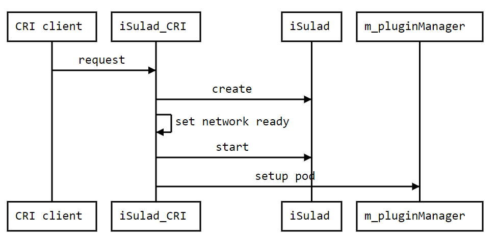
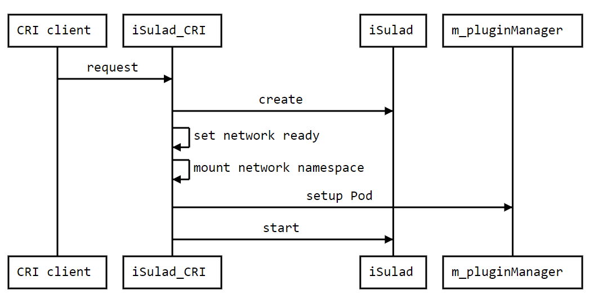

# CRI-CNI重构设计文档

## 重构目的

重构前启动pod的流程是创建容器在先，网络命名空间由容器运行时来创建。当容器运行起来了之后再用CNI插件去配置这个网络命名空间。这个流程和containerd的实现是不一样的，而且无法兼容安全容器。安全容器涉及到虚拟机和宿主机之间的通信，因而要求在容器运行之前就要有一个能够使用的网络命名空间。现有的流程无法满足这个需求，这使得重构pod的启动流程成为了必须。

重构后的pod启动流程应该有如下行为：

- 在需要的情况下主动创建网络命名空间；
- 先配置网络，即通过CNI插件设置该命名空间的网络；
- 启动容器的时候指定pod容器的网络命名空间为配置好的命名空间。

修改后要求能够兼容安全容器（kata），并保障已有的功能。

## 重构思路

在重构时有三个主要问题，一是如何避免与客户端启动容器流程的冲突；二是以怎样的方式保存命名空间的路径；三是引入了新的数据和文件之后怎么处理资源的回收。

解决思路如下:

### 如何避免与客户端启动容器流程的冲突

- 引入一个新network mode：cni，作为CRI启动pod时的默认模式。

### 以怎样的方式保存命名空间的路径

- 在network settings中加入sandbox key作为自主创建的网络命名空间的路径。创建pod时通过一个线程在这个路径下新建文件并将线程网络空间挂载到该文件上实现持久化；
- network settings需要落盘防止iSulad重启；
- 如果网络模式为cni，那么inspect时要把sandbox key也纳入其中。

### 资源回收

- 在重构后，启动流程如下：
    1. 收到request，开始创建pod、解析request、生成配置并落盘等，此时会生成sandbox key，并在/var/run/netns下创建文件；
    2. 设置network为ready；
    3. 网络命名空间挂载；
    4. 将命名空间路径通过annotation的方式传递给CNI插件以配置pod网络；
    5. 启动容器时从runtime的数据结构中（container_t的network settings里）拿到网络命名空间路径并交给下层容器运行时使pod运行在自主生成的网络命名空间之中。
- 根据这个流程，资源回收策略如下：
    1. 在删除容器的时候，先对命名空间进行umount，随后删除文件；
    2. 与启动的逻辑相对应，在停止pod的时候清理cni网络，成功的话对命名空间进行umount，但并不删除文件；
    3. 在异常处理的时候也与启动的逻辑相对应，如果在某一启动步骤发生异常，只清理在那个步骤前已有的资源。

## 时序图



重构前时序图



重构后时序图

## Network Settings

```json
{
    "$schema": "http://json-schema.org/draft-04/schema#",
    "type": "object",
    "properties": {
        "Bridge": {
            "type": "string"
        },
        "SandboxID": {
           "type": "string"
        },
        "LinkLocalIPv6Address": {
            "type": "string"
        },
        "LinkLocalIPv6PrefixLen": {
            "type": "integer"
        },
        "Ports": {
            "$ref": "../defs.json#/definitions/mapStringObjectPortBindings"
        },
        "CNIPorts": {
            "$ref": "../cni/anno_port_mappings.json"
        },
        "SandboxKey": {
            "type": "string"
        },
        "EndpointID": {
            "type": "string"
        },
        "Gateway": {
            "type": "string"
        },
        "GlobalIPv6Address": {
            "type": "string"
        },
        "GlobalIPv6PrefixLen": {
            "type": "integer"
        },
        "IPAddress": {
            "type": "string"
        },
        "IPPrefixLen": {
            "type": "integer"
        },
        "IPv6Gateway": {
            "type": "string"
        },
        "MacAddress": {
            "type": "string"
        },
        "Activation": {
            "type": "boolean"
        },
        "Networks": {
            "$ref": "../defs.json#/definitions/mapStringObjectNetworks"
        }
    }
}
```