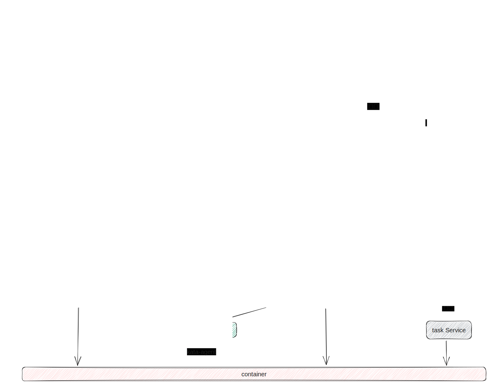

| Author | 钟涛                                     |
| ------ | ------------------------------------------ |
| Date   | 2023-06-27                                 |
| Email  | zhongtao17@huawei.com |

# 1.方案目标

**sandbox 模块**分为两个类：sandbox类代表一个抽象的sandbox实例，提供sandbox的创建、启动、删除等功能。sandboxManager类提供sandbox管理功能。

为了保证sandbox与container id与name的独特性，需抽象出一个公用id与name管理模块，主要维护两个map，一个为目前已被使用的id map，一个为目前已被使用的name的map，分别用锁保证其线程安全。

# 2.总体设计

## 2.1 模块关系图



## 2.2 代码位置
src/daemon/common/id_name_manager.h

src/daemon/sandbox/sandbox_manager.h

src/daemon/sandbox/sandbox.h

## 2.3 类图

# 3.接口描述
## 3.1 sandbox接口
```c
const std::string SANDBOX_METADATA_JSON = "sandbox_metadata.json";
const std::string SANDBOX_STATE_JSON = "sandbox_state.json";
const std::string NETWORK_SETTINGS_JSON = "network_settings.json";

// Keep consistent with the default values set in containerd and cri-o.
const uint32_t DEFAULT_STOP_TIMEOUT = 10;
const std::string DEFAULT_NETMODE = "cni";

enum SandboxStatus {
    SANDBOX_STATUS_UNKNOWN = 0,
    SANDBOX_STATUS_RUNNING,
    SANDBOX_STATUS_PENDING,
    SANDBOX_STATUS_STOPPED,
    SANDBOX_STATUS_REMOVING,
};

struct StatsInfo {
    int64_t timestamp;
    uint64_t cpuUseNanos;
};

struct RuntimeInfo {
    // container runtime
    std::string runtime;
    // sandbox type
    std::string sandboxer;
    // cri runtime handler
    std::string runtimeHandler;
};

struct SandboxState {
    uint32_t pid;
    uint64_t createdAt;
    // now, updatedAt is unused
    uint64_t updatedAt;
    uint64_t exitedAt;
    uint32_t exitStatus;
    SandboxStatus status;
};

// 暴露给sandbox manage的构造函数
Sandbox(const std::string id, const std::string &rootdir, const std::string &statedir, const std::string name = "",
        const RuntimeInfo info = {"", "", ""}, std::string netMode = DEFAULT_NETMODE, std::string netNsPath = "",
        const runtime::v1::PodSandboxConfig sandboxConfig = runtime::v1::PodSandboxConfig::default_instance());


// 判断sandbox状态
auto IsReady() const -> bool;

// 获取sandbox的基本信息
auto GetId() const -> const std::string &;
auto GetName() const -> const std::string &;
auto GetRuntime() const -> const std::string &;
auto GetSandboxer() const -> const std::string &;
auto GetRuntimeHandle() const -> const std::string &;
auto GetSandboxConfig() const -> const runtime::v1::PodSandboxConfig &;
auto GetMutableSandboxConfig() -> std::shared_ptr<runtime::v1::PodSandboxConfig>;
auto GetRootDir() const -> const std::string &;
auto GetStateDir() const -> const std::string &;
auto GetResolvPath() const -> std::string;
auto GetHostnamePath() const -> std::string;
auto GetHostsPath() const -> std::string;
auto GetShmPath() const -> std::string;
auto GetStatsInfo() -> StatsInfo;
auto GetNetworkReady() const -> bool;
auto GetNetMode() const -> const std::string &;
auto GetNetNsPath() const -> const std::string &;
auto GetNetworkSettings() -> const std::string &;
auto GetCreatedAt() -> uint64_t;
auto GetPid() -> uint32_t;
auto GetTaskAddress() const -> const std::string &;
auto GetContainers() -> std::vector<std::string>;

// 设置和更新sandbox的变量值
void SetNetMode(const std::string &mode);
void SetController(std::shared_ptr<Controller> controller);
void AddAnnotations(const std::string &key, const std::string &value);
void RemoveAnnotations(const std::string &key);
void AddLabels(const std::string &key, const std::string &value);
void RemoveLabels(const std::string &key);
void AddContainer(const std::string &id);
void SetConatiners(const std::vector<std::string> &cons);
void RemoveContainer(const std::string &id);
void UpdateNetworkSettings(const std::string &settingsJson, Errors &error);
auto UpdateStatsInfo(const StatsInfo &info) -> StatsInfo;
void SetNetworkReady(bool ready);
void SetNetworkMode(const std::string &networkMode);
auto FindAvailableVsockPort(uint32_t &port) -> bool;
void ReleaseVsockPort(uint32_t port);
auto CleanupSandboxFiles(Errors &error) -> bool;

// Save to file
auto Save(Errors &error) -> bool;
// Load from file
auto Load(Errors &error) -> bool;

// 状态改变callback函数
void OnSandboxReady();
void OnSandboxPending();
void OnSandboxExit(const ControllerExitInfo &exitInfo);

// sandbox的操作
auto UpdateStatus(Errors &error) -> bool;
auto Create(Errors &error) -> bool;
auto Start(Errors &error) -> bool;
auto Stop(uint32_t timeoutSecs, Errors &error) -> bool;
auto Remove(Errors &error) -> bool;
void Status(runtime::v1::PodSandboxStatus &status);
```

## 3.2 sandbox manage 接口
```c
// Singleton 获得sandbox管理实例
static SandboxManager *GetInstance() noexcept;

// 初始化sandbox manager
auto Init(Errors &error) -> bool;

// 创建 sandbox 实例
auto CreateSandbox(const std::string &name, RuntimeInfo &info, std::string &netNsPath, std::string &netMode, const runtime::v1::PodSandboxConfig &sandboxConfig, Errors &error) -> std::shared_ptr<Sandbox>;


// 查询获得sandbox
auto GetSandbox(const std::string &idOrName) -> std::shared_ptr<Sandbox>;

// 删除sandbox
auto DeleteSandbox(const std::string &idOrName, Errors &error) -> bool;

// restore sandboxes
auto RestoreSandboxes(Errors &error) -> bool;

// list all sandbox by filter
void ListAllSandboxes(const runtime::v1::PodSandboxFilter &filters, std::vector<std::shared_ptr<Sandbox>> &sandboxes);
```
## 3.3 id name manager 接口
```c
// 初始化与释放
int id_name_manager_init(void);
void id_name_manager_release(void);

bool id_name_manager_add_entry_with_existing_id(const char *id, const char *name);
bool id_name_manager_add_entry_with_new_id(const char *name, char **id);
bool id_name_manager_add_entry_with_new_id_and_name(char **id, char **name);
bool id_name_manager_remove_entry(const char *id, const char *name);
bool id_name_manager_rename(const char *new_name, const char *old_name);
```

# 4.详细设计

## 4.1 sandbox模块

```c
namespace sandbox {

const std::string SANDBOX_METADATA_JSON = "sandbox_metadata.json";
const std::string SANDBOX_STATE_JSON = "sandbox_state.json";
const std::string NETWORK_SETTINGS_JSON = "network_settings.json";

// Keep consistent with the default values set in containerd and cri-o.
const uint32_t DEFAULT_STOP_TIMEOUT = 10;
const std::string DEFAULT_NETMODE = "cni";

enum SandboxStatus {
    SANDBOX_STATUS_UNKNOWN = 0,
    SANDBOX_STATUS_RUNNING,
    SANDBOX_STATUS_PENDING,
    SANDBOX_STATUS_STOPPED,
    SANDBOX_STATUS_REMOVING,
};

struct StatsInfo {
    int64_t timestamp;
    uint64_t cpuUseNanos;
};

struct RuntimeInfo {
    // container runtime
    std::string runtime;
    // sandbox type
    std::string sandboxer;
    // cri runtime handler
    std::string runtimeHandler;
};

struct SandboxState {
    uint32_t pid;
    uint64_t createdAt;
    // now, updatedAt is unused
    uint64_t updatedAt;
    uint64_t exitedAt;
    uint32_t exitStatus;
    SandboxStatus status;
};

class Sandbox : public SandboxStatusCallback, public std::enable_shared_from_this<Sandbox> {
public:
    Sandbox(const std::string id, const std::string &rootdir, const std::string &statedir, const std::string name = "",
            const RuntimeInfo info = {"", "", ""}, std::string netMode = DEFAULT_NETMODE, std::string netNsPath = "",
            const runtime::v1::PodSandboxConfig sandboxConfig = runtime::v1::PodSandboxConfig::default_instance());
    virtual ~Sandbox() = default;

    auto IsReady() -> bool;

    auto GetId() const -> const std::string &;
    auto GetName() const -> const std::string &;
    auto GetRuntime() const -> const std::string &;
    auto GetSandboxer() const -> const std::string &;
    auto GetRuntimeHandle() const -> const std::string &;
    auto GetSandboxConfig() const -> const runtime::v1::PodSandboxConfig &;
    auto GetMutableSandboxConfig() -> std::shared_ptr<runtime::v1::PodSandboxConfig>;
    auto GetRootDir() const -> const std::string &;
    auto GetStateDir() const -> const std::string &;
    auto GetResolvPath() const -> std::string;
    auto GetHostnamePath() const -> std::string;
    auto GetHostsPath() const -> std::string;
    auto GetShmPath() const -> std::string;
    auto GetStatsInfo() -> StatsInfo;
    auto GetNetworkReady() const -> bool;
    auto GetNetMode() const -> const std::string &;
    auto GetNetNsPath() const -> const std::string &;
    auto GetNetworkSettings() -> const std::string &;
    auto GetCreatedAt() -> uint64_t;
    auto GetPid() -> uint32_t;
    auto GetTaskAddress() const -> const std::string &;
    auto GetContainers() -> std::vector<std::string>;
    void SetNetMode(const std::string &mode);
    void SetController(std::shared_ptr<Controller> controller);
    void AddAnnotations(const std::string &key, const std::string &value);
    void RemoveAnnotations(const std::string &key);
    void AddLabels(const std::string &key, const std::string &value);
    void RemoveLabels(const std::string &key);
    void AddContainer(const std::string &id);
    void SetConatiners(const std::vector<std::string> &cons);
    void RemoveContainer(const std::string &id);
    void UpdateNetworkSettings(const std::string &settingsJson, Errors &error);
    auto UpdateStatsInfo(const StatsInfo &info) -> StatsInfo;
    void SetNetworkReady(bool ready);
    void SetNetworkMode(const std::string &networkMode);
    auto FindAvailableVsockPort(uint32_t &port) -> bool;
    void ReleaseVsockPort(uint32_t port);
    auto CleanupSandboxFiles(Errors &error) -> bool;

    // Save to file
    auto Save(Errors &error) -> bool;
    // Load from file
    auto Load(Errors &error) -> bool;

    void OnSandboxReady();
    void OnSandboxPending();
    void OnSandboxExit(const ControllerExitInfo &exitInfo);

    auto UpdateStatus(Errors &error) -> bool;

    auto Create(Errors &error) -> bool;
    auto Start(Errors &error) -> bool;
    auto Stop(uint32_t timeoutSecs, Errors &error) -> bool;
    auto Remove(Errors &error) -> bool;
    void Status(runtime::v1::PodSandboxStatus &status);

private:
    auto SaveState(Errors &error) -> bool;
    auto SaveMetadata(Errors &error) -> bool;
    auto SaveNetworkSetting(Errors &error) -> bool;

    auto LoadState(Errors &error) -> bool;
    auto LoadMetadata(Errors &error) -> bool;
    void LoadNetworkSetting();

    void SetSandboxConfig(const runtime::v1::PodSandboxConfig &config);
    void SetNetworkSettings(const std::string &settings, Errors &error);
    auto CreateHostname(bool shareHost, Errors &error) -> bool;
    auto CreateHosts(bool shareHost, Errors &error) -> bool;
    auto CreateResolvConf(Errors &error) -> bool;
    auto CreateShmDev(Errors &error) -> bool;
    auto SetupSandboxFiles(Errors &error) -> bool;
    void DoUpdateStatus(std::unique_ptr<ControllerSandboxStatus> status, Errors &error);
    void DoUpdateExitedStatus(const ControllerExitInfo &exitInfo);

    auto GetMetadataJsonPath() ->  std::string;
    auto GetStatePath() -> std::string;
    auto GetNetworkSettingsPath() -> std::string;

    void FillSandboxState(sandbox_state *state);
    void FillSandboxMetadata(sandbox_metadata* metadata, Errors &error);

    auto GenerateSandboxStateJson(sandbox_state *state) -> std::string;
    auto GenerateSandboxMetadataJson(sandbox_metadata *metadata) -> std::string;
    auto ParseSandboxStateFile() ->std::unique_ptr<CStructWrapper<sandbox_state>>;
    auto ParseSandboxMetadataFile() ->std::unique_ptr<CStructWrapper<sandbox_metadata>>;

    auto DoStop(uint32_t timeoutSecs, Errors &error) -> bool;
    auto IsRemovalInProcess() -> bool;
    auto IsStopped() -> bool;
    auto isValidMetadata(std::unique_ptr<CStructWrapper<sandbox_metadata>> &metadata) -> bool;

    void CleanupSandboxDirs();

private:
    // Since the cri module will operate concurrently on the sandbox instance,
    // use m_mutex to ensure the correctness of the sandbox instance
    RWMutex m_mutex;
    // use m_stateMutex to ensure the correctness of m_state, m_statsInfo and m_networkSettings
    RWMutex m_stateMutex;
    SandboxState m_state;
    std::string m_id;
    std::string m_name;
    RuntimeInfo m_runtimeInfo;
    // m_rootdir = conf->rootpath + / + sandbox + / + id
    std::string m_rootdir;
    std::string m_statedir;
    std::string m_taskAddress;
    StatsInfo m_statsInfo;
    // Store network information in the sandbox, which is convenient for the cri module to obtain
    // and update the network settings of the pause container in the shim-controller.
    std::string m_netMode;
    std::string m_netNsPath;
    std::string m_networkMode;
    bool m_networkReady;
    std::string m_networkSettings;
    // container id lists
    std::vector<std::string> m_containers;
    RWMutex m_containersMutex;
    // TOOD: m_sandboxConfig is a protobuf message, it can be converted to json string directly
    //       if save json string directly for sandbox recover, we need to consider hot
    //       upgrade between different CRI versions
    std::shared_ptr<runtime::v1::PodSandboxConfig> m_sandboxConfig;

    // it should select accroding to the config
    std::shared_ptr<Controller> m_controller { nullptr };

    // vsock ports
    std::mutex m_vsockPortsMutex;
    std::set<uint32_t> m_vsockPorts;
};

} // namespace sandbox
```
### 4.1.1 sandbox状态机


1. 若sandbox不处于running状态，则无需再次进行stop操作。

2. 若sandbox处于stopped状态

    (1)则OnSandboxReady,OnSandboxExit()与OnSandboxPending()不会造成状态变化

3. 若sandbox处于removing状态

    (1) 则OnSandboxReady(),OnSandboxExit与OnSandboxPending()不会造成状态变化

    (2) 不允许进行start，stop以及再次进行remove操作。

4. 当sandbox处于running状态时执行remove操作，首先会调用controller的stop函数，但是不会等待确保stop成功将sandbox状态设置为stopped（与containerd行为保持一致），而是直接将sandbox状态设置为removing，之后调用controller的shutdown函数。

### 4.1.2 持久化保存
1. 状态信息
```c
uint32_t pid;
uint64_t createdAt;
// now, updatedAt is unused
uint64_t updatedAt;
uint64_t exitedAt;
uint32_t exitStatus;
SandboxStatus status;
```
2. sandbox基础信息
```c
std::string m_id;
std::string m_name;
RuntimeInfo m_runtimeInfo;
// m_rootdir = conf->rootpath + / + sandbox + / + id
std::string m_rootdir;
std::string m_statedir;
std::string m_taskAddress;
StatsInfo m_statsInfo;
// Store network information in the sandbox, which is convenient for the cri module to obtain
// and update the network settings of the pause container in the shim-controller.
std::string m_netMode;
std::string m_netNsPath;
std::string m_networkMode;
bool m_networkReady;
std::string m_networkSettings;
// container id lists
std::vector<std::string> m_containers;
RWMutex m_containersMutex;
// TOOD: m_sandboxConfig is a protobuf message, it can be converted to json string directly
//       if save json string directly for sandbox recover, we need to consider hot
//       upgrade between different CRI versions
std::shared_ptr<runtime::v1::PodSandboxConfig> m_sandboxConfig;

// it should select accroding to the config
std::shared_ptr<Controller> m_controller { nullptr };

// vsock ports
std::mutex m_vsockPortsMutex;
std::set<uint32_t> m_vsockPorts;
```

### 4.1.3 锁以及其保障范围

1. m_mutex: 保障并发sandbox的生命周期操作（start, stop, remove）
2. m_stateMutex:保障并发对m_state，m_statsInfo，m_networkSettings的修改与读取
3. m_containersMutex：保障对m_containers的并发操作

## 4.2 sandbox manage 模块

```c
namespace sandbox {

class SandboxManager {
public:
    // Singleton
    static SandboxManager *GetInstance() noexcept;

    // initialize value
    auto Init(Errors &error) -> bool;

    // Create meanningful sandbox instance
    auto CreateSandbox(const std::string &name, RuntimeInfo &info, std::string &netNsPath, std::string &netMode,
                       const runtime::v1::PodSandboxConfig &sandboxConfig, Errors &error) -> std::shared_ptr<Sandbox>;

    auto GetSandbox(const std::string &idOrName) -> std::shared_ptr<Sandbox>;
    auto DeleteSandbox(const std::string &idOrName, Errors &error) -> bool;

    auto RestoreSandboxes(Errors &error) -> bool;
    // list all sandboxes by filter
    void ListAllSandboxes(const runtime::v1::PodSandboxFilter &filters, std::vector<std::shared_ptr<Sandbox>> &sandboxes);
private:
    SandboxManager() = default;
    SandboxManager(const SandboxManager &other) = delete;
    SandboxManager &operator=(const SandboxManager &) = delete;
    virtual ~SandboxManager() = default;

    void StoreAdd(const std::string &id, std::shared_ptr<Sandbox> sandbox);
    void StoreRemove(const std::string &id);
    void StoreGetAll(std::vector<std::shared_ptr<Sandbox>> &sandboxes);
    auto StoreGetById(const std::string &id) -> std::shared_ptr<Sandbox>;
    auto StoreGetByName(const std::string &name) -> std::shared_ptr<Sandbox>;
    auto StoreGetByPrefix(const std::string &prefix) -> std::shared_ptr<Sandbox>;

    void NameIndexAdd(const std::string &name, const std::string &id);
    void NameIndexRemove(const std::string &name);
    auto NameIndexGet(const std::string &name) -> std::string;
    auto NameIndexGetAll(void) -> std::map<std::string, std::string>;

    auto IDNameManagerRemoveEntry(const std::string &id, const std::string &name) -> bool;
    auto IDNameManagerNewEntry(std::string &id, const std::string &name) -> bool;

    void SaveSandboxToStore(const std::string &id, std::shared_ptr<Sandbox> sandbox);
    void DeleteSandboxFromStore(const std::string &id, const std::string &name);

    auto GetSandboxRootpath() -> std::string;
    auto GetSandboxStatepath() -> std::string;
    bool ListAllSandboxdir(std::vector<std::string> &allSubdir);
    auto LoadSandbox(std::string &id) -> std::shared_ptr<Sandbox>;
    void CleanInValidSandboxDir(const std::string &id);

private:
    static std::atomic<SandboxManager *> m_instance;
    std::string m_rootdir;
    std::string m_statedir;
    // id --> sandbox map
    std::map<std::string, std::shared_ptr<Sandbox>> m_storeMap;
    // name --> id map
    std::map<std::string, std::string> m_nameIndexMap;
    // Read-write locks can only be used if the C++ standard is greater than 17
    RWMutex m_storeRWMutex;
    RWMutex m_indexRWMutex;
};

} // namespace sandbox
```

