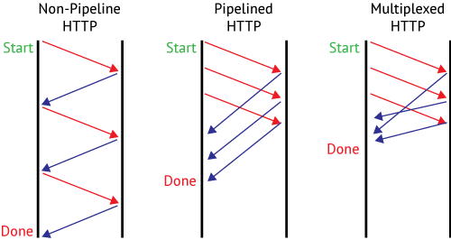
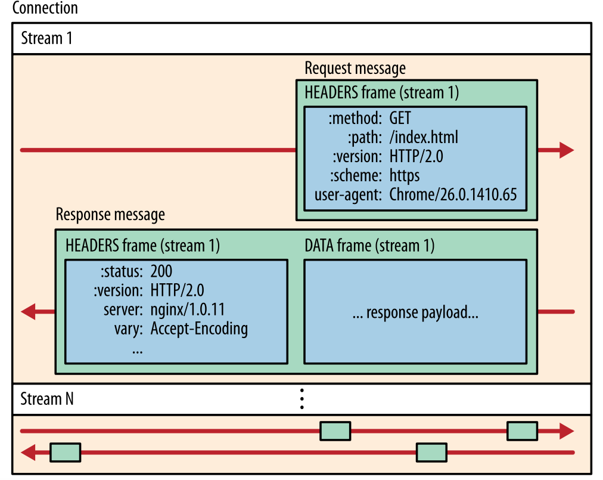

# 使用nghttp2实现rest server

## About
本文主要讨论如何使用libnghttp2来实现一个http rest server, 并简要讨论http rest server应该具有什么样的功能， 以满足isulad的需要。

* 首先， 我们比较一下`http/1.1`与`http/2`的主要区别在哪
* 然后我们分析nghttp2的主要特点与重要的API
* 然后通过一张简要的架构设计图来介绍一下这个rest server会有哪些组件
* 接着通过分析下isulad的一些处理事务的流程，来看看isulad将会怎样使用该rest server， 分析的一些重要流程如下：当普通rest request和流式rest request到达时, rest server怎样处理；绑定的endpoint handler怎样调用下层具体执行容器操作的callback等场景。 
* 最后分析一下进行替换之后， isulad的哪些代码需要改动， 改动量有多大。


## 1. Features In Http/2
### 1.1 二进制框架层

http1.1和2.0 最大的区别是2.0多出的一个二进制框架层。与 http1.1把所有请求和响应作为纯文本不同，http2 使用二进制框架层把所有消息封装成二进制，且仍然保持http语法，消息的转换让http2能够尝试http1.1所不能的传输方式。

> 二进制框架层带来的改变：
> * 纯文本的请求或者响应 -> 二进制的Message
>   * Header Text -> Header Frame
>   * Body Text -> Data Frame 

要理解为什么会出现二进制框架层, 可以从没有二进制框架层的http/1.1有什么问题入手：这个问题来源于*http/1.1的流水线和队头阻塞*。




**流水线** 即http/1.1相对于http/1.0做出的改进， 通过增加keep-alive头部， 不同的request可以复用同一条tcp长连接，许多request在这一条tcp连接上一次发出，就像在流水线上一样。 tcp建立连接资源消耗大， 所以在高并发的场景下这是一个很重要的改进， 现代的web browser和流行的http库都是默认开启keep-alive的。 可以写一个简单的http/1.1 client 来做实验， 只要是请求同一个server， 那么所有的request都是从同一个socket fd上发出去的。

**队头阻塞** 即http/1.1使用长连接和流水线之后出现的问题， 如果流水线上的第一个request发生了阻塞， 那么这条连接上的后面的request都会被阻塞直到第一个request发送出去或者超时。添加并行的tcp连接能够减轻这个问题，但是tcp连接的数量是有限的，每个新的连接需要额外的资源， 这种并行连接就是http/1.0的处理方式。

**二进制框架层** 理解http/2的二进制框架层， 就是理解一些http/2的抽象概念：
* Session: session是tcp connection的抽象， 建立connection之后， session就出现了， 一个session会管理这个connection， connection error 或者 end之后， 当前的session也会关闭。Session要管理一个或者多个stream， 这就是二进制框架层带来的multiplexing功能.
* Stream: 已知tcp提供流式连接， 那么tcp stream与这里的stream的区别是什么呢？这里的Stream通过多路复用， 跑在同一个tcp stream上，也就是说， 这里的stream提供原tcp stream一样对功能， 但是抽象了多路复用这个细节。
* Message: Message即http/2标准定义对proto部分， 这一部分与http/1.1差别不大， 略有修改。从Stream上recv的data是无结构的raw bit stream， 序列化成Message； 相反的， Message通过反序列化成raw bit stream, 向Stream上send. Message包括request message和response message。
* Frame: 上述的raw bit stream要通过data chunk来发送和接收， Frame就是data chunk的抽象。frame data chunk是最小通信单位，以二进制压缩格式存放内容。


### 1.2 Stream优先级
不会使用到， 暂时没有总结， TODO

### 1.3 服务端 push
不会使用到， 暂时没有总结， TODO

## 2. Features In nghttp2
nghttp2是HTTP/2 protocol的一个c实现 

### 2.1 Low Level http library
nghttp2的地位属于是一个low level的http2库， 它并不针对client， server设计， 它只是提供http/2的那些抽象概念的具体实现， 至于如何实现client或者server， 由用户自己负责。

具体一点来说，如果你要用nghttp2来实现一个client向server发送一个请求：
* 可以使用nghttp2的api来构建一个message对象 
* 然后使用api发送这个对象， nghttp2会帮你完成序列化， split into data chunk, send over stream等工作. 

可以与其他high level http library来一个对比， 这里与go来一个对比：
```go
package main

import (
    "net/http"
)

client := &http.Client{
	CheckRedirect: redirectPolicyFunc,
}

req, err := http.NewRequest("GET", "http://www.google.com", nil)
req.Header.Add("Language", "English")
resp, err := client.Do(req)
```

对比之下， nghttp2不提供使用`client, request, response`这些对象的方便的接口， client建立连接和io这部分也需要自己完成：
```c
static int connect_to(const char *host, uint16_t port) {
  struct addrinfo hints;
  int fd = -1;
  int rv;
  char service[NI_MAXSERV];
  struct addrinfo *res, *rp;
  snprintf(service, sizeof(service), "%u", port);
  memset(&hints, 0, sizeof(struct addrinfo));
  hints.ai_family = AF_UNSPEC;
  hints.ai_socktype = SOCK_STREAM;
  rv = getaddrinfo(host, service, &hints, &res);
  if (rv != 0) {
    dief("getaddrinfo", gai_strerror(rv));
  }
  for (rp = res; rp; rp = rp->ai_next) {
    fd = socket(rp->ai_family, rp->ai_socktype, rp->ai_protocol);
    if (fd == -1) {
      continue;
    }
    /*
    ** connect to a server, get the socketfd.
    */
    while ((rv = connect(fd, rp->ai_addr, rp->ai_addrlen)) == -1 &&
           errno == EINTR)
      ;
    if (rv == 0) {
      break;
    }
    close(fd);
    fd = -1;
  }
  freeaddrinfo(res);
  return fd;
}

static ssize_t send_callback(nghttp2_session *session, const uint8_t *data,
                             size_t length, int flags, void *user_data) {
  struct Connection *connection;
  int rv;
  (void)session;
  (void)flags;

  connection = (struct Connection *)user_data;
  /*
  ** do real io on the socketfd
  */
  rv = write(connection->fd, data, (int)length);
  if (rv <= 0) {
    perror("write error");
    return rv;
  }
  printf("write success: %d\n", rv);
  return rv;
}
```

client发送一次request需要完成的操作： 
* 建立连接， 拿到socketfd
* 构建一个request对象(header + body)， 调用nghttp2_submit_request把request提交到待发送队列，这时候不会发生io. 
* 在fd上使用poll, 当fd可写时调用nghttp2_session_send, 该api触发nghttp2的send事件，导致一系列callback被调用， 包括反序列化的callback, 执行i/o的send_callback等。 nghttp2_session_send会选择优先级最高的frame来发送
* nghttp2_session_send api会导致我们注册的send_callback被调用， 这个send_callback由用户实现， 目的是把数据发送到网络， 其函数原型是nghttp2规定的， 需要用set_callback api提前注册， 其参数中的data和length是待发送队列中的request反序列化之后的数据， 这些数据存储在nghttp2内部的一个buffer上。
* 由于fd可写， 可以非阻塞的在fd上write这些buffer上的数据


### 2.2. High Level Application
在nghttp2仓库下， 还提供了几个基于libnghttp2的high level application:
* nghttp-client, c++实现的一个http/2客户端
* nghttpd, c++实现的一个multi-thread static web server
* nghttpx, c++实现的一个multi-thread http reverse proxy
* nghttp-asio, 使用c++实现的一个web server框架， 与所有的现代web server框架类似， 支持使用匿名函数注册handler， 可以非常方便的完成编写handler， 注册路由， 配置server等操作。

isulad要实现的rest server就与nghttp-asio一样，这里简单看下nghttp-asio怎么启动一个web server, 并与go做一下对比：
```c++
int main(int argc, char *argv[]) {
  try {
    // Check command line arguments.
    if (argc < 4) {
      std::cerr
          << "Usage: asio-sv <address> <port> <threads> [<private-key-file> "
          << "<cert-file>]\n";
      return 1;
    }

    boost::system::error_code ec;

    std::string addr = argv[1];
    std::string port = argv[2];
    std::size_t num_threads = std::stoi(argv[3]);

    http2 server;

    server.num_threads(num_threads);

    /*
    ** register route with a handler
    */
    server.handle("/", [](const request &req, const response &res) {
      res.write_head(200, {{"foo", {"bar"}}});
      res.end("hello, world\n");
    });

    if (argc >= 6) {

      if (server.listen_and_serve(ec, NULL, addr, port)) {
        std::cerr << "error: " << ec.message() << std::endl;
      }
    } else {
      if (server.listen_and_serve(ec, addr, port)) {
        std::cerr << "error: " << ec.message() << std::endl;
      }
    }
  } catch (std::exception &e) {
    std::cerr << "exception: " << e.what() << "\n";
  }

  return 0;
}

```

```go
import (
   "fmt"
   "net/http"
)

func main () {
   http.HandleFunc("/", func(w http.ResponseWriter, r *http.Request) {
    fmt.Fprintf(w, "Hello")
   })
   http.ListenAndServe(":8000", nil)
}
```
这两个web server框架的使用看起来非常的类似， 即使使用了不同的语言。 go看起来更简单的原因是因为使用了预先初始化好的default server和default mux这两个包内全局变量， 所以少了创建server的代码。


### 2.3 部分API介绍
我把使用到的nghttp2 API分成两部分：
* 面向tcp连接用来处理网络i/o这一部分的api
* 面向用户，http应用使用的api

#### 2.3.1 API for Net I/O 

> `NGHTTP2_EXTERN int nghttp2_session_recv(nghttp2_session *session);`
>
> `typedef ssize_t (*nghttp2_recv_callback)(nghttp2_session *session, uint8_t *buf, size_t length, int flags, void *user_data);`
>
> `NGHTTP2_EXTERN ssize_t nghttp2_session_mem_recv(nghttp2_session *session, const uint8_t *in, size_t inlen);` 


这三个API用来从tcp层接收数据， 有recv + callback 和 mem_recv这两种方式。这两种方式没有什么不同， 前者主动调用， 后者是回调callback的方式， 其达成的效果都是把数据从user_data这个抽象数据类型里面转移到长度固定的nghttp2 buffer里面. user_data最简单的实现就是用user_data这个结构体包含socket fd.

> `NGHTTP2_EXTERN int nghttp2_session_send(nghttp2_session *session);`
>
> `NGHTTP2_EXTERN ssize_t nghttp2_session_mem_send(nghttp2_session *session,const uint8_t **data_ptr);`
>
> `typedef ssize_t (*nghttp2_send_callback)(nghttp2_session *session, const uint8_t *data, size_t length, int flags, void *user_data);`

这三个API用来向tcp层发送数据， 有send + callback 和 mem_send这两种方式。其效果都是把nghttp2 buffer里的数据发送给user_data。

还有两个辅助函数
> `NGHTTP2_EXTERN int nghttp2_session_want_read(nghttp2_session *session);`
> 
> `NGHTTP2_EXTERN int nghttp2_session_want_write(nghttp2_session *session);`

nghttp2内部的buffer也有可能full or empty, 这时可以用这两个函数来判断是否能收发数据


#### 2.3.2 API to process http2 protocol
这一部分使用到的API很多， 这里只简单介绍最核心的部分：

首先是代表各种特殊的http事件发生的时候， 被这些事件驱动的callback 原型。http事件的意思就是当收到某些特殊二进制消息， nghttp2通过解析， 就认为某些事件已经发生， 至于这些事件具体是什么， 下面的callback原型会给出说明。

> `typedef int (*nghttp2_on_begin_headers_callback)(nghttp2_session *session,
                                                 const nghttp2_frame *frame,
                                                 void *user_data);`

当这个callback被调用的时候， 说明第一个Header Frame已经收到， 这标志一个新的Stream的建立，这个callback应该完成Stream对象的初始化，并且让Session来管理这个Stream对象。

> `typedef int (*nghttp2_on_header_callback)(nghttp2_session *session,
                                          const nghttp2_frame *frame,
                                          const uint8_t *name, size_t namelen,
                                          const uint8_t *value, size_t valuelen,
                                          uint8_t flags, void *user_data);`

当这个callback被调用的时候， 说明某个特殊的http header被识别到了， 这个http header用一个四元组来代表 `name:namelen:value:valuelen`, 这个callback应该记录或者处理这些http header.

> `typedef int (*nghttp2_on_frame_recv_callback)(nghttp2_session *session, const nghttp2_frame_hd *hd, void *user_data)`

当这个callback被调用的时候， 说明一个完整的frame被收到了， 这个frame可能是header或者data类型的， 由于header或者data都可能由多个frame组成， 所以可以判断这个frame是不是最后一个frame：
* 当这个frame是最后一个header frame时， 这是一个用来完成路由工作的好时机， 因为所有的header信息都拿到了， 而路由只依赖与header信息， 即使data数据（即request body）没有收到， 依然可以提前完成路由工作。
* 当这个frame是最后一个data frame的时候， 这是一个用来设置request body的结束标志的时机。

> `typedef int (*nghttp2_on_stream_close_callback)(nghttp2_session *session, int32_t stream_id, uint32_t error_code, void *user_data);`

当这个callback被调用的时候， 说明这个Stream上的所有Message都传输完毕， 这是一个关闭Stream并做清理工作的好的时机, 该Stream应该从Session上删除。

> `typedef int (*nghttp2_on_data_chunk_recv_callback)(nghttp2_session *session,uint8_t flags,int32_t stream_id,const uint8_t *data,size_t len, void *user_data);`

这个callback用来专门处理data frame里面的data chunk。


## 3 Rest Server Design
nghttp2的实现思路是， 针对完全抽象的http/2标准做了具体的实现， 上面讨论的一些http/2中的抽象概念在nghttp2中都有对应的组件： 
* *Session* -> `struct nghttp2_session`
* *Stream* -> `struct nghttp2_stream`
* *Message* -> 没有request， response的具体结构体， 因为Message被分成了粒度更细的数据结构， 比如header, body. `  rv = nghttp2_submit_response(session, stream_id, nva, nvlen, &data_prd);`, 这些函数的参数用来代表一个response
* *Frame* -> `struct nghttp2_headers struct nghttp2_priority`

nghttp2的实现不是专门为了做一个client或是server，它是一个底层的框架， 所以它的实现更加的抽象。 为了实现该rest server， 主要的设计思路时：利用nghttp2的这些通用的组件， 在其基础上添加更加具体的实现； 即在每一个组件上添加更多的数据成员和方法来实现一个服务器的功能。

因此， rest server的主要模块如下：
* Server, 这一部分主要负责监听和建立连接， 这一部分的逻辑在nghttp2中是缺失的， 因此需要从0实现
* I/O Event, 这一部分用libevent来实现异步i/o, 用libevent的api来代替传统的socket相关系统调用， 因此其他涉及到使用网络I/O的组件不是主动I/O, 而是定义callback函数，并注册到本模块上， 当事件发生时， 本模块会驱动其他组件完成对应操作
* Session Context, 这一部分是nghttp_session的更加具体的实现， 当建立连接之后， 会创建一个session context, 一个session context就是一条tcp连接。 session context的主要职责就是定义一系列的callback， 当某些特定i/o事件发生，应该负责建立其他的对象，举个例子： 当装载着headers的frame到达的时候， 这时候意味着一条新的Stream建立了， 应该创建一个新的stream对象并管理它。 额外举个例子：当装载着data的request body到达的时候， 这时候应该调用事先定义好的处理request body的代码， 比如request body是json string， 那么就应该调marshal json string的代码. 
* Stream Context, 当Session Context发现了一个request header的时候，这标志着一个Stream建立了， 这时候Session Context会建立Stream并管理它，Stream Context会唯一绑定nghttp2 Stream对象。 Stream Context对象会负责创建Request和Response对象。
* Mux, 这是路由模块，通过request path, 路由到注册的handler上去， 让对应的handler来处理request。
* Request and Response, handler通过调用这两个模块上的方法来处理请求和响应。


## 4 Handling Process
这里主要分析两个具体的isulad http接口怎么用该rest server实现，我挑选了一个普通接口resize和流式接口copyFromContainer.

### 4.1 resize接口流程分析
* 为了完成resize rest接口， 在 Mux模块上注册Handler， Handler函数内部会注册request处理函数和response响应函数, 然后Handler返回， request真正的处理和response的真正的响应的调用时机由nghttp2决定， 这里只是注册；这个地方的逻辑与传统的rest server框架不同， 这是因为nghttp2是异步框架。
  * 关于request 处理函数的设计： 如果request body很长， 或者是流式的request body, 那么nghttp2会把body分成多个data chunk, 我们的request处理函数需要处理这种情况， 目前我的设计是：在request结构体内部增加一个buffer， 每次把data chunk写入buffer里面， 而且每次检查data chunk的最后一个byte是否是\0, 如果确实是json string的结尾， 那么就调用lcr生成的json parse函数， 把json字符串转换成结构体， 并进行后续操作。
  * 关于response 响应函数的设计： 同样不是传统的模型， 不能直接写所有的响应json string, nghttp2提供的响应接口是这样的`  rv = nghttp2_submit_response(session, stream_id, nva, nvlen, &data_prd);`, 前面的参数用来寻找发送的Stream和构造response header, 而response body用最后data_prd提供， data_prd即`data_provider`， 它要求你绑定一个readcb来提供数据， 这里是这个read_cb要求你把数据放到一个buffer里去， 但是每次放多少也是不确定的。目前我的设计是：把要返回的结构体用yajl提供的函数生成为字符串， 把字符串写入buffer里面， 每次调用read_cb的时候，记录当前已读过的offset, 下次读读时候从offset开始，这里是极端情况， 绝大多数情况来说应该都是一次读完的。

### 4.2 copy接口流程分析
* copy接口应该与resize接口大部分处理类似， request处理是一样的， 不同的是response响应的处理
  * 关于request 处理函数的设计：因为request body还是使用json string, 这里的处理和resize完全一样。
  * 关于response 响应函数的设计： 因为这里是流式传输， 而且需要适配之前的代码框架， 之前grpc进行流式传输的方式是把一个writer object提供给更下层的cb
  ```c++
    stream_func_wrapper stream = { 0 };
    stream.context = (void *)context;
    stream.is_cancelled = &grpc_is_call_cancelled;
    stream.add_initial_metadata = &grpc_add_initial_metadata;
    stream.write_func = &grpc_copy_from_container_write_function;
    stream.writer = (void *)writer;
  ```
  这个cb底层会启动一个while循环不断的调用write_func, 因此， 除非这个while循环运行在独立的线程里面，不然这个while循环的设计没法与nghttp2的异步框架兼容。
  因此改动最小改法可能就是把底层的cb的执行放进一个独立线程里面， 然后向一个buffer写， 另外这个buffer会被data_provider持有， 并有readcb不断从buffer读取并进行response响应。
